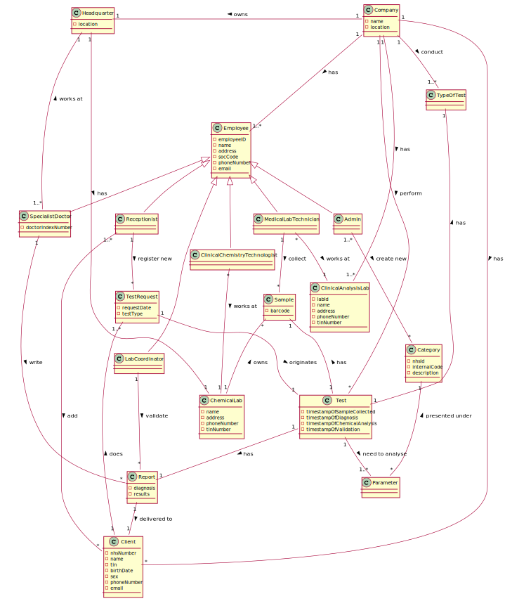

# OO Analysis #

The construction process of the domain model is based on the client specifications, especially the nouns (for _
concepts_) and verbs (for _relations_) used.

## Rationale to identify domain conceptual classes ##

To identify domain conceptual classes, start by making a list of candidate conceptual classes inspired by the list of
categories suggested in the book "Applying UML and Patterns: An Introduction to Object-Oriented Analysis and Design and
Iterative Development".

### _Conceptual Class Category List_ ###

**Business Transactions**

* Test

---

**Transaction Line Items**

* Blood Sample
* Covid Sample
* Other Sample

---

**Product/Service related to a Transaction or Transaction Line Item**

* Parameter

---

**Transaction Records**

* NHS Report

--- 

**Roles of People or Organizations**

* ManyLabs
* NHS
* Client
* Receptionist
* Lab Coordinator
* Medical Lab Technician
* Specialist Doctor
* Clinical Chemistry Technologist
* Admin
* Employee

---

**Places**

* Clinical Analysis Lab
* Chemical Labs
* Headquarters
* Application

---

**Noteworthy Events**

* Chemical Analysis
* Test Request
* Write Reports & diagnosis

---

**Physical Objects**

* Samples

---

**Descriptions of Things**

* Type of Test
* Category

---

**Catalogs**

*

---

**Containers**

* Company

---

**Elements of Containers**

* Employee

---

**Organizations**

* ManyLabs (company)
* NHS

---

**Other External/Collaborating Systems**

* External Barcode Generator

---

**Records of finance, work, contracts, legal matters**

* NHS Reports

---

**Financial Instruments**

*

---

**Documents mentioned/used to perform some work**

* Lab Order
* Citizen Card
* Reports
* Diagnosis

---

### **Rationale to identify associations between conceptual classes**

An association is a relationship between instances of objects that indicates a relevant connection and that is worth of
remembering, or it is derivable from the List of Common Associations:

+ **_A_** is physically or logically part of **_B_**
+ **_A_** is physically or logically contained in/on **_B_**
+ **_A_** is a description for **_B_**
+ **_A_** known/logged/recorded/reported/captured in **_B_**
+ **_A_** uses or manages or owns **_B_**
+ **_A_** is related with a transaction (item) of **_B_**
+ etc.

| Concept (A)        |  Association    |  Concept (B) |
|----------	   		|:-------------:    |------:       |
| Company                           | has                | Employee |
| Company                           | owns               | Headquarter |
| Company                           | conducts           | TypeOfTest |
| Company                           | perform            | Test |
| Company                           | has                | ClinicalAnalysisLab |
| Company                           | has                | Client |
| Headquarter                       | has                | ChemicalLab |
| Admin                             | is an              | Employee  |
| SpecialistDoctor                  | is an              | Employee |
| Lab Coordinator                   | is an              | Employee |
| Receptionist                      | is an              | Employee |
| MedicalLabTechnician              | is an              | Employee |
| ClinicalChemistryTechnologist    | is an              | Employee |
| MedicalLab Technician             | works at           | ClinicalAnalysisLab |
| MedicalLab Technician             | collect            | Sample |
| LabCoordinator                    | validate           | Report |
| SpecialistDoctor                  | write              | Report |
| SpecialistDoctor                  | works at           | Headquarter |
| ClinicalChemistryTechnologist     | works at           | ChemicalLab |
| Receptionist                      | register new       | TestRequest |
| Receptionist                      | add                | Client |
| Admin                             | create new         | Category |
| TestRequest                       | originates         | Test |
| Parameter                         | presented under    | Category |
| Test                              | has                | Report |
| Test                              | has                | TypeOfTest |
| Test                              | has                | Sample |
| Test                              | need to analyse    | Parameter |
| Report                            | delivered to       | Client |
| ChemicalLab                       | owns               | Sample |
| Client                            | does               | TestRequest |

## Domain Model

