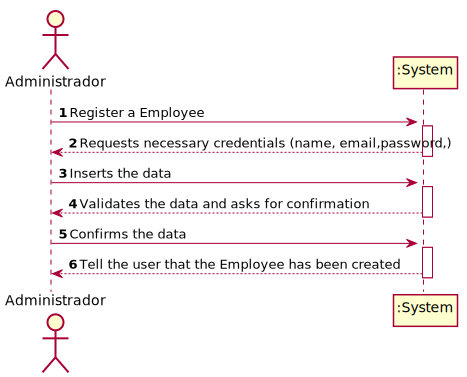
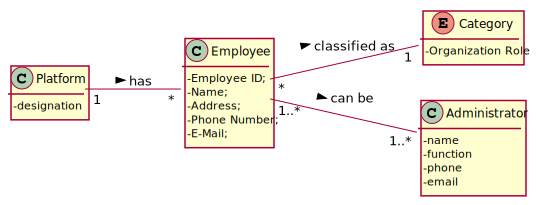
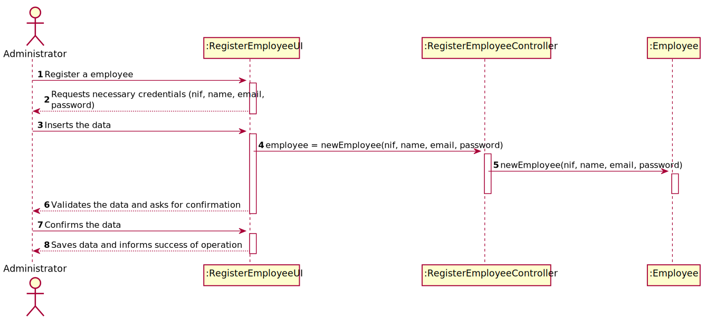
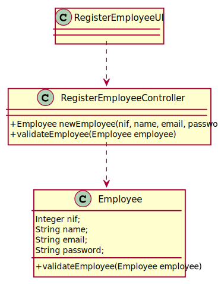

# US 006 - To create a Task 

## 1. Requirements Engineering

### 1.1. User Story Description

As an laboratory admin, I want to register a new emplyee in order to get access to the application.

### 1.2. Customer Specifications and Clarifications 

**From the specifications document:**

>	Each task is characterized by having a unique reference per organization, a designation, an informal and a technical description, an estimated duration and cost as well as the its classifying task category. 

>	As long as it is not published, access to the task is exclusive to the employees of the respective organization. 

**From the client clarifications:**

> **Question:** What kind of information does the company store about their employees and owned laboratories?
>  
> **Answer:** Employee ID;
Organization Role;
Name;
Address;
Phone Number;
E-Mail;
Standard Occupational Classification (SOC) code.
> 
> The Specialist Doctor has an additional attribute:
Doctor Index Number.

>Each Clinical Analysis Laboratory is characterized by the following attributes:
Laboratory ID;
Name;
Address;
Phone Number;
TIN number.

>The Chemical Laboratory is characterized by the following attributes:
Name;
Address;
Phone Number;
TIN number.

### 1.3. Acceptance Criteria

* **AC1:** All required fields must be filled in.
* **AC2:** Employee reference must have at least 5 alphanumeric chars.
* **AC3:** When creating a employee with an already existing reference, the system must reject such operation and the user must have the change to modify the typed reference.

### 1.4. Found out Dependencies

### 1.5 Input and Output Data

**Input Data:**

* Typed data:
	* Employee ID;
	* Name;
	* Address;
	* Phone Number;
	* E-Mail;
	* Standard Occupational Classification (SOC) code.
	
* Selected data:
	* Organization Role;

**Output Data:**

* List of existing employees
* (In)Success of the operation

### 1.6. System Sequence Diagram (SSD)

**Alternative 1**

### 1.7 Other Relevant Remarks

* The created task stays in a "not published" state in order to distinguish from "published" tasks.

## 2. OO Analysis

### 2.1. Relevant Domain Model Excerpt 

### 2.2. Other Remarks

n/a

## 3. Design - User Story Realization 

### 3.1. Rationale

**SSD - Alternative 1 is adopted.**

| Interaction ID | Question: Which class is responsible for... | Answer  | Justification (with patterns)  |
|:-------------  |:--------------------- |:------------|:---------------------------- |
| Step 1  		 |	... interacting with the actor? | RegisterEmployeeUI   |  Pure Fabrication: there is no reason to assign this responsibility to any existing class in the Domain Model.           |
| 			  		 |	... coordinating the US? | RegisterEmployeeController | Controller                             |
| 			  		 |	... instantiating a new Employee? | Administrator   | Creator (Rule 1): in the DM Employee is a administrator, but is the last one that creates new ones.   |
| 			  		 | ... knowing the user using the system?  | UserSession  | IE: cf. A&A component documentation.  |
| 			  		 |	... knowing to which organization the user belongs to? | Platform  | IE: has registed all Organizations |
| 			  		 |							 | Administrator   | IE: knows/has its own Employees|
| 			  		 |							 | Employee  | IE: knows its own data (e.g. email) |
| Step 2  		 |							 |             |                              |
| Step 3  		 |	...saving the inputted data? | Employee  | IE: object created in step 1 has its own data.  |
| Step 4  		 |	...knowing the employee roles to show? | Platform  | IE: Employee roles are defined by the Platform. |
| Step 5  		 |	... saving the selected category? | Employee  | IE: object created in step 1 is classified in one Employee.  |
| Step 6  		 |							 |             |                              |              
| Step 7  		 |	... validating all data (local validation)? | Employee | IE: owns its data.| 
| 			  		 |	... validating all data (global validation)? | Administrator | IE: knows all its employees.| 
| 			  		 |	... saving the created employee? | Employee | IE: owns all its employee.| 
| Step 8  		 |	... informing operation success?| RegisterEmployeeUI  | IE: is responsible for user interactions.  | 

### Systematization ##

According to the taken rationale, the conceptual classes promoted to software classes are: 

 * Administrator
 * Platform
 * Employee

Other software classes (i.e. Pure Fabrication) identified: 

 * RegisterEmployeeUI  
 * RegisterEmployeeController

## 3.2. Sequence Diagram (SD)

## 3.3. Class Diagram (CD)

# 4. Tests 

**Test 1:** Check that it is not possible to create an instance of the Task class with null values. 

	@Test(expected = IllegalArgumentException.class)
		public void ensureNullIsNotAllowed() {
		Task instance = new Task(null, null, null, null, null, null, null);
	}
	

**Test 2:** Check that it is not possible to create an instance of the Task class with a reference containing less than five chars - AC2. 

	@Test(expected = IllegalArgumentException.class)
		public void ensureReferenceMeetsAC2() {
		Category cat = new Category(10, "Category 10");
		
		Task instance = new Task("Ab1", "Task Description", "Informal Data", "Technical Data", 3, 3780, cat);
	}

*It is also recommended to organize this content by subsections.* 

# 5. Construction (Implementation)

## Class CreateTaskController 

		public boolean createTask(String ref, String designation, String informalDesc, 
			String technicalDesc, Integer duration, Double cost, Integer catId)() {
		
			Category cat = this.platform.getCategoryById(catId);
			
			Organization org;
			// ... (omitted)
			
			this.task = org.createTask(ref, designation, informalDesc, technicalDesc, duration, cost, cat);
			
			return (this.task != null);
		}

## Class Organization

		public Task createTask(String ref, String designation, String informalDesc, 
			String technicalDesc, Integer duration, Double cost, Category cat)() {
		
	
			Task task = new Task(ref, designation, informalDesc, technicalDesc, duration, cost, cat);
			if (this.validateTask(task))
				return task;
			return null;
		}

# 6. Integration and Demo 

* A new option on the Employee menu options was added.

* Some demo purposes some tasks are bootstrapped while system starts.

# 7. Observations

Platform and Organization classes are getting too many responsibilities due to IE pattern and, therefore, they are becoming huge and harder to maintain. 

Is there any way to avoid this to happen?

