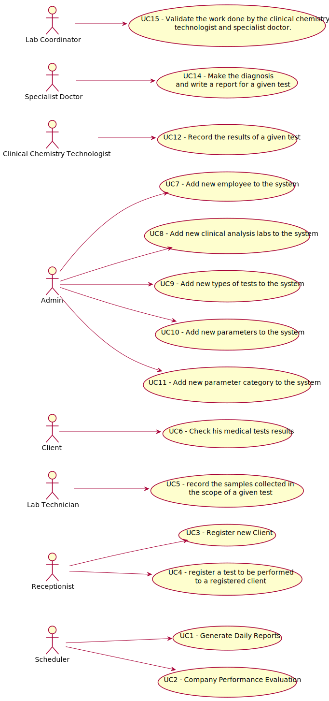

# Use Case Diagram (UCD)

# Use Cases / User Stories
| UC/US  | Description                                                               |                   
|:----|:------------------------------------------------------------------------|
| US3 - Register new client | [Register Client](US3/US3.md)   |
| US7 - Register new Employee | [Register Employee](US7/US7.md)  |
| US8 - Register new Clinical Analysis Lab| [Register C.A. Lab](US8/US8.md)|
| US9 - Register new Type of Test| [Register Type of Test](US9/US9.md)|
| US10 - Register new Parameter| [Register Parameter](US10/US10.md)|
| US11 - Register new Parameter Category| [Register P. Category](US11/US11.md)|

