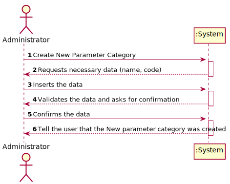
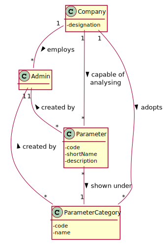

# US 011 - To create a new parameter category

## 1. Requirements Engineering

### 1.1. User Story Description

As an administrator, I want to specify a new parameter category.

### 1.2. Customer Specifications and Clarifications 

**From the specifications document:**

>	"Regardless, such tests rely on measuring one 
    or more parameters that can be grouped/organized by categories."
>
>   “Blood tests are frequently characterized by measuring several parameters which for presentation/reporting purposes are organized 
 by categories. For example, parameters such as the number of Red Blood Cells (RBC), White Blood Cells (RBC) and Platelets (PLT) are 
 usually presented under the blood count (Hemogram) category.”

**From the client clarifications:**

> **Question:** What are the information related to a Parameter Category?
>  
> **Answer:** Each category has a name, unique code. There are no subcategories.

> **Question:** What are the formats of the attributes of one category?
>
> **Answer:** Name: is a string with no more than 10 characters;
>
> Code: are five alphanumeric characters. The code is unique and is not automatically generated.

### 1.3. Acceptance Criteria

* **AC1:** All required fields must be filled in.
* **AC2:** Each category must have a name and a unique code.
* **AC3:** When creating a new category with the same name and code as one previously registered in the system, 
the application should deny the operation and inform the user to change the parameters or discard the operation.
* **AC4:** Code must be unique having 5 chars
* **AC5:** Name cannot have more than 10 characters

### 1.4. Found out Dependencies

* No dependencies were found.

### 1.5 Input and Output Data

**Input Data:**

* Typed data:
	* Parameter category name.
	* Parameter category code.
	
* Selected data:
	* (none)

**Output Data:**
* Success or failure in the operation.

### 1.6. System Sequence Diagram (SSD)

### 1.7 Other Relevant Remarks

## 2. OO Analysis

### 2.1. Relevant Domain Model Excerpt 

### 2.2. Other Remarks

n/a

## 3. Design - User Story Realization 

### 3.1. Rationale

| Interaction ID | Question: Which class is responsible for... | Answer  | Justification (with patterns)  |
|:-------------  |:--------------------- |:------------|:---------------------------- |
| Step 1: Start new parameter category |... interacting with the actor? | CreateNewParameterCategoryUI    | UI Layer is always responsible for user interactions |         
| Step 2: Ask for the data |... requesting data needed? | CreateNewParameterCategoryUI | UI Layer is responsible for user interaction |
| Step 4: Create new parameter category |... send command to create new parameter category? | CreateNewParameterCategoryController | Controller makes the bridge between UI layer and Domain Layer| 
| Step 5: Initiate store process|... start the store process for the parameter category being created? | Company | HC+LC: Company delegates some of its responsibilities to other classes |      
| Step 6: Create new parameter category |... instantiating new parameter category? | ParameterCategoryStore | Creator: R1/2 |      
| Step 7: Save Data |... saving the introduced data? | ParameterCategory  | IE: instance of object created has its own data.  |
| Step 8: Validate parameter category |... validating all data (local validation)? | ParameterCategoryStore | IE: knows its own data.| 
| Step 9: Present data to user |...requesting confirmation for data introduced? | CreateNewParameterCategoryUI | UI Layer is responsible for user interaction |
| Step 11: Save parameter category |... send command to save the created parameter category? | CreateNewParameterCategoryController | Controller makes the bridge between UI layer and Domain Layer| 
| Step 12: Save parameter category |... saving the created parameter category? | ParameterCategoryStore | IE: stores all parameter category created| 
| Step 13: Validate parameter category globally |... validating all data at global level? | ParameterCategoryStore | IE: Company Knows all existing Parameter Category| 
| Step 14: Add parameter category |... add created parameter category to the list? | ParameterCategoryStore | IE: Responsible to add new Parameter Categories to the list| 
| Step 15: Operation success |... informing operation success?| CreateNewParameterCategoryUI | UI Layer is responsible for user interactions.  | 

### Systematization ##

According to the taken rationale, the conceptual classes promoted to software classes are: 

 * Company
 * ParameterCategory
 * ParameterCategoryStore

Other software classes (i.e. Pure Fabrication) identified: 

 * NewParameterCategoryUI  
 * CreateNewParameterCategoryController

## 3.2. Sequence Diagram (SD)

## 3.3. Class Diagram (CD)

# 4. Tests 

**Test 1:** Check that it is not possible to create an instance of the NewParameterCategory class with same parameters as an existing parameter category - AC3.

	@Test
    public void ensureCannotAddSameParameterTwice(){
        Parameter p1 = ps.createParameter("12345", "Cells", "Whatever", "hemograms");
        Parameter p2 = ps.createParameter("12345", "Cells", "Whatever", "hemograms");
        ps.saveParameter(p1);
        assertFalse(ps.saveParameter(p2));
    }
	

**Test 2:** Check that it is not possible to create an instance of the NewParameterCategory class with missing parameters - AC1.

	@Test(expected = IllegalArgumentException.class)
    public void ensureCodeCannotBeBlank() {
        new Parameter("", "Blood", "Test Blood Cells", "hemograms");
    }   

**Test 3:** Check that it is not possible to create an instance of the NewParameterCategory with a code composed with more or less than 5 chars - AC4.

     @Test(expected = IllegalArgumentException.class)
     public void ensureCodeCannotHaveMoreThan5Char() {
         new ParameterCategory("120121", "hemograms");
     }
    
     @Test(expected = IllegalArgumentException.class)
     public void ensureCodeCannotHaveLessThan5Char() {
         new ParameterCategory("120", "hemograms");
     }   

**Test 4:** Check that it is not possible to create an instance of the NewParameterCategory with a code composed with more than 10 chars - AC5.

    @Test(expected = IllegalArgumentException.class)
    public void ensureNameCannotHaveMoreThan10Char() {
        new ParameterCategory("12012", "hemograms12");
    }
# 5. Construction (Implementation)

## Class CreateParameterCategoryController

    public class CreateParameterCategoryController {

        private ParameterCategoryStore pcStore;
        private ParameterCategory pc;
    
        public CreateParameterCategoryController() {
            this(App.getInstance().getCompany().getParameterCategoryStore());
        }
    
        public CreateParameterCategoryController(ParameterCategoryStore pcStore) {
            this.pcStore = pcStore;
            this.pc = null;
        }
    
        public boolean createNewParameterCategory(String code, String name){
            this.pc = this.pcStore.createParameterCategory(code, name);
            return this.pcStore.validateParameterCategory(pc);
        }
    
        public boolean saveParameterCategory(){
            return this.pcStore.saveParameterCategory(pc);
        }
    }

# 6. Integration and Demo 

# 7. Observations

