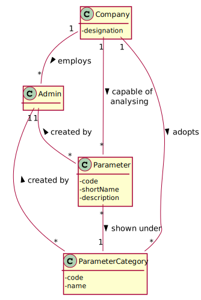
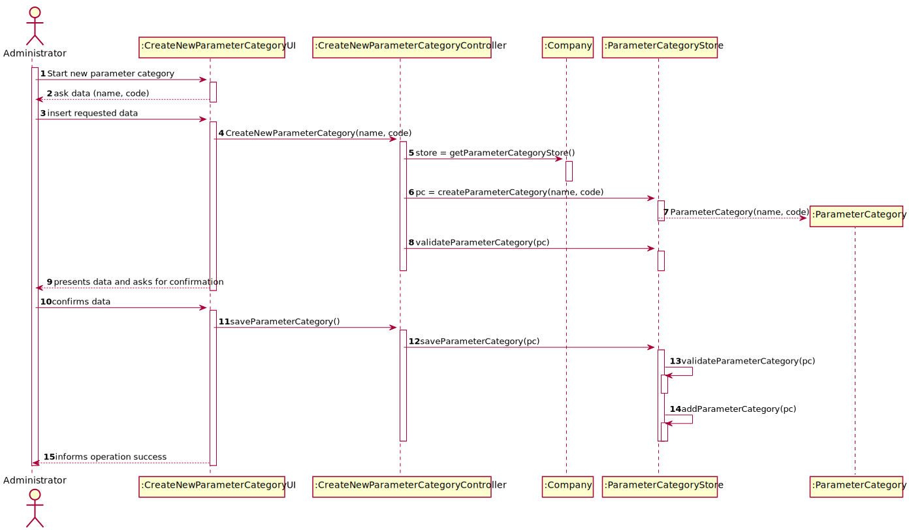
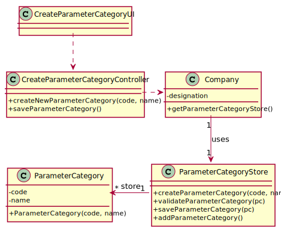

# US 006 - To create a new parameter category

## 1. Requirements Engineering

### 1.1. User Story Description

As an administrator, I want to specify a new parameter category.

### 1.2. Customer Specifications and Clarifications 

**From the specifications document:**

>	"Regardless, such tests rely on measuring one 
    or more parameters that can be grouped/organized by categories."
>
>   “Blood tests are frequently characterized by measuring several parameters which for presentation/reporting purposes are organized 
 by categories. For example, parameters such as the number of Red Blood Cells (RBC), White Blood Cells (RBC) and Platelets (PLT) are 
 usually presented under the blood count (Hemogram) category.”

**From the client clarifications:**

> **Question:** What are the information related to a Parameter Category?
>  
> **Answer:** Each category has a name, description, unique code and an NHS identifier. There are no subcategories.

### 1.3. Acceptance Criteria

* **AC1:** All required fields must be filled in.
* **AC2:** Each category must have a name, and a unique code
* **AC3:** When creating a new category with the same name and code as one previously registered in the system, 
the application should deny the operation and inform the user to change the parameters or discard the operation.
* **AC4:** Code must be unique having 4 to 8 chars
* **AC5:** Description cannot be empty and has, at maximum, 40 chars
* **AC6:** NHS identifier is not mandatory

### 1.4. Found out Dependencies
* No dependencies were found.

### 1.5 Input and Output Data

**Input Data:**

* Typed data:
	* Name;
	* Unique code.
	* NHS identifier.
	* Description
	
* Selected data:
	* (none)

**Output Data:**

* Success or insuccess of the operation

### 1.6. System Sequence Diagram (SSD)

**Alternative 1**

### 1.7 Other Relevant Remarks

## 2. OO Analysis

### 2.1. Relevant Domain Model Excerpt 

### 2.2. Other Remarks

n/a

## 3. Design - User Story Realization 

### 3.1. Rationale

**SSD - Alternative 1 is adopted.**

| Interaction ID | Question: Which class is responsible for... | Answer  | Justification (with patterns)  |
|:-------------  |:--------------------- |:------------|:---------------------------- |
| Step 1  		 |	... interacting with the actor? | CreateNewParameterCategoryUI    |  Pure Fabrication: there is no reason to assign this responsibility to any existing class in the Domain Model.           |
| 			  		 |	... coordinating the US? | CreateNewParameterCategoryController | Controller                             |
| 			  		 |	... instantiating a new parameter category? | Administrator   | Creator (Rule 1): in the DM, Administrator is an Employee, but is the first one that creates new ones.   |
| 			  		 | ... knowing the user using the system?  | UserSession  | IE: cf. A&A component documentation.  |
| 			  		 |	... knowing to which organization the user belongs to? | Platform  | IE: has registed all Organizations |
| 			  		 |							 | Administrator   | IE: knows/has its own Employees|
| 			  		 |							 | Employee  | IE: knows its own data (e.g. email) |
| Step 2  		 |							 |             |                              |
| Step 3  		 |	...saving the inputted data? | Employee  | IE: object created in step 1 has its own data.  |
| Step 4  		 |	...knowing the employee roles to show? | Platform  | IE: Employee roles are defined by the Platform. |
| Step 5  		 |	... saving the selected category? | Employee  | IE: object created in step 1 is classified in one Employee.  |
| Step 6  		 |							 |             |                              |              
| Step 7  		 |	... validating all data (local validation)? | Employee | IE: owns its data.| 
| 			  		 |	... validating all data (global validation)? | Administrator | IE: knows all its employees.| 
| 			  		 |	... saving the created employee? | Employee | IE: owns all its employee.| 
| Step 8  		 |	... informing operation success?| RegisterEmployeeUI  | IE: is responsible for user interactions.  | 

### Systematization ##

According to the taken rationale, the conceptual classes promoted to software classes are: 

 * Administrator
 * Platform
 * Employee

Other software classes (i.e. Pure Fabrication) identified: 

 * NewParameterCategoryUI  
 * CreateNewParameterCategoryController

## 3.2. Sequence Diagram (SD)

## 3.3. Class Diagram (CD)

# 4. Tests 

**Test 1:** Check that it is not possible to create an instance of the NewParameterCategory class with same parameters as an existing parameter category - AC3.

	@Test(expected = IllegalArgumentException.class)
		public void ensureNullIsNotAllowed() {
		Task instance = new Task(null, null, null, null, null, null, null);
	}
	

**Test 2:** Check that it is not possible to create an instance of the NewParameterCategory class with no parameters assigned to it - AC1.

	@Test(expected = IllegalArgumentException.class)
		public void ensureReferenceMeetsAC2() {
		Category cat = new Category(10, "Category 10");
		
		Task instance = new Task("Ab1", "Task Description", "Informal Data", "Technical Data", 3, 3780, cat);
	}

# 5. Construction (Implementation)

## Class CreateTaskController 

		

## Class Organization

# 6. Integration and Demo 

# 7. Observations

