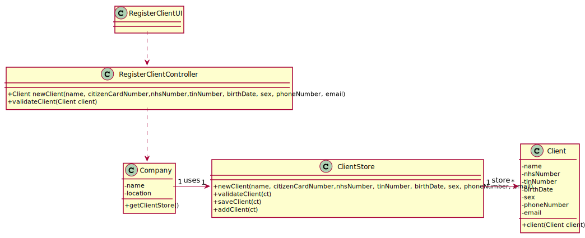

# US 03 - To register a new client

## 1. Requirements Engineering

### 1.1. User Story Description

*As a receptionist of the laboratory, I want to register a client in order to access the application.*

### 1.2. Customer Specifications and Clarifications 
*From the Specification Document:*

> "Typically, the client arrives at one of the clinical analysis laboratories with a lab order prescribed by
a doctor. Once there, a receptionist asks the client’s citizen card number, the lab order (which
contains the type of test and parameters to be measured), and registers in the application the test to
be performed to that client."
>
> "In case of a new client, the receptionist registers the client in the application. To register a client, the
receptionist needs the client’s citizen card number, National Healthcare Service (NHS) number,
birth date, sex, Tax Identification number (TIN), phone number, e-mail and name."
  
*From the Client Specifications:*

> **Question:** What attributes a Receptionist have? 
>
>**Answer:** 
Employee ID;
Organization Role;
Name;
Address;
Phone Number;
E-Mail;
Standard Occupational Classification (SOC) code.

### 1.3. Acceptance Criteria

* **AC1:** The client must become a system user.
* **AC2:** The "auth" component available on the repository must be reused (without modifications).
* **AC3:** There are some formats that need to be respected like: Citizen Card must have a 16 digit number; NHS must have a 10 digit number; Birth Date must be in DD/MM/YY format; only two genders available (Male/Female); Phone number must have an 11 digit number.
* **AC4:** The phone number is not mandatory.
* **AC5:** The sex of the client is optional.
* **AC6:** When registering a client with an already existing data, the system must reject such operation with an error and the user must have the change to modify the typed reference.

### 1.4. Found out Dependencies

There is dependency with the US07 - Register an employee, because in order to register a new client the system
must have a receptionist logged in, so the receptionist can register the client.

### 1.5 Input and Output Data

*Input Data*

-Typed Data: Name; Address; Phone Number; E-Mail; Citizen Card number; TIN number; Birth date; Sex.

-Output Data: (In)Success of the operation.

*Identity here the data to be inputted by the system actor as well as the output data that the system have/needs to present in order to properly support the actor actions. Regarding the inputted data, it is suggested to distinguish between typed data and selected data (e.g. from a list)*

### 1.6. System Sequence Diagram (SSD)

### 1.7 Other Relevant Remarks

*Use this section to capture other relevant information that is related with this US such as (i) special requirements ; (ii) data and/or technology variations; (iii) how often this US is held.* 

## 2. OO Analysis

### 2.1. Relevant Domain Model Excerpt

### 2.2. Other Remarks

*Use this section to capture some additional notes/remarks that must be taken into consideration into the design activity. In some case, it might be usefull to add other analysis artifacts (e.g. activity or state diagrams).* 

## 3. Design - User Story Realization 

### 3.1. Rationale

**The rationale grounds on the SSD interactions and the identified input/output data.**

| Interaction ID | Question: Which class is responsible for... | Answer  | Justification (with patterns)  |
|:-------------  |:--------------------- |:------------|:---------------------------- |
| Step 1/Msg 1: register a new client                     | ... instantiating a new Client?               |  Receptionist             | Creator (Rule 1): in the DM Receptionist add Client |
|                                                         | ... interacting with the actor?               |  RegisterClientUI         | Pure Fabrication: there is no reason to assign this responsibility to any existing class in the Domain Model |
|                                                         | ... coordination the US?                      |  RegisterClientController | Controller                                      |
|                                                         | ... asking for the needed data?               |  RegisterClientController | Controller                                      |
|                                                         | ... knowing the user using the system?        |  UserSession              | IE: cf. A&A component documentation             |
|                                                         |                                               |  Company                  | IE: knows/has its own Clients                   |
|                                                         |                                               |  Client                   | IE: knows its own data                          |
| Step 2/Msg 2: request mandatory data (Citizen Card number, NHS number, TIN number, Birth day, sex) and optional data (Phone number) | n/a |                                           |
| Step 3/Msg 3: insert the data                           |	... saving the input data                     |  ClientStore              | IE: object created in step 1 has its own data   |
| Step 4/Msg 4: shows the data and request a confirmation |	... validating locally all the data?          |  Client                   | IE: knows its own data                          |
|                                                         | ... validating globally all the data?         |  Company                  | IE: knows all the Client objects                |
| Step 5/Msg 5: confirms the data                         | ... saving the registered client?	          |  Client                   | IE: owns all its client                         |
| Step 6/Msg 6: informs operation success                 |	... informing operation success?              |  RegisterClientUI         | IE: responsible for user interaction            |              

### Systematization ##

According to the taken rationale, the conceptual classes promoted to software classes are: 

 * Company
 * Client
 * ClientStore

Other software classes (i.e. Pure Fabrication) identified: 
 * RegisterClientUI  
 * RegisterClientController

## 3.2. Sequence Diagram (SD)

## 3.3. Class Diagram (CD)

# 4. Tests 
*In this section, it is suggested to systematize how the tests were designed to allow a correct measurement of requirements fulfilling.* 

**_DO NOT COPY ALL DEVELOPED TESTS HERE_**

**Test 1:** Check that it is not possible to create an instance of the Client class with null values. 

	@Test(expected = IllegalArgumentException.class)
		public void ensureNullIsNotAllowed() {
		Client instance = new Client(null, null, null, null, null, null, null);
	}

*It is also recommended to organize this content by subsections.* 

# 5. Construction (Implementation)

*In this section, it is suggested to provide, if necessary, some evidence that the construction/implementation is in accordance with the previously carried out design. Furthermore, it is recommeded to mention/describe the existence of other relevant (e.g. configuration) files and highlight relevant commits.*

#Class RegisterClientController

		public boolean newClient(String name, String email, 
			int nhsNumber, String birthDate, String sex, int phoneNumber)() {
		
			Client clt = this.platform.getClientByName(cltName);
			
			Organization org;
			// ... (omitted)
			
			this.client = org.newClient(name, email, nhsNumber, birthDate, sex, phoneNumber, clt);
			
			return (this.client != null);
		}

## Class Company

		public Client newClient(String name, String email, 
			int nhsNumber, String birthDate, String sex, int phoneNumber)() {
		
	
			Client client = new Client(name, email, nhsNumber, birthDate, sex, phoneNumber, clt);
			if (this.validateClient(client))
				return client;
			return null;
		}
 

# 6. Integration and Demo 

*In this section, it is suggested to describe the efforts made to integrate this functionality with the other features of the system.*

# 7. Observations

*In this section, it is suggested to present a critical perspective on the developed work, pointing, for example, to other alternatives and or future related work.*

