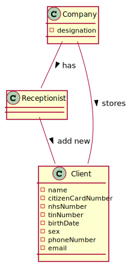

# US 03 - To register a new client

## 1. Requirements Engineering

### 1.1. User Story Description

*As a receptionist of the laboratory, I want to register a client in order to access the application.*

### 1.2. Customer Specifications and Clarifications 
*From the Specification Document:*

> "Typically, the client arrives at one of the clinical analysis laboratories with a lab order prescribed by
a doctor. Once there, a receptionist asks the client’s citizen card number, the lab order (which
contains the type of test and parameters to be measured), and registers in the application the test to
be performed to that client."
>
> "In case of a new client, the receptionist registers the client in the application. To register a client, the
receptionist needs the client’s citizen card number, National Healthcare Service (NHS) number,
birth date, sex, Tax Identification number (TIN), phone number, e-mail and name."
  
*From the Client Specifications:*

> **Question:** What attributes a Receptionist have? 
>
>**Answer:** 
Employee ID;
Organization Role;
Name;
Address;
Phone Number;
E-Mail;
Standard Occupational Classification (SOC) code.
> 
> **Question:** What attributes a Client have?
>
>**Answer:**
Name;
Citizen Card Number
NHS number
TIN number
Birth Date
Sex
Phone number
Email
.

### 1.3. Acceptance Criteria

* **AC1:** The client must become a system user.
* **AC2:** The "auth" component available on the repository must be reused (without modifications).
* **AC3:** There are some formats that need to be respected like: name have a maximum of 35 characters, Citizen Card must have a 16 digit number; NHS must have a 10 digit number; Birth Date must be in DD/MM/YYYY format; only two genders available (Male/Female); Phone number must have an 11 digit number.
* **AC4:** The sex of the client is optional.
* **AC5:** When registering a client with an already existing data, the system must reject such operation with an error and the user must have the change to modify the typed reference.

### 1.4. Found out Dependencies

There is dependency with the US07 - Register an employee, because in order to register a new client the system
must have a receptionist logged in, so the receptionist can register the client.

### 1.5 Input and Output Data

*Input Data*

-Typed Data: Name; Citizen Card Number; NHS number; TIN number; Birth Date; Sex; Phone Number; Email.

-Output Data: The client receives an email with the registration confirmation and his password
(In)Success of the operation.

*Identity here the data to be inputted by the system actor as well as the output data that the system have/needs to present in order to properly support the actor actions. Regarding the inputted data, it is suggested to distinguish between typed data and selected data (e.g. from a list)*

### 1.6. System Sequence Diagram (SSD)

### 1.7 Other Relevant Remarks

*Use this section to capture other relevant information that is related with this US such as (i) special requirements ; (ii) data and/or technology variations; (iii) how often this US is held.* 

## 2. OO Analysis

### 2.1. Relevant Domain Model Excerpt

### 2.2. Other Remarks

*Use this section to capture some additional notes/remarks that must be taken into consideration into the design activity. In some case, it might be usefull to add other analysis artifacts (e.g. activity or state diagrams).* 

## 3. Design - User Story Realization 

### 3.1. Rationale

**The rationale grounds on the SSD interactions and the identified input/output data.**

| Interaction ID | Question: Which class is responsible for... | Answer  | Justification (with patterns)  |
|:-------------  |:--------------------- |:------------|:---------------------------- |
| Step 1: Start new parameter |... interacting with the actor? | RegisterAnewClientUI | UI Layer is always responsible for user interactions |         
| Step 2: Ask for the data |... requesting data needed? | RegisterAnewClientUI | UI Layer is responsible for user interaction |
| Step 4: Create new parameter |... send command to register a new client? | RegisterClientController | Controller makes the bridge between UI layer and Domain Layer|
| Step 5: Initiate store process|... start the store process for the client being registered? | Company | HC+LC: Company delegates some of its responsibilities to other classes |      
| Step 6: Register new Client |... instantiating new Client? | ClientStore | Creator: R1/2 |      
| Step 7: Save Data |... saving the introduced data? | Client | IE: instance of object created has its own data.  |
| Step 8: Validate client |... validating all data (local validation)? | ClientStore | IE: knows its own data.|
| Step 9: Present data to user |...requesting confirmation for data introduced? | RegisterAnewClient | UI Layer is responsible for user interaction |
| Step 11: Save client |... send command to save the created client? | CreateNewParameterController | Controller makes the bridge between UI layer and Domain Layer|
| Step 12: Save client |... saving the created client? | ClientStore | IE: stores all parameters created|
| Step 13: Validate client globally |... validating all data at global level? | ClientStore | IE: Company Knows all existing Clients|
| Step 14: Add client |... add created parameter to the list? | ClientStore | IE: Responsible to add new Client to the list|
| Step 15: Operation success |... informing operation success?| RegisterAnewClientUI | UI Layer is responsible for user interactions.  |

### Systematization ##

According to the taken rationale, the conceptual classes promoted to software classes are:
 * Company
 * Client
 * ClientStore

Other software classes (i.e. Pure Fabrication) identified: 
 * RegisterClientUI  
 * RegisterClientController

## 3.2. Sequence Diagram (SD)

## 3.3. Class Diagram (CD)

# 4. Tests 
*In this section, it is suggested to systematize how the tests were designed to allow a correct measurement of requirements fulfilling.* 

**_DO NOT COPY ALL DEVELOPED TESTS HERE_**

**Test 1:** Check that it is not possible to create an instance of the Client class with null values. 

	 @Test(expected = NullPointerException.class)
    public void garanteeNullClientIsntCreatedWithAllDataAndSex() {
        new Client(null, null, null, null, null, null, null, null);
    }

**Test 2:** Check that it is not possible to create an instance of the Client class with null values.

	 @Test(expected = NullPointerException.class)
    public void garanteeNullClientIsntCreatedWithAllDataAndSex() {
        new Client(null, null, null, null, null, null, null, null);
    }

*It is also recommended to organize this content by subsections.* 

# 5. Construction (Implementation)

*In this section, it is suggested to provide, if necessary, some evidence that the construction/implementation is in accordance with the previously carried out design. Furthermore, it is recommeded to mention/describe the existence of other relevant (e.g. configuration) files and highlight relevant commits.*

#Class RegisterClientController

    public class RegisterClientController {
        private ClientStore ctStore;
        private Client ct;

    private AuthFacade authFacade;

    public RegisterClientController() {
        this(App.getInstance().getCompany());
    }

    public RegisterClientController(Company company) {
        this.ctStore= company.getClientStore();
        this.authFacade = company.getAuthFacade();
        this.ct = null;
    }

    private boolean addUserToSystem(String name, String email, String role) {
        return CommonMethods.addUserToSystem(name, email, role, this.authFacade);
    }

    public List<Client> getClientList(){
        return App.getInstance().getCompany().getClientStore().getClientList();
        }
    }

## Class Client

    public Client(String name, String citizenCardNumber, String nhsNumber, String tinNumber, String birthDate, String sex, String phoneNumber, String email) {
        setName(name);
        setCitizenCardNumber(citizenCardNumber);
        setNhsNumber(nhsNumber);
        setTinNumber(tinNumber);
        setBirthDate(birthDate);
        setSex(sex);
        setPhoneNumber(phoneNumber);
        setEmail(email);
    }

    public Client(String name, String citizenCardNumber, String nhsNumber, String tinNumber, String birthDate, String phoneNumber, String email) {
        setName(name);
        setCitizenCardNumber(citizenCardNumber);
        setNhsNumber(nhsNumber);
        setTinNumber(tinNumber);
        setBirthDate(birthDate);
        this.sex = SEX_BY_OMISSION;
        setPhoneNumber(phoneNumber);
        setEmail(email);
    }
 

# 6. Integration and Demo 

*In this section, it is suggested to describe the efforts made to integrate this functionality with the other features of the system.*

# 7. Observations

*In this section, it is suggested to present a critical perspective on the developed work, pointing, for example, to other alternatives and or future related work.*

