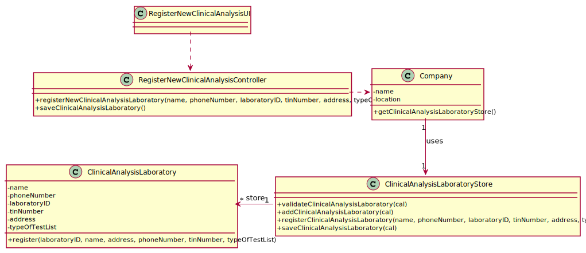

# US 008 -  Register a new clinical analysis laboratory

## 1. Requirements Engineering

### 1.1. User Story Description

As an administrator, I want to register a new clinical analysis laboratory stating which
kind of test(s) it operates.

### 1.2. Customer Specifications and Clarifications 

**From the specifications document:**

>	All clinical analysis laboratories perform clinical blood tests, and a subset of
these laboratories also performs Covid-19 tests. 

**From the client clarifications:**

> **Question:** What information is associated with a clinical Analysis laboratory?(e.g. designation, localization...) 

> **Answer:** Each Clinical Analysis Laboratory is characterized a Laboratory ID, Name, Address, Phone Number, TIN number.

> **Question:** What rules are applicable to such data?
  
> **Answer:** The Chemical Laboratory is characterized by the following attributes: Name; Address; Phone Number;TIN number.
>Many labs has only one chemical lab.

> **Question:** When the administrator is registering a Clinical Analysis Laboratory and typing the information does he type the laboratory ID or is it generated by the system afterwards?

> **Answer:** The Laboratory ID is introduced manually.

> **Question:** What defines a test type category?

> **Answer:** Each category has a name and a unique code. There are no subcategories.

> **Question** When starting a new clinical analysis laboratory registration, should the entered requested data be showed to the user for confirmation purposes?

> **Answer** It is always a good practice to validate and ask for confirmation.

> **Question** Which type/format has LaboratoryID, address, name, phone number, and TIN number on Clinical Analysis Laboratory?
 
> **Answer** Each Clinical Analysis Laboratory is characterized by the following attributes:
Laboratory ID: five alphanumeric characters;
Name: A string with no more than 20 characters;
Address: A string with no more than 30 characters;
Phone Number: 11 digit number;
TIN number: 10 digit number;
Type of tests performed by the lab.
All information is required.

> **Question** Are two Clinical Analysis Laboratories with the same:
a) Laboratory ID OR
b) name OR
c) address OR
d) phone Number OR
e) TIN number
allowed to exist?

> **Answer** Only the name of two CAL can be same.

> **Question** Can a parameter be classified in more than one parameter category?

> **Answer** No. Each parameter has only one category. There are no subcategories. 
### 1.3. Acceptance Criteria

* **AC1:** All required fields must be filled in.
* **AC2:** Phone number must have 11 digits
* **AC3:** TIN must have 10 digits
* **AC4:** Address:Cannot have more than 30 characters
* **AC5:** Laboratory ID: five alphanumeric characters
* **AC6:** Name:Cannot have more than 20 characters

### 1.4. Found out Dependencies

* There is a dependency to "US09 Specify a new type of test" since a test type must exist in order to state the type of test performed in a laboratory.

### 1.5 Input and Output Data

**Input Data:**
    
    * phoneNumber
	* name
    * tinNumber
	* laboratoryID (only for clinical analysis laboratories)
	* address
    *typeOfTest
	
**Selected data**
* Type of test 

**Output Data:**
* (In)Success of the operation

### 1.6. System Sequence Diagram (SSD)

**Alternative 1**

**Alternative 2**

**Other alternatives might exist.**

### 1.7 Other Relevant Remarks
n/a.

## 2. OO Analysis

### 2.1. Relevant Domain Model Excerpt 

### 2.2. Other Remarks

n/a

## 3. Design - User Story Realization 

### 3.1. Rationale

**SSD - Alternative 1 is adopted.**

| Interaction ID | Question: Which class is responsible for... | Answer  | Justification (with patterns)  |
|:-------------  |:--------------------- |:------------|:---------------------------- |
| Step 1 |Register a New Clinical Analysis Laboratory|... interacting with the actor? | RegisterNewClinicalAnalysisLaboratoryUI   | UI Layer is always responsible for user interactions|
| Step 2 |Request for the necessary credentials|... requesting credentials needed? | RegisterNewClinicalAnalysisUI | UI Layer is responsible for user interaction |
| Step 4 |Register New Clinical Analysis Laboratory|	send command to create new clinical analysis laboratory? | NewClinicalAnalysisController | Controller makes the bridge between UI layer and Domain Layer |
| Step 5 |Initiate store process|... start the store process for the clinical analysis laboratory being created? | Company | HC+LC: Company delegates some of its responsibilities to other classes |
| Step 6 |Register New Clinical Analysis Laboratory|... instantiating new parameter category? | ParameterCategoryStore | Creator: R1/2 | 			  		 |	... knowing to which organization the user belongs to? | Platform  | IE: has registed all Organizations |
| Step 7 |Save Data |... saving the introduced data? | ParameterCategory  | IE: instance of object created has its own data.  |
| Step 8 |Validate Clinical Analysis Laboratory |... validating all data (local validation)? | ClinicalAnalysisLaboratoryStore | IE: knows its own data.| 
| Step 9 |Present data to user |...requesting confirmation for data introduced? | RegisterNewClinicalAnalysisUI | UI Layer is responsible for user interaction |
| Step 11| Save Clinical Analysis Laboratory |... send command to save the created Clinical Analysis Laboratory? | NewClinicalAnalysisController | Controller makes the bridge between UI layer and Domain Layer| 
| Step 12| Save Clinical Analysis Laboratory |... saving the created Clinical Analysis Laboratory? | ClinicalAnalysisLaboratoryStore | IE: stores all Clinical Analysis Laboratories created| 
| Step 13| Validate Clinical Analysis Laboratory |... validating all data at global level? | ClinicalAnalysisLaboratoryStore | IE: Company Knows all existing Clinical Analysis Laboratories| 
| Step 14| Add Clinical Analysis Laboratory |... add created clinical analysis laboratory to the list? | ClinicalAnalysisLaboratoryStore | IE: Responsible to add Clinical Analysis Laboratories to the list| 
| Step 15| Operation success |... informing operation success?| RegisterNewClinicalAnalysisUI | UI Layer is responsible for user interactions.  |   | 

### Systematization ##

According to the taken rationale, the conceptual classes promoted to software classes are: 

* Company
* ClinicalAnalysisLaboratory
* ClinicalAnalysisLaboratoryStore

Other software classes (i.e. Pure Fabrication) identified: 

* RegisterNewClinicalAnalysisUI
* RegisterNewClinicalAnalysisController

## 3.2. Sequence Diagram (SD)

**Alternative 1**

**Alternative 2**

## 3.3. Class Diagram (CD)

**From alternative 1**

# 4. Tests 

**Test 1:** Check that it is not possible to create an instance of the Task class with null values. 

	
	

**Test 2:** Check that it is not possible to create an instance of the Task class with a reference containing less than five chars - AC2. 

	

*It is also recommended organizing this content by subsections.* 

# 5. Construction (Implementation)

## Class CreateTaskController 

## Class Organization

# 6. Integration and Demo 

A new option on the Receptionist menu options was added.

# 7. Observations

No observations.

