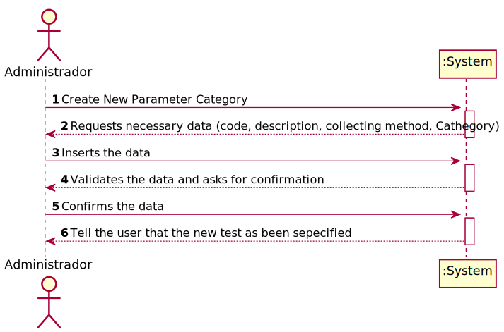
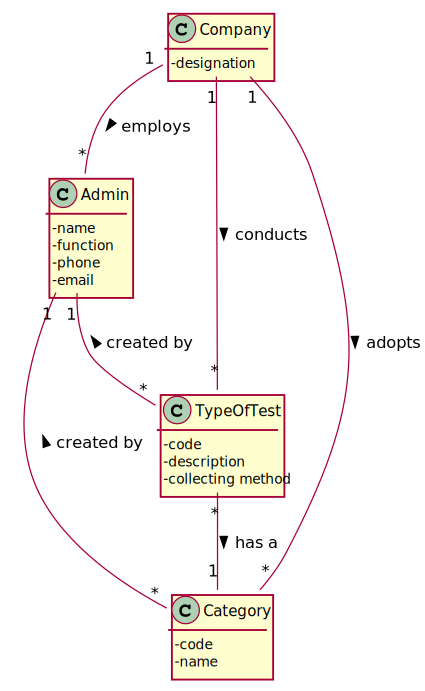
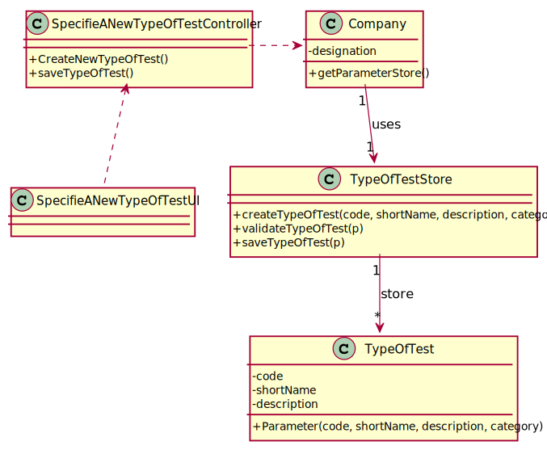

# US 09 - Specify a new type of test

## 1. Requirements Engineering

### 1.1. User Story Description

* As an administrator, I want to specify a new type of test and its collecting methods.

### 1.2. Customer Specifications and Clarifications 
*From the Specification Document:*

>"Each test is characterized by an internal code, an NHS
code, a description that identifies the sample collection method, the date and time when the samples
were collected, the date and time of the chemical analysis, the date and time of the diagnosis made
by the specialist doctor, the date and time when the laboratory coordinator validated the test, and the
test type (whether it is blood test or Covid test)."

>"Despite being out of scope, the system should be developed having in mind the need to
easily support other kinds of tests (e.g., urine). Regardless, such tests rely on measuring one
or more parameters that can be grouped/organized by categories."

*From the client clarifications:*

> **Question:** In the US9 what do you mean by the collecting methods and  what collecting methods  are available?
>
> **Answer:** To make a Covid test you need a swab to collect a sample. To make a blood test you need sample tubes and a syringe.
>When the administrator (US9) specifies a new type of test, the administrator also specifies the method to collect a sample.
> The administrator introduces a brief description for each collecting method.

>**Question:** Does a type of test holds any attribute besides it's name and collecting methods?
>
>**Answer:**The attributes for a new test type are:
            Code: five alphanumeric characters. The code is not automatically generated.
            Description: a string with no more than 15 characters.
            Collecting Method: a string with no more than 20 characters.
            Each test type should have a set of categories. Each category should be chosen from a list of categories.
            From a previous post: "Each category has a name and a unique code. There are no subcategories."

### 1.3. Acceptance Criteria

* **AC1:** All required fields must be filled in.
* **AC2:** The colecting method description neds the materials used and have no more than 20 characters.
* **AC3:** The code must have 5 alphanumeric characters written.
* **AC4:** The Description must have no more than 15 characters.
* **AC5:** There exists only one collection method per test type.

### 1.4. Found out Dependencies
 
 UC11:As an administrator, I want to specify a new parameter category.

### 1.5 Input and Output Data

**Input Data:**
* Typed data:
    *code
    *description
    *collecting method
    
* Selected data:
    *Cathegory
 
**Output Data:**
*(In)Success of the operation

### 1.6. System Sequence Diagram (SSD)

### 1.7 Other Relevant Remarks

n/a

## 2. OO Analysis

### 2.1. Relevant Domain Model Excerpt 

### 2.2. Other Remarks

n/a

## 3. Design - User Story Realization 

### 3.1. Rationale
**SSD - Alternative 1 is adopted.**

| Interaction ID | Question: Which class is responsible for... | Answer  | Justification (with patterns)  |
|:-------------  |:--------------------- |:------------|:---------------------------- |
| Step 1: Specifie a New Type of test  |... interacting with the actor? | SpecifieANewTypeOfTestUI    | UI Layer is always responsible for user interactions |         
| Step 2: Requests necessary data |... requesting data needed? | SpecifieANewTypeOfTestUI | UI Layer is responsible for user interaction |
| Step 4: Create new type of test |... send command to create new type of test? | SpecifieANewTypeOfTestController | Controller makes the bridge between UI layer and Domain Layer|
| Step 5: Initiate store process|... start the store process for the type of test being created? | Company | HC+LC: Company delegates some of its responsibilities to other classes |      
| Step 6: Create new type of test |... instantiating new type of test? | TypeOfTestStore | Creator: R1/2 |      
| Step 7: Save Data |... saving the introduced data? | TypeOfTest  | IE: instance of object created has its own data.  |
| Step 8: Validate type of test |... validating all data (local validation)? | TypeOfTestStore | IE: knows its own data.|
| Step 9: Present data to user |...requesting confirmation for data introduced? | SpecifieANewTypeOfTestUI | UI Layer is responsible for user interaction |
| Step 11: Save type of test |... send command to save the created type of test? | SpecifieANewTypeOfTestController | Controller makes the bridge between UI layer and Domain Layer|
| Step 12: Save type of test |... saving the created type of test? | TypeOfTestStore | IE: stores all type of test created|
| Step 13: Validate type of test globally |... validating all data at global level? | TypeOfTestStore | IE: Company Knows all existing Type of Test|
| Step 14: Add type of test |... add created parameter category to the list? | TypeOfTestStore | IE: Responsible to add new Type of Test to the list|
| Step 15: Operation success |... informing operation success?| SpecifieANewTypeOfTestUI | UI Layer is responsible for user interactions.  |

### Systematization ##

According to the taken rationale, the conceptual classes promoted to software classes are: 

 * Company
 * TypeOfTest
 * TypeOfTestStore

Other software classes (i.e. Pure Fabrication) identified: 

 * SpecifieANewTypeOfTestUI
 * SpecifieANewTypeOfTestController
 
## 3.2. Sequence Diagram (SD)

## 3.3. Class Diagram (CD)

# 4. Tests 

**Test 1:** Check that it is not possible to create an instance of the NewParameterCategory class with same parameters as an existing parameter category - AC3.

	@Test(expected = IllegalArgumentException.class)
		public void ensureNullIsNotAllowed() {
		Task instance = new Task(null, null, null, null, null, null, null);
	}
	

**Test 2:** Check that it is not possible to create an instance of the NewParameterCategory class with no parameters assigned to it - AC1.

	@Test(expected = IllegalArgumentException.class)
		public void ensureReferenceMeetsAC2() {
		Category cat = new Category(10, "Category 10");
		
		Task instance = new Task("Ab1", "Task Description", "Informal Data", "Technical Data", 3, 3780, cat);
	}

# 5. Construction (Implementation)

## Class CreateTaskController 

        public boolean createTask(String ref, String designation, String informalDesc, 
			String technicalDesc, Integer duration, Double cost, Integer catId)() {
		
			Category cat = this.platform.getCategoryById(catId);
			
			Organization org;
			// ... (omitted)
			
			this.task = org.createTask(ref, designation, informalDesc, technicalDesc, duration, cost, cat);
			
			return (this.task != null);
		}

## Class Organization

      public Task createTask(String ref, String designation, String informalDesc, 
			String technicalDesc, Integer duration, Double cost, Category cat)() {
		
	
			Task task = new Task(ref, designation, informalDesc, technicalDesc, duration, cost, cat);
			if (this.validateTask(task))
				return task;
			return null;
		}

# 6. Integration and Demo 

# 7. Observations