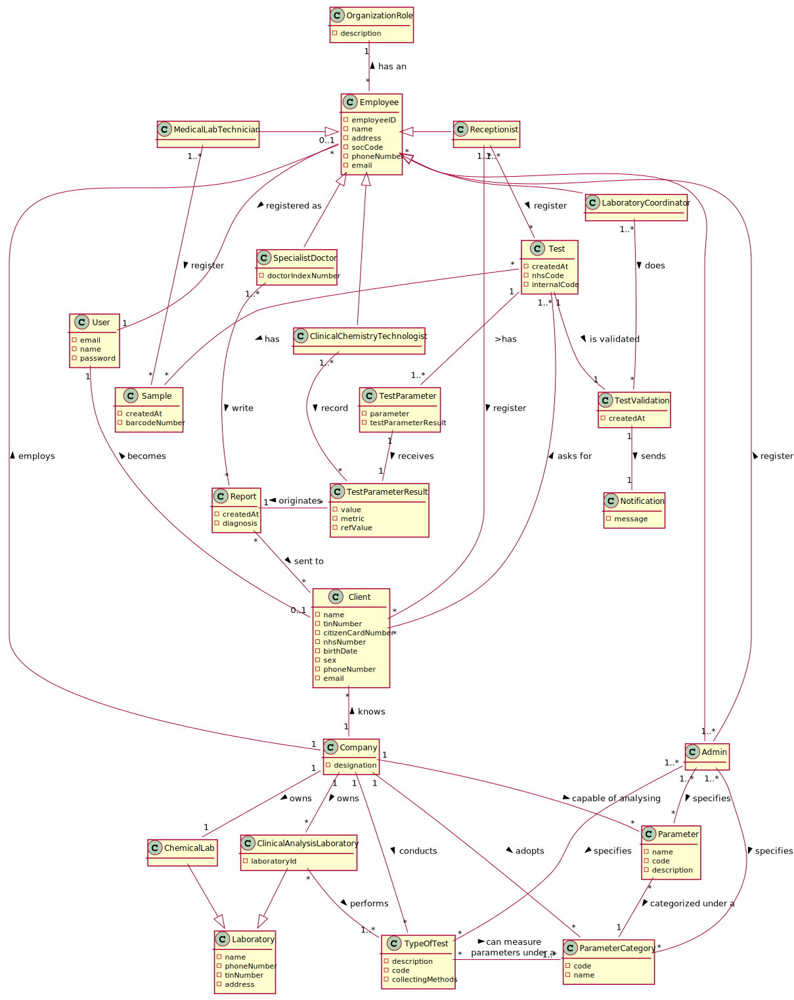

# OO Analysis #

## Rationale to identify domain conceptual classes ##

### _Conceptual Class Category List_ ###

**Business Transactions**

* n/a
---

**Transaction Line Items**

* Blood Sample
* Covid Sample
* Other Sample

---

**Product/Service related to a Transaction or Transaction Line Item**

* Parameter

---

**Transaction Records**

* NHS Report

--- 

**Roles of People or Organizations**

* ManyLabs
* NHS
* Client
* Receptionist
* Lab Coordinator
* Medical Lab Technician
* Specialist Doctor
* Clinical Chemistry Technologist
* Admin
* Employee

---

**Places**

* Clinical Analysis Lab
* Chemical Labs
* Headquarters
* Application

---

**Noteworthy Events**

* Chemical Analysis
* Samples collection
* Test Request
* Write Reports & diagnosis
* Test validation
---

**Physical Objects**

* Samples

---

**Descriptions of Things**

* Type of Test
* Category

---

**Catalogs**

*

---

**Containers**

* Company

---

**Elements of Containers**

* Employee

---

**Organizations**

* ManyLabs (company)
* NHS

---

**Other External/Collaborating Systems**

* External Barcode Generator
* External modules to get reference values for parameters

---

**Records of finance, work, contracts, legal matters**

* NHS Reports

---

**Financial Instruments**

*

---

**Documents mentioned/used to perform some work**

* Lab Order
* Citizen Card
* Reports

---

### **Rationale to identify associations between conceptual classes**

| Concept (A)        |  Association    |  Concept (B) |
|----------	   		|:-------------:    |------:       |
| Company                           | has                | Employee |
| Company                           | owns               | Headquarter |
| Company                           | conducts           | TypeOfTest |
| Company                           | perform            | Test |
| Company                           | has                | ClinicalAnalysisLab |
| Company                           | has                | Client |
| Headquarter                       | has                | ChemicalLab |
| Admin                             | is an              | Employee  |
| SpecialistDoctor                  | is an              | Employee |
| Lab Coordinator                   | is an              | Employee |
| Receptionist                      | is an              | Employee |
| MedicalLabTechnician              | is an              | Employee |
| ClinicalChemistryTechnologist     | is an              | Employee |
| MedicalLabTechnician              | works at           | ClinicalAnalysisLab |
| MedicalLabTechnician              | collect            | Sample |
| LabCoordinator                    | validate           | Report |
| SpecialistDoctor                  | write              | Report |
| SpecialistDoctor                  | works at           | Headquarter |
| ClinicalChemistryTechnologist     | record             | TestParameterResult |
| ClinicalChemistryTechnologist     | works at           | ChemicalLab |
| LabCoordinator                    | validates          | Report |
| LabCoordinator                    | validates          | TestParameterResult |
| Receptionist                      | register new       | Test |
| Receptionist                      | add                | Client |
| Admin                             | create new         | ParameterCategory |
| Admin                             | register new       | Employee |
| Admin                             | register new       | TypeOfTest |
| Admin                             | register new       | ClinicalAnalysisLab |
| Admin                             | create new         | Parameter |
| Parameter                         | presented under    | ParameterCategory |
| Test                              | has                | TestParameter |
| TestParameter                     | has                | TestParameterResult |
| Test                              | has                | TypeOfTest |
| Test                              | has                | Sample |
| Test                              | need to analyse    | Parameter |
! Result                            | has                | Report   | 
| Report                            | delivered to       | Client |
| ChemicalLab                       | owns               | Sample |
| Client                            | asks for           | Test |

## Domain Model

