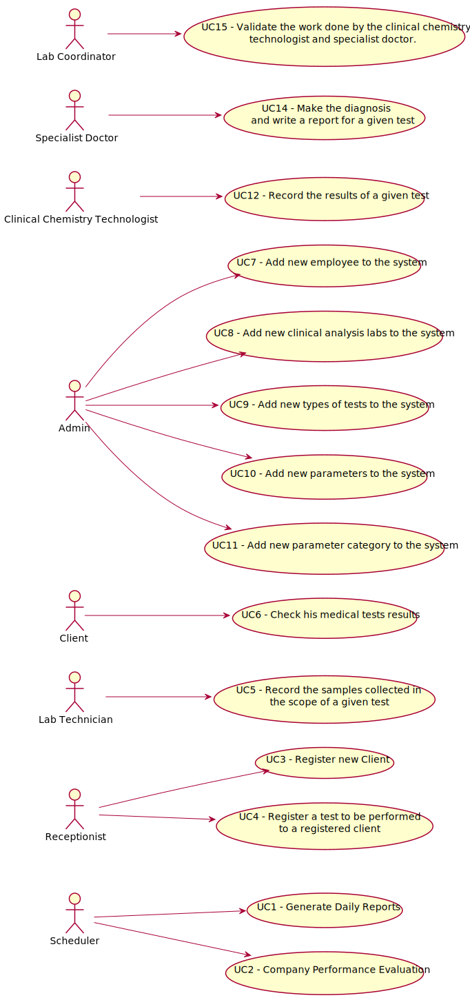

# Use Case Diagram (UCD)

# Use Cases / User Stories
| UC/US  | Description                                                               |                   
|:----|:------------------------------------------------------------------------|
| US3 - Register new client | [Register client](US3/US3.md)   |
| US4 - Register a test to be performed to a client | [Register test to perform to client](US4/US4.md)   |
| US7 - Register new Employee | [Register employee](US7/US7.md)  |
| US8 - Register new Clinical Analysis Lab| [Register C.A. lab](US8/US8.md)|
| US9 - Register new Type of Test| [Register type of test](US9/US9.md)|
| US10 - Register new Parameter| [Register parameter](US10/US10.md)|
| US11 - Register new Parameter Category| [Register p. category](US11/US11.md)|
| US12 - Record the results of a given test | [Record test results](US12/US12.md)   |
| US14 - Make diagnosis and write reports| [Make diagnosis and write reports](US14/US14.md)|
| US15 - Validate work of c.c. technologist & specialist Dr.| [Validate work of C.C.T and S.Dr.](US15/US15.md)|

