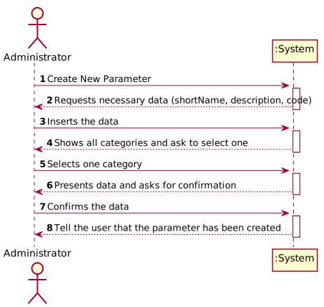
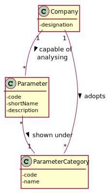
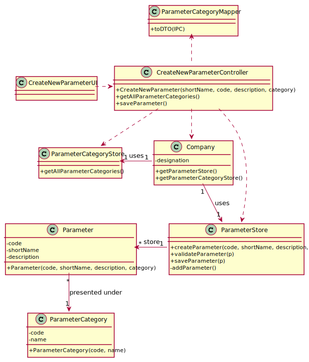

# US 010 - To specify a new parameter and categorize it

## 1. Requirements Engineering

### 1.1. User Story Description

As an administrator, I want to specify a new parameter and categorize it.

### 1.2. Customer Specifications and Clarifications 

**From the specifications document:**

>	"...the system should be developed having in mind the need to easily support other kinds of tests..."
>
>   "...such tests rely on measuring one or more parameters that can be grouped/organized by categories..."

**From the client clarifications:**

> **Question:** Which data is needed to create a new parameter?
>  
> **Answer:** Each parameter is associated with one category. Each parameter has a Code, a Short Name and a Description.

> **Question:** What rules do the parameter's data need to follow in order to be accepted? 
>
> **Answer:** The Code is five alphanumeric characters. The Short Name is a String with no more than 8 characters. 
> The Description is a String with no more than 20 characters.

> **Question:** Can a parameter be classified in more than one parameter category?
>
> **Answer:** No. Each parameter has only one category. There are no subcategories.

> **Question:** When specifying more than one parameter at the same time, all that parameters will be categorized to one single category 
>or should I ask the category to each parameter?
>
> **Answer:** You should always ask the category of each parameter.

### 1.3. Acceptance Criteria

* **AC1:** The parameter created must be associated with a category.
* **AC2:** The new parameter needs to have a short name, a code and a description to be created.
* **AC3:** The parameter's code is composed by 5 alphanumeric characters.
* **AC4:** The parameter's short name is a string with no more than 8 characters.
* **AC5:** The parameter's description is a string with no more than 20 characters.

### 1.4. Found out Dependencies

There is dependency with the US11 - Create New Parameter Category, because in order to create a new parameter the system 
must have at least one category, so the admin can categorize the new parameter.

### 1.5 Input and Output Data

**Input Data:**

* Typed data:
    *   Parameter's Short Name (8 chars max)
    *   Parameter's Description (20 chars max)
    *   Parameter's Code (5 alphanumeric chars)    
	
* Selected data:
    *   Category

**Output Data:**

* (In)Success of the operation

### 1.6. System Sequence Diagram (SSD)

### 1.7 Other Relevant Remarks

* n/a

## 2. OO Analysis

### 2.1. Relevant Domain Model Excerpt 

### 2.2. Other Remarks

* n/a

## 3. Design - User Story Realization 

### 3.1. Rationale

| Interaction ID | Question: Which class is responsible for... | Answer  | Justification (with patterns)  |
|:-------------  |:--------------------- |:------------|:---------------------------- |
| Step 1: Start new parameter |... interacting with the actor? | CreateNewParameterUI | UI Layer is always responsible for user interactions |         
| Step 2: Ask for the data |... requesting data needed? | CreateNewParameterUI | UI Layer is responsible for user interaction |
| Step 4: Create new parameter |... send command to create new parameter? | CreateNewParameterController | Controller makes the bridge between UI layer and Domain Layer| 
| Step 5: Initiate store process|... start the store process for the parameter being created? | Company | HC+LC: Company delegates some of its responsibilities to other classes |      
| Step 6: Create new parameter |... instantiating new parameter? | ParameterStore | Creator: R1/2 |      
| Step 7: Save Data |... saving the introduced data? | Parameter | IE: instance of object created has its own data.  |
| Step 8: Validate parameter |... validating all data (local validation)? | ParameterStore | IE: knows its own data.| 
| Step 9: Present data to user |...requesting confirmation for data introduced? | CreateNewParameterUI | UI Layer is responsible for user interaction |
| Step 11: Save parameter |... send command to save the created parameter? | CreateNewParameterController | Controller makes the bridge between UI layer and Domain Layer| 
| Step 12: Save parameter |... saving the created parameter? | ParameterStore | IE: stores all parameters created| 
| Step 13: Validate parameter globally |... validating all data at global level? | ParameterStore | IE: Company Knows all existing Parameters| 
| Step 14: Add parameter |... add created parameter to the list? | ParameterStore | IE: Responsible to add new Parameters to the list| 
| Step 15: Operation success |... informing operation success?| CreateNewParameterUI | UI Layer is responsible for user interactions.  | 

### Systematization ##

According to the taken rationale, the conceptual classes promoted to software classes are: 

 * Company
 * Parameter
 * ParameterStore

Other software classes (i.e. Pure Fabrication) identified: 

 * CreateNewParameterUI  
 * CreateNewParameterController

## 3.2. Sequence Diagram (SD)

## 3.3. Class Diagram (CD)

# 4. Tests 

**Test 1:** Check that it is not possible to create an instance of a Parameter without all attributes assigned to it. (AC1/2)
    
    @Test(expected = NullPointerException.class)
    public void ensureNullParameterIsNotCreated() {
        new Parameter(null, null, null, null);
    }
	
**Test 2:** Check that it is not possible to create an instance of a parameter with a code with more than 8 characters. (AC3)

    @Test(expected = IllegalArgumentException.class)
    public void ensureCodeCannotHaveMoreThan5Char() {
        new Parameter("102322", "Blood", "Test Blood Cells", "hemograms");
    }

    @Test(expected = IllegalArgumentException.class)
    public void ensureCodeCannotHaveLessThan5Char() {
        new Parameter("122", "Blood", "Test Blood Cells", "hemograms");
    }

**Test 3:** Check that it is not possible to create an instance of a parameter with a name with more than 8 characters. (AC4)

	@Test(expected = IllegalArgumentException.class)
    public void ensureNameCannotHaveMoreThan8Char() {
        new Parameter("10322", "Blood Cells", "Test Blood Cells", "hemograms");
    }

**Test 4:** Check that it is not possible to create an instance of a parameter with a description with more than 20 characters. (AC5)

    @Test(expected = IllegalArgumentException.class)
    public void ensureDescriptionCannotHaveMoreThan20Char() {
        new Parameter("10322", "Blood Cells", "Test Blood Cells and Urine", "hemograms");
    }

# 5. Construction (Implementation)

## Class CreateNewParameterController

    public class CreateNewParameterController {
    
        private ParameterStore ps;
    
        private Parameter param;
    
        public CreateNewParameterController() {
            this(App.getInstance().getCompany().getParameterStore());
        }
    
        public CreateNewParameterController(ParameterStore pStore){
            this.ps = pStore;
            this.param = null;
        }
    
        public boolean createNewParameter(String code, String name, String description, String category){
            this.param = this.ps.createParameter(code,name,description,category);
            return saveParameter();
        }
    
        public boolean saveParameter(){
            return this.ps.saveParameter(param);
        }
    
        public List<ParameterCategory> getCategoryList(){
            return App.getInstance().getCompany().getParameterCategoryStore().getParameterCategoryList();
        }       
    }

# 6. Integration and Demo 

* n/a

# 7. Observations

* n/a

