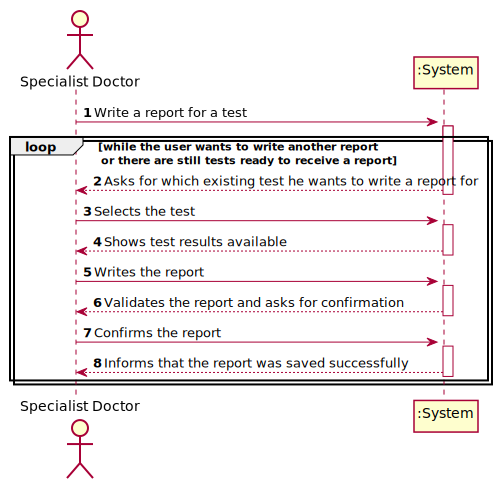

# US 014 - To make a diagnosis and write reports of the test results

## 1. Requirements Engineering

### 1.1. User Story Description

As a specialist doctor, I want to make diagnosis and be able to write reports of the results.

### 1.2. Customer Specifications and Clarifications 

**From the specifications document:**

>	After completing the chemical analysis, the results of all chemical analyses are analysed by a
specialist doctor who makes a diagnosis and writes a report that afterwards will be delivered to the
client.

**From the client clarifications:**

> **Question:** Can the Specialist Doctor edit a report once it has already been written? 
> 
> **Answer:** No.

> **Question:** Can the Specialist Doctor edit after the Laboratory Coordinator has already approved the report?
> 
> **Answer:** No.

> **Question:** What characterizes a diagnosis? What it needs to have in it to be a valid diagnosis?
> 
> **Answer:** The report contains the diagnosis. The report is free text and should have no more than 400 words.

> **Question:** Regarding the tests that the Specialist Doctor can write a report about. Should the SD chose from a list of tests? 
> And should he only receive a list of test that have completed all the previous steps?
> 
> **Answer:** The system shows all tests ready (that have completed all the previous steps) to make the diagnosis, and the Specialist Doctor selects one test.
> Then, the Specialist Doctor writes the report for the selected test.

### 1.3. Acceptance Criteria

* **AC1:** The report can't have more than 400 words
* **AC2:** Only tests that have completed all previous steps can receive a report

### 1.4. Found out Dependencies

* This US has a dependency with the US12, because to write a report, the Specialist Doctor needs to know the results of the test. Meanwhile, the US12 also has its own dependencies.

### 1.5 Input and Output Data

**Input Data:**

* Typed data:
	* Report Text
	
* Selected data:
	* Available tests to make the report for

**Output Data:**

* (In)Success of the operation

### 1.6. System Sequence Diagram (SSD)

### 1.7 Other Relevant Remarks

## 2. OO Analysis

### 2.1. Relevant Domain Model Except 

### 2.2. Other Remarks

n/a

## 3. Design - User Story Realization 

### 3.1. Rationale

**SSD - Alternative 1 is adopted.**

| Interaction ID | Question: Which class is responsible for... | Answer  | Justification (with patterns)  |
|:-------------  |:--------------------- |:------------|:---------------------------- |
| Step 1/2/3     |	... interacting with the actor? | RegisterEmployeeUI   |  Pure Fabrication: there is no reason to assign this responsibility to any existing class in the Domain Model.           |
| 			     |	... instantiating a new Employee? | Employee with Administrator role | Creator (Rule 1): in the DM Employee can have a administrator role.   |
|       		 |	... knowing the employee roles to show? | Company | IE: Employee roles are defined by the Company. |
| Step 4 	  	 |	... connecting the UI layer to the Domain? | RegisterEmployeeController | Controller is responsible for making the bridge between UI and Domain |
| Step 5  		 |	... send the Employee List of the company employee store? | Company  | IE: Company knows all its Employee  |
| Step 6  		 |	... sending the inputted data to the object constructor? | EmployeeStore  | The employee store is responsible for sending data to the Employee constructor and store the object later.  |
| Step 7  		 |	... saving the inputted data? | Employee  | IE: object created in this step has its own data.  |
|                |	... validating all data (local validation)? | Employee | IE: owns its data.| 
| Step 9	     |	... asking user to confirm data? | RegisterEmployeeUI | UI Layer is responsible for user interactions.|  
| Step 11	     |	... asking to save the Employee after admin validated data? | RegisterEmployeeController | Sends UI commands to the Domain layer.| 
| Step 12	     |	... saving the Employee after admin validated data? | EmployeeStore | IE: stores all employees.| 
| Step 8/13	     |	... validating all data (global validation)? | EmployeeStore | IE: knows all its employees.| 
| Step 14	  	 |	... adding the created employee to the employee list? | EmployeeStore | IE: owns all its employee.| 
| Step 15  		 |	... informing operation success?| RegisterEmployeeUI  | UI Layer is responsible for user interactions.  | 

### Systematization ##

According to the taken rationale, the conceptual classes promoted to software classes are: 

 * Employee
 * Company
 * SpecialistDoctor
 * EmployeeStore

Other software classes (i.e. Pure Fabrication) identified: 

 * RegisterEmployeeUI  
 * RegisterEmployeeController

## 3.2. Sequence Diagram (SD)

## 3.3. Class Diagram (CD)

# 4. Tests 

**Test 1:** Check that it is not possible to create an instance of the Task class with null values. 

	@Test(expected = IllegalArgumentException.class)
		public void ensureNullIsNotAllowed() {
		Task instance = new Task(null, null, null, null, null, null, null);
	}
	

**Test 2:** Check that it is not possible to create an instance of the Task class with a reference containing less than five chars - AC2. 

	@Test(expected = IllegalArgumentException.class)
		public void ensureReferenceMeetsAC2() {
		Category cat = new Category(10, "Category 10");
		
		Task instance = new Task("Ab1", "Task Description", "Informal Data", "Technical Data", 3, 3780, cat);
	}

*It is also recommended to organize this content by subsections.* 

# 5. Construction (Implementation)

## Class CreateEmployeeController 

    public boolean createEmployee(String role, String name, String address, String phoneNumber, String email, int soc){
        this.emp = this.empStore.createEmployee(role, name, address, phoneNumber, email, soc);
        return saveEmployee();
    }

    public boolean createSpecialistDoctor(String role, String name, String address, String phoneNumber, String email, int soc, int indexNumber){
        this.emp = this.empStore.createSpecialistDoctor(role,name,address,phoneNumber,email,soc, indexNumber);
        return saveEmployee();
    }

	private boolean saveEmployee() {
        return this.empStore.saveEmployee(emp);
    }

## Class Employee

	public Employee(String role, String name, String address, String phoneNumber, String email, int soc) {
        employeeCount++;
        setRole(role);
        setName(name);
        setAddress(address);
        setPhoneNumber(phoneNumber);
        setEmail(email);
        setSoc(soc);
        this.employeeID = employeeIdCreator();
    }

# 6. Integration and Demo 

* A new option on the Employee menu options was added.

* Some demo purposes some tasks are bootstrapped while system starts.

# 7. Observations

