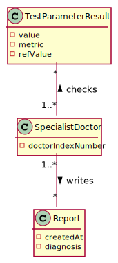
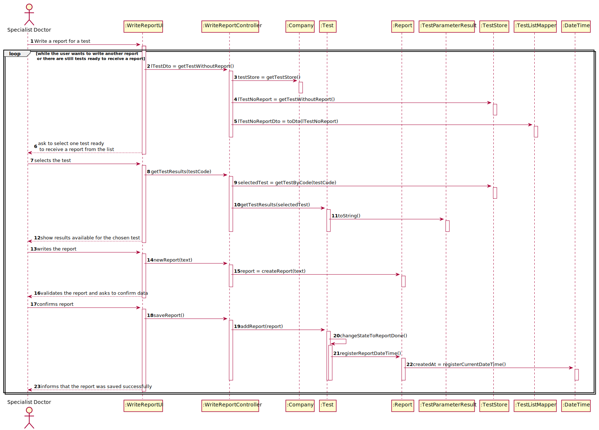
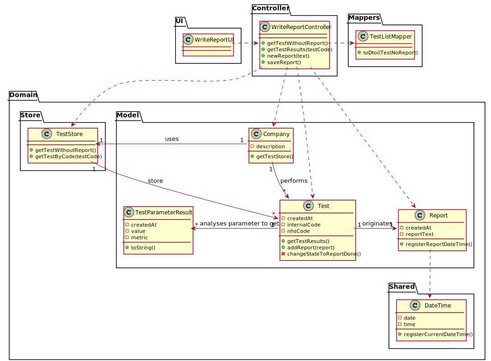

# US 014 - To make a diagnosis and write reports of the test results

## 1. Requirements Engineering

### 1.1. User Story Description

As a specialist doctor, I want to make diagnosis and be able to write reports of the results.

### 1.2. Customer Specifications and Clarifications 

**From the specifications document:**

>	After completing the chemical analysis, the results of all chemical analyses are analysed by a
specialist doctor who makes a diagnosis and writes a report that afterwards will be delivered to the
client.

**From the client clarifications:**

> **Question:** Can the Specialist Doctor edit a report once it has already been written? 
> 
> **Answer:** No.

> **Question:** Can the Specialist Doctor edit after the Laboratory Coordinator has already approved the report?
> 
> **Answer:** No.

> **Question:** What characterizes a diagnosis? What it needs to have in it to be a valid diagnosis?
> 
> **Answer:** The report contains the diagnosis. The report is free text and should have no more than 400 words.

> **Question:** Regarding the tests that the Specialist Doctor can write a report about. Should the SD chose from a list of tests? 
> And should he only receive a list of test that have completed all the previous steps?
> 
> **Answer:** The system shows all tests ready (that have completed all the previous steps) to make the diagnosis, and the Specialist Doctor selects one test.
> Then, the Specialist Doctor writes the report for the selected test.

> **Question:** While in the "Make a diagnosis and write a report" option of the main menu, should the specialist doctor be able to make a diagnosis and write a 
> report for more than one test? Or does he need to exit and enter the "Make a diagnosis and write a report" option every time he wants to make a new diagnosis and write a new report?
>
> **Answer:** After writing a report the SD can choose to write other reports without leaving the use case.

> **Question:** Once the specialist doctor decides to write the report for a given test, should the results of the chemical analysis and the reference values be presented on the screen?
> 
> **Answer:** After selecting a test (to make the diagnosis/report) the results of the chemical analysis, and the reference values should be presented on the screen. Then the Specialist Doctor should write the report.

### 1.3. Acceptance Criteria

* **AC1:** The report can't have more than 400 words
* **AC2:** Only tests that have completed all previous steps can receive a report

### 1.4. Found out Dependencies

* This US has a dependency with the US12, because to write a report, the Specialist Doctor needs to know the results of the test. Meanwhile, the US12 also has its own dependencies.

### 1.5 Input and Output Data

**Input Data:**

* Typed data:
	* Report Text
	
* Selected data:
	* Available tests to make the report for

**Output Data:**

* (In)Success of the operation

### 1.6. System Sequence Diagram (SSD)

### 1.7 Other Relevant Remarks

## 2. OO Analysis

### 2.1. Relevant Domain Model Except 

### 2.2. Other Remarks

n/a

## 3. Design - User Story Realization 

### 3.1. Rationale

| Interaction ID | Question: Which class is responsible for... | Answer  | Justification (with patterns)  |
|:-------------  |:--------------------- |:------------|:---------------------------- |
| Step 1 | ...interacting with the user? | WriteReportUI | Pure Fabrication: There are no reasons to assign this task to any class of the domain |
| | ...managing the US? | WriteReportController | Controller: The controller is responsible to make the bridge between UI layer and Domain Layer |
| Step 2 | | | |
| Step 3 | ...send data from UI to Domain? | WriteReportController | Controller |
| | ...transform list of tests to a DTO? | TestListMapper | DTO: Used to transfer data from domain to UI and vice-versa, and reduce coupling between these layers |
| | ...present tests that need a report? | WriteReportUI | Pure Fabrication: There are no reasons to assign this task to any class of the domain |
| | ...giving all tests without report done? | TestStore | Creator and HC+LC: to remove this responsibility from the Company and apply HC+LC |
| | ...knows the TestStore? | Company | IE: Company knows all its stores |
| | ...knowing test data? | Test | IE: Each test knows its own data |
| | ...knowing the results for each parameter testes? | TestParameterResult | IE: each parameter result knows its own data |
| Step 4 | | | |
| Step 5 | ...storing the reports? | Test | Creator: Test will store its own reports and is also responsible for instantiating a new report |
| Step 6 | | | |
| Step 7 | ...validating the written report? | Report | IE: knows its own data and also knows each acceptance criteria |
| | ...knowing the current date and time? | DateTime | Pure Fabrication: there is no need to assign this responsibility to any domain class |
| | ...registering validation date and time? | Report | IE: saves its own data |
| Step 8 | ...informing success of the operation? | WriteReportUI | It's always responsible for user interaction |
### Systematization ##

According to the taken rationale, the conceptual classes promoted to software classes are: 

 - Company
 - Report
 - Test
 - TestParameterResult

Other software classes (i.e. Pure Fabrication) identified: 

 - WriteReportUI
 - WriteReportController
 - TestStore
 - TestListMapper
 - DateTime

## 3.2. Sequence Diagram (SD)

## 3.3. Class Diagram (CD)

# 4. Tests 

**Test 1:** Check that it is not possible to create an instance of the Task class with null values. 

	@Test(expected = IllegalArgumentException.class)
		public void ensureNullIsNotAllowed() {
		Task instance = new Task(null, null, null, null, null, null, null);
	}
	

**Test 2:** Check that it is not possible to create an instance of the Task class with a reference containing less than five chars - AC2. 

	@Test(expected = IllegalArgumentException.class)
		public void ensureReferenceMeetsAC2() {
		Category cat = new Category(10, "Category 10");
		
		Task instance = new Task("Ab1", "Task Description", "Informal Data", "Technical Data", 3, 3780, cat);
	}

*It is also recommended to organize this content by subsections.* 

# 5. Construction (Implementation)

## Class CreateEmployeeController 

    public boolean createEmployee(String role, String name, String address, String phoneNumber, String email, int soc){
        this.emp = this.empStore.createEmployee(role, name, address, phoneNumber, email, soc);
        return saveEmployee();
    }

    public boolean createSpecialistDoctor(String role, String name, String address, String phoneNumber, String email, int soc, int indexNumber){
        this.emp = this.empStore.createSpecialistDoctor(role,name,address,phoneNumber,email,soc, indexNumber);
        return saveEmployee();
    }

	private boolean saveEmployee() {
        return this.empStore.saveEmployee(emp);
    }

## Class Employee

	public Employee(String role, String name, String address, String phoneNumber, String email, int soc) {
        employeeCount++;
        setRole(role);
        setName(name);
        setAddress(address);
        setPhoneNumber(phoneNumber);
        setEmail(email);
        setSoc(soc);
        this.employeeID = employeeIdCreator();
    }

# 6. Integration and Demo 

* A new option on the Employee menu options was added.

* Some demo purposes some tasks are bootstrapped while system starts.

# 7. Observations

