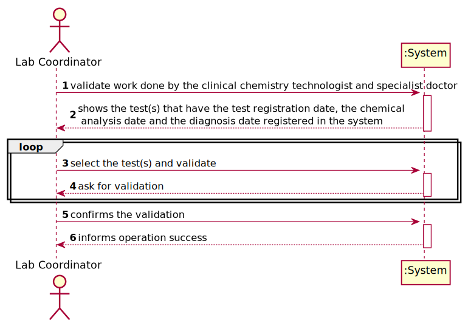
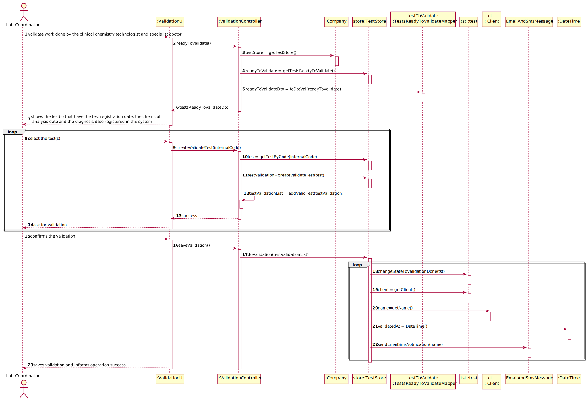
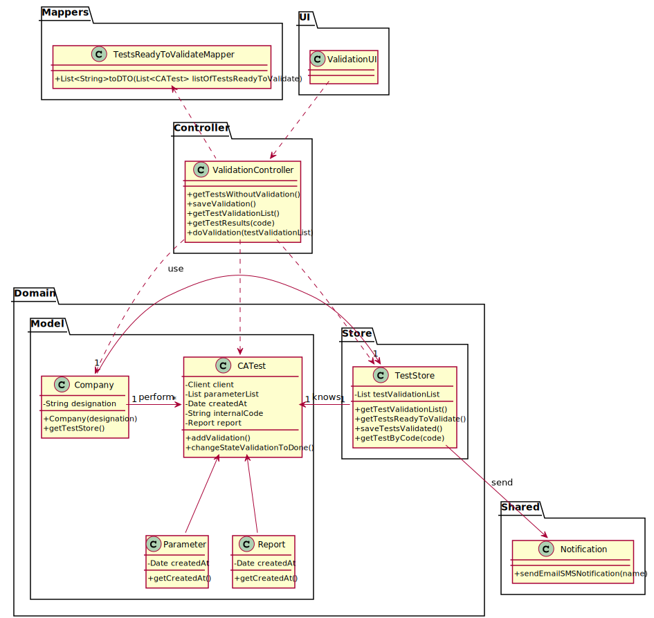

# US15 - To validate the work done by the clinical chemistry technologist and specialist doctor

## 1. Requirements Engineering

### 1.1. User Story Description

*As a laboratory coordinator, I want to validate the work done by the clinical chemistry technologist and specialist doctor.*

### 1.2. Customer Specifications and Clarifications
*From the Specification Document:*

> "To facilitate and simplify the validation work performed by the specialist doctor, the application uses an external module that is responsible for doing an automatic validation
using test reference values."
>
> "After the specialist doctor has completed the diagnosis, the results of the clinical analyses and the report become available in the system and must be validated by the laboratory coordinator. To validate the work done, the laboratory coordinator checks the chemical test/result and associated diagnosis made and confirms 
that everything was done correctly. Once the laboratory coordinator confirms that everything was done correctly, 
the client receives a notification alerting that the results are already available in the central application and 
informing that he/she must access the application to view those results. The client receives the notification by SMS and e-mail. 
At the same time, the results are also available in the central application where the medical lab technicians who collect the samples, the clinical chemistry technologist, the specialist doctor, and the laboratory coordinator can check them."
> 
> "To facilitate the access to the results, the application must allow ordering the clients by TIF and by name."
> 
> "At least two sorting algorithms should be evaluated and documented in the application user manual (in the annexes) that must be delivered with the application."
> 
> "The company wants to decrease the number of tests waiting for its result. To evaluate this, it proceeds as following: for any interval of time, for example one week (6 working days with 12 working hours per day), the difference between the number of new tests and the number of results available to the client during each half an hour period is computed.
In that case, a list with 144 integers is obtained, where a positive integer means that in such half an hour more tests were processed than results were obtained, and a negative integer means the opposite."
> 
> "The problem consists in determining what the contiguous subsequence of the initial sequence is, whose sum of their entries is maximum. This will show the time interval, in such week, when the company was less effective in responding. So, the application should implement a brute-force algorithm (an algorithm which examines each subsequence) to determine the contiguous subsequence with maximum sum, for any interval of time registered. The implemented algorithm should be analysed in terms of its worst-case time, and it should be compared to a provided benchmark algorithm. The algorithm to be used by the application must be defined through a configuration file."
> 
> "The complexity analysis must be accompanied by the observation of the execution time of the algorithms for inputs of variable size in order to observe the asymptotic behaviour. The time complexity analysis of the algorithms should be properly documented in the application user manual (in the annexes) that must be delivered with the application."

*From the Client Specifications:*

> **Question:** Regarding the process of validating a certain test/result, what validation states should be considered by the laboratory coordinator?
For example, can "Valid" or "Invalid" be accepted as a confirmation for the chemical test/result and its diagnosis?
>
>**Answer:**
Only Valid state. The system shows all tests ready to validate (tests that already have the test registration date, the chemical analysys date and the diagnosis date registered in the system) and the laboratory coordinator selects one or more tests to mark as validated.
>
> **Question:** Does the laboratory coordinator choose which client's results to validate??
>
>**Answer:**
The laboratory coordinator chooses a set of tests he wants to validate.
> 
> **Question:** How should the laboratory coordinator choose the test to operate on, from a list of all the tests with a result and report or by inputting the code unique to a specific test?
>
> **Answer:**
: From a list of all tests that have a test registration date, a chemical analysis date and a diagnosis date.
>
> **Question:** : What information does the laboratory coordinator needs to be able do validate a test? We got from the description that it's suposed to show all dates. Should the system provide any more information?
>
> **Answer:**
> Only the dates.
> 
> Q: After validation do we need to have the time and date of the validation?
> 
>A: Yes, the system should record the date (DD/MM/YYYY) and time (HH:MM) when the validation was made.
Moreover, in this US, when the system shows to the laboratory coordinator all the dates (test registration date, chemical analysis date and diagnosis date), the system should show the date (DD/MM/YYYY) and the time (HH:MM).

### 1.3. Acceptance Criteria

* **AC1:** The system does not show client personal information but shows all dates(test registration code, chemical analysis date and diagnosis date);
* **AC2:** The application must allow ordering the clients by TIF and name;
* **AC3:** At least two sorting algorithms should be evaluated and documented in th application user manual;
* **AC4:** The system should record the validation date.
  
* **AC5:** 
* **AC6:** 
* **AC7:** 
* **AC8:** 
* **AC9:**
* **AC9:** 

### 1.4. Found out Dependencies

There is dependency with the "US12 - To record the results of a given test" and "US14 - to make the diagnosis and write a report for a given test", because in order to validate the work done by the clinical chemistry technologist and specialist doctor, is need the work done by them, such as the results, report and their respective dates.

### 1.5 Input and Output Data

*Input Data*

-Typed Data: Results of the clinical analysis; Report; Realization dates of the results and report.

-Output Data: The client receives a notification by email and SMS informing that the results are available on the central application.
(In)Success of the operation.

### 1.6. System Sequence Diagram (SSD)

### 1.7 Other Relevant Remarks

*Use this section to capture other relevant information that is related with this US such as (i) special requirements ; (ii) data and/or technology variations; (iii) how often this US is held.*

## 2. OO Analysis

### 2.1. Relevant Domain Model Excerpt

### 2.2. Other Remarks

*Use this section to capture some additional notes/remarks that must be taken into consideration into the design activity. In some case, it might be usefull to add other analysis artifacts (e.g. activity or state diagrams).*

## 3. Design - User Story Realization

### 3.1. Rationale

**The rationale grounds on the SSD interactions and the identified input/output data.**

| Interaction ID | Question: Which class is responsible for... | Answer  | Justification (with patterns)  |
|:-------------  |:--------------------- |:------------|:---------------------------- |
| Step 1: Start new parameter |... interacting with the actor? | RegisterAnewClientUI | UI Layer is always responsible for user interactions |         
| Step 2: Ask for the data |... requesting data needed? | RegisterAnewClientUI | UI Layer is responsible for user interaction |
| Step 4: Create new parameter |... send command to register a new client? | RegisterClientController | Controller makes the bridge between UI layer and Domain Layer|
| Step 5: Initiate store process|... start the store process for the client being registered? | Company | HC+LC: Company delegates some of its responsibilities to other classes |      
| Step 6: Register new Client |... instantiating new Client? | ClientStore | Creator: R1/2 |      
| Step 7: Save Data |... saving the introduced data? | Client | IE: instance of object created has its own data.  |
| Step 8: Validate client |... validating all data (local validation)? | ClientStore | IE: knows its own data.|
| Step 9: Present data to user |...requesting confirmation for data introduced? | RegisterAnewClient | UI Layer is responsible for user interaction |
| Step 11: Save client |... send command to save the created client? | CreateNewParameterController | Controller makes the bridge between UI layer and Domain Layer|
| Step 12: Save client |... saving the created client? | ClientStore | IE: stores all parameters created|
| Step 13: Validate client globally |... validating all data at global level? | ClientStore | IE: Company Knows all existing Clients|
| Step 14: Add client |... add created parameter to the list? | ClientStore | IE: Responsible to add new Client to the list|
| Step 15: Operation success |... informing operation success?| RegisterAnewClientUI | UI Layer is responsible for user interactions.  |

### Systematization ##

According to the taken rationale, the conceptual classes promoted to software classes are:
* Company
* Client
* ClientStore

Other software classes (i.e. Pure Fabrication) identified:
* RegisterClientUI
* RegisterClientController

## 3.2. Sequence Diagram (SD)

## 3.3. Class Diagram (CD)

# 4. Tests
*In this section, it is suggested to systematize how the tests were designed to allow a correct measurement of requirements fulfilling.*

**_DO NOT COPY ALL DEVELOPED TESTS HERE_**

**Test 1:** Check that it is not possible to create an instance of the Client class with null values.

	 @Test(expected = NullPointerException.class)
    public void garanteeNullClientIsntCreatedWithAllDataAndSex() {
        new Client(null, null, null, null, null, null, null, null);
    }

**Test 2:** Check that it is not possible to create an instance of the Client class with a name with alphanumerical values.

	 @Test(expected = IllegalArgumentException.class)
    public void ensureThatNameNotHaveAlphanumericChar() {
        new Client("To<más", "1234567890123456", "1234567891", "1234567890", "23/12/2010", "male", "12345678901", "tomas@isep.ipp.pt");
    }

**Test 3:** Check that it is not possible to create an instance of the Client class with a citizen card number with more than 16 numbers.

    @Test(expected = IllegalArgumentException.class)
    public void ensureThatCitizenCardNumberCannotHaveMore16Characters() {
        new Client("Tomás", "12345678901234568", "1234567891", "1234567890", "23/12/2001", "male", "12345678901", "tomas@isep.ipp.pt");
    }

**Test 4:** Check that it is not possible to create an instance of the Client class with a NHS and TIN number with more than 10 numbers.

    @Test(expected = IllegalArgumentException.class)
    public void ensureThatNhsAndTinCannotHaveMoreAndLessThan10Characters() {
        new Client("Tomás", "1234567890123456", "12345678901", "12345678901", "23/12/2001", "male", "12345678901", "tomas@isep.ipp.pt");
    }

**Test 5:** Check that it is not possible to create an instance of the Client class with a birth date in a wrong format.

    @Test(expected = IllegalArgumentException.class)
    public void checkBirthDateWrongFirstConstructor() {
        new Client("Tomás", "1234567890123456", "1234567891", "1234567890", "23/12/20011", "Male", "12345678901", "tomas1@isep.ipp.pt");
    }

**Test 6:** Check that it is not possible to create an instance of the Client class with a sex that don't match with the correct formats (Male/Female).

    @Test(expected = IllegalArgumentException.class)
    public void checkSexWrong() {
        new Client("Tomás", "1234567890123456", "1234567891", "1234567890", "23/12/2001", "madeira", "12345678901", "tomas1@isep.ipp.pt");
    }

**Test 7:** Check that it is not possible to create an instance of the Client class with a phone number that have more or less than 11 numbers.

    @Test(expected = IllegalArgumentException.class)
    public void checkPhoneNumberWrongFirstConstructor() {
        new Client("Tomás", "1234567890123456", "1234567891", "1234567890", "23/12/2001", "male", "1234561111178901", "tomas1@isep.ipp.pt");
    }

**Test 8:** Check that it is not possible to create an instance of the Client class with an invalid email.

    @Test(expected = IllegalArgumentException.class)
    public void checkEmailWrongFirstConstructor() {
        new Client("Tomás", "1234567890123456", "1234567891", "1234567890", "23/12/2001", "male", "12345678901", "tomas1isep.ipp.pt");
    }

# 5. Construction (Implementation)

#Class RegisterClientController

    public class RegisterClientController {
        private ClientStore ctStore;
        private Client ct;

    private AuthFacade authFacade;

    public RegisterClientController() {
        this(App.getInstance().getCompany());
    }

    public RegisterClientController(Company company) {
        this.ctStore= company.getClientStore();
        this.authFacade = company.getAuthFacade();
        this.ct = null;
    }

    private boolean addUserToSystem(String name, String email, String role) {
        return CommonMethods.addUserToSystem(name, email, role, this.authFacade);
    }

    public List<Client> getClientList(){
        return App.getInstance().getCompany().getClientStore().getClientList();
        }
    }

## Class Client

    public Client(String name, String citizenCardNumber, String nhsNumber, String tinNumber, String birthDate, String sex, String phoneNumber, String email) {
        setName(name);
        setCitizenCardNumber(citizenCardNumber);
        setNhsNumber(nhsNumber);
        setTinNumber(tinNumber);
        setBirthDate(birthDate);
        setSex(sex);
        setPhoneNumber(phoneNumber);
        setEmail(email);
    }

    public Client(String name, String citizenCardNumber, String nhsNumber, String tinNumber, String birthDate, String phoneNumber, String email) {
        setName(name);
        setCitizenCardNumber(citizenCardNumber);
        setNhsNumber(nhsNumber);
        setTinNumber(tinNumber);
        setBirthDate(birthDate);
        this.sex = SEX_BY_OMISSION;
        setPhoneNumber(phoneNumber);
        setEmail(email);

        ....
    }

## Class Company
    public class Company {

    private String designation;
    private AuthFacade authFacade;

    private TypeOfTestStore totStore = new TypeOfTestStore();
    private ClientStore clientStore = new ClientStore();
    private ParameterCategoryStore pcStore = new ParameterCategoryStore();
    private ParameterStore pStore = new ParameterStore();
    private ClinicalAnalysisLaboratoryStore calStore = new ClinicalAnalysisLaboratoryStore();
    private EmployeeStore empStore = new EmployeeStore();

    public Company(String designation)
    {
        if (StringUtils.isBlank(designation))
            throw new IllegalArgumentException("Designation cannot be blank.");

        this.designation = designation;
        this.authFacade = new AuthFacade();
        
        ...
    }

# 6. Integration and Demo

*In this section, it is suggested to describe the efforts made to integrate this functionality with the other features of the system.*

# 7. Observations

*Overall, it is believed that the work done is consistent and meets the requirements specified by the Client.*

