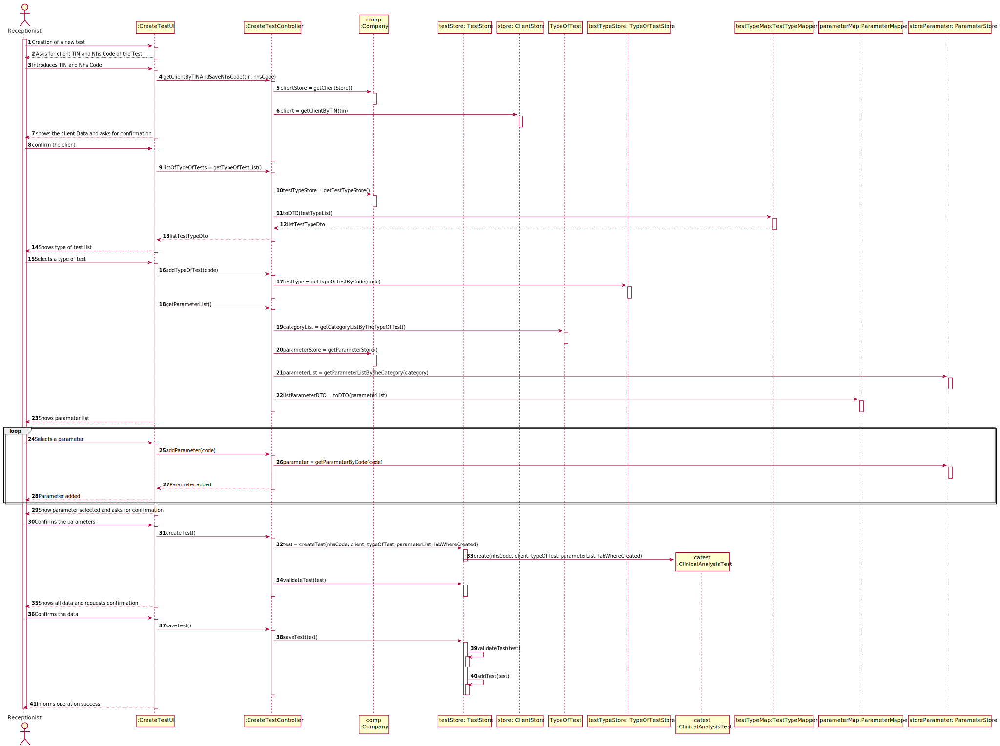

# US 004 - Register a test to be performed

## 1. Requirements Engineering

### 1.1. User Story Description

As a receptionist of the laboratory, I intend to register a test to be performed to a
registered client.

### 1.2. Customer Specifications and Clarifications

**From the specifications document:**

>Typically, the client arrives at one of the clinical analysis laboratories with a lab order prescribed by
a doctor. Once there, a receptionist asks the client’s citizen card number, the lab order (which
contains the type of test and parameters to be measured), and registers in the application the test to
be performed to that client.

**From the client clarifications:**

> **Question:** What are the necessary parameters according to the type of test?

> **Answer:** Each parameter is associated with one category. Each parameter has a Code, a Short Name and a Description. The Code are five alphanumeric characters. The Short Name is a String with no more than 8 characters. The Description is a String with no more than 20 characters."
This answers your question? Moreover, you have US10 saying "As an administrator, I want to specify a new parameter and categorize it".

> **Question:** When the receptionist chooses the test type, should the categories appear, and then when selecting the category, the receptionist can choose the parameters for the test? Or when the Receptionist chooses the test type, should appear all the parameters that it includes immediately?

> **Answer:** Firstly, the receptionist should choose a test type. Then choose a category from a set of categories. Last, the receptionist should choose a parameter.

> **Question:** What are the attributes of a test and the acceptance criteria?

> **Answer:** A test has the following attributes:
Test code : Sequential number with 12 digits. The code is automatically generated.
NHS code: 12 alphanumeric characters.

> **Question:** Since the Client has a Lab Order which contains the type of test and all the parameters to be measured, all the parameters selected by the Receptionist need to be equal to the Lab Order's parameters?

> **Answer:** Yes.

> **Question:** About the other Test attributes, do we need to have in consideration any other criteria? Is the code generated or NHS code optional ?

> **Answer:** All test attributes are mandatory. The test attributes are the following:
Test code : sequential number with 12 digits. The code is automatically generated.
NHS code: 12 alphanumeric characters.

 
> **Question:** when the receptionist is registering a test for a client, the test can have more than one category and many parameters of the chosen categories or it only can have one category?

> **Answer** Each test can have more than one category.

> **Question** I wanted to ask if the NHS code of which test is unique or not.

> **Answer** Yes. 

> **Question** Can the client have two identical tests? or the system should stop from creating the same test?

> **Answer** A test is unique in the system.

> **Question** NHS code contains 12 characters and is alphanumeric, so this will be different from the NHS number from the client? If so, how do we know a certain test is associated to a client?

> **Answer** A test has a NHS code, and a client has a NHS number. In US4 the receptionist of the laboratory should ask the client to get his TIN number. Using the TIN number the receptionist of the laboratory can find all information about the client. Do not forget that a client should be registered in the system to make a test.
 

> **Question** Should we show the list of all clients available or just introduce the client's CCN ?

> **Answer** The TIN number should be used to find a client and associate the client with the test.

> **Question** How is it possible to know in which laboratory the test is being registered? Should the Receptionist select the Laboratory before selecting the Test Type?

> **Answer** After a login the receptionist should select the laboratory where she is working. Then, the receptionist has access to the system's features/functionalities.

> **Question** We are aware that both the receptionist, and the MLT are two employees that may work on different labs. As such, do you want that Tests become associated to a specific Lab?
 
> **Answer** Yes.
 

> **Question** This means that, when the receptionist creates a new Test, this test will only be "visible" for that specific LAB (for the receptionist and the MLT only), which means that all other roles (Chemistry Technologist, Specialist Doctor and the Laboratory Coordinator) will be able to see a list of all the tests performed in any lab.
 
> **Answer** Yes. The test will only be visible for that specific LAB and for all those working in the Chemical Laboratory.
### 1.3. Acceptance Criteria

AC1 -- a test can have only one client

AC2 -- a test can have only one type of test

AC3 -- NHS code must have 12 alphanumeric characters.

AC5 -- NHS code must be unique for each type of test

AC6 -- Internal code must have 12 digit sequential number and generally automatic

AC7 -- A type of test can have one or more categories

AC8 -- A receptionist find the client only by the tin

### 1.4. Found out Dependencies

* There is a dependency to "US 09 - Specify new test type category" 

* There is a dependency to "US 10 - Specify a new parameter and categorize it" 

* There is a dependency to "US 11 - Create a parameter category" 

### 1.5 Input and Output Data

**Input Data:**

* Typed data:
    * tin
    * nhsCode
     
* Selected data:
    * Classifying Parameter
    * Classifying Type Of Test category
    * Classifying Type Of Test
    * Classifying Test
  
**Output Data:**

* List of existing parameters for each type of test categories
* List of existing type of test categories
* List of the types of tests  
* (In)Success of the operation

### 1.6. System Sequence Diagram (SSD)

**Alternative 1**

### 1.7 Other Relevant Remarks

## 2. OO Analysis

### 2.1. Relevant Domain Model Excerpt

### 2.2. Other Remarks

n/a

## 3. Design - User Story Realization

### 3.1. Rationale

| Interaction ID | Question: Which class is responsible for... | Answer  | Justification (with patterns)  |
|:-------------  |:--------------------- |:------------|:---------------------------- |
| Step 1  		 |	... interacting with the actor? | CreateTestUI   |  **Pure Fabrication:** there is no reason to assign this responsibility to any other of the existing class in the Domain Model.           |
| 		 |	... coordinating the US? | CreateTestController   |  **Controller**         |
| Step 2		 |	|   |          |
| Step 3		 | ...transfer the data typed in the UI to the domain?	| CreateTestController |  **IE** When there is so much data to transfer, it is better to opt by using a DTO in order to reduce coupling between UI and domain        |
| 		 | ... knows ClientStore?	| Company  |  **IE** Company knows the ClientStore to which is delegation some tasks        |
| 		 | ... knows client?	| ClientStore  |  **IE** ClientStore knows all Clients       |
| 	
| 		 | ... knows the test types?	| ClinicalAnalysisLaboratory  |  **IE** a Laboratory object  knows its own data 	      |
| 		 | ... knows the testTypeStore?	| Company  |  **IE** Company knows the TestTypeStore  to which it is delegating some tasks    |
| Step 4		 | |   |         |
| Step 5		 | ...knows the the test type?	| TestTypeStore  |  **IE** TestTypeStore knows all test types         |
| 		 | ...knows the parameter categories for the test type?	| TestType  |  **IE** an object knows its data        |
| Step 6		 | 	|   |          |
| Step 7		 | ...knows the ParameterStore?	|  Company | **IE**  knows the ParameterCategoryStore  to which it is delegating some tasks        |
| 		 | ...knows the parameter category?	|  TestTypeStore | **IE**  TestTypeStore knows all parameter categories        |
| Step 8		 | 	|   |       |
| Step 9  |	... knows parameters?| ParameterCategory  | **IE:** ParameterCategory object knows its owns data |
| Step 10		 | ...knows the parameter data	| Parameter  |  **IE:** a Parameter knows its own data      |
| 		 | ...knows the ParameterStore	| Company  |  **IE:** Company knows the ParameterStore  to which it is delegating some tasks      |
| 		 | ...saving the typed/selected data? 	| Test  |  **IE:** a Test knows its own data      |
| 		                 |	... instantiating a new Test? | TestStore   | **Creator (R1)** and **HC+LC**: By the application of the Creator (R1) it would be the "Company". But, by applying HC + LC to the "Company", this delegates that responsibility to the "TestStore"   |
|  		 			     |  ... knows TestStore?	 |  Company   |  **IE:** Company knows the TestStore to which it is delegating some tasks |
|  		             |	... validating all data? | Test | **IE:** an object knows its data|
| 			  		 |	... validating all data? | TestStore | **IE:** knows all the Tests| 
|                                                                                                                                                                              
| Step 11 |	... knows the Parameter?| ParameterStore  | **IE:** ParameterStore knows all parameters  |
| |	... knows the Test?| TestStore  | **IE:** TestStore knows all tests  |
| 
|   |	... adding a new parameter?| Test  | **IE:** an object knows its data  |
| Step 12  |	|  |   |
| Step 13 |	|   |   |
| Step 14  | ... validating all data?	| TestStore  | **IE** TestStore knows all test   |
|   | ... saving the Test?	| TestStore  | **IE** TestStore knows all test   |
| Step 15  |	... informing operation success?| CreateTestUI  | **IE:** is responsible for user interactions  |

### Systematization ##

According to the taken rationale, the conceptual classes promoted to software classes are:

* Company
* CATest
* TypeOfTest

Other software classes (i.e. Pure Fabrication) identified:

* CreateTestUI
* CreateTestController
* TestStore
* TypeOfTestStore
* ParameterMapper
* ParameterStore
* ClientStore
* TestTypeMapper

## 3.2. Sequence Diagram (SD)

## 3.3. Class Diagram (CD)

# 4. Tests

**Test 1:** Check that it is not possible to create an instance of the Test class with null values.

                @Test(expected = NullPointerException.class)
                public void ensureNullTestIsNotCreated() {
                   new CATest(null, null, null, null, null);
                }

**Test 2:** Check that it is possible get a new Client to the existing test

                @Test
                public void checkGetClientMethod() {
                   Client client = new Client(new ClientDTO("Emilia", "0202417845965874", "1074601020", "1212787895", "05/03/1963", "female", "91474765456", "emilia@isep.ipp.pt"));
                   TypeOfTest typeOfTest = new TypeOfTest("00002", "7777", "666", new ParameterCategory("70104", "lkj"));
                   List<Parameter> lparameter = new ArrayList<>();
                   lparameter.add(new Parameter("90265", "sz", "7021", new ParameterCategory("22109", "ads")));
                   CATest t2 = new CATest("100090000003", client, typeOfTest, lparameter, "88878");
                   String expected = String.format("Client:%nName: Emilia%nCitizen Card Number: 0202417845965874%nNHS number: 1074601020%nTIN number: 1212787895%nBirth date: 05/03/1963%nSex: female%nPhone number: 91474765456%nEmail: emilia@isep.ipp.pt");
                   assertEquals(expected, t2.getClient().toString());
                }

# 5. Construction (Implementation)
        
#Class Test

               /***
               * Constructor for CATest with all parameters
               * @param nhsCode
               * @param client
               * @param typeOfTest
               * @param parameterList
               * @param labWhereCreated
               */
               public CATest(String nhsCode, Client client, TypeOfTest typeOfTest, List<Parameter> parameterList, String labWhereCreated) {
                  testCounter++;
                  this.labWhereCreated = labWhereCreated;
                  setClient(client);
                  this.typeOfTest = typeOfTest;
                  this.createdAt = new DateTime();
                  this.internalCode = generateInternalCode();
                  this.client = client;
                  setNhsCode(nhsCode);
                  setTypeOfTest(typeOfTest);
                  setParameterList(parameterList);
                  createTestParameterList();
               }

## Class CreateTestController

              public void createTest() {
                 this.test = testStore.createTest(nhsCode, client, typeOfTest, pList, labId);
              }

             /**
             * Method to get a client by tin
             *
             * @param tin object
             * @return true if the client exist false if not
             */
             public String getClientByTINAndSaveNhsCode(String tin, String nhsCode) {
                this.nhsCode = nhsCode;

                this.client = cs.getClientByTIN(tin);
                if (client != null)
                    return client.toString();
                else
                    return null;
             }

## Class TestStore

             /**             
             * Method to create a new test
             * @param nhsCode of the test
             * @param client object of the Client
             * @param typeOfTest object of the TestType
             * @param lParameter object of the Parameter
             * @return
             */
             public CATest createTest(String nhsCode, Client client, TypeOfTest typeOfTest, List<Parameter> lParameter, String labWhereCreated) {
                this.test = new CATest(nhsCode, client, typeOfTest, lParameter, labWhereCreated);
                return this.test;
             }

             /**
             * Method to validate test
             * @param testCreated object of the test to be validated
             * @return true if test created is valid
             */
            public boolean validateTest(CATest testCreated) {
                 if (testCreated == null)
                     return false;
                 for (CATest test : testList) {
                      if (test.equals(testCreated)) {
                          System.out.println(testCreated);
                          return false;
                      }
                 } 
                 return !this.testList.contains(testCreated);
            }

# 6. Integration and Demo

* A new option on the Reception menu options was added.
* The receptionist can add one or more parameters when  he/she creates a test

# 7. Observations

No observations.

