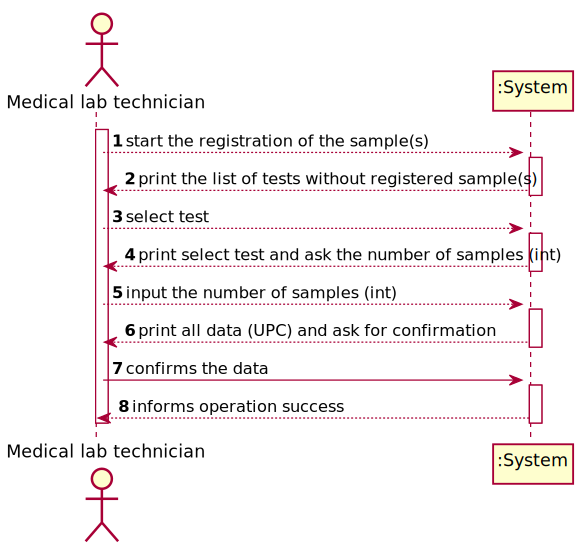
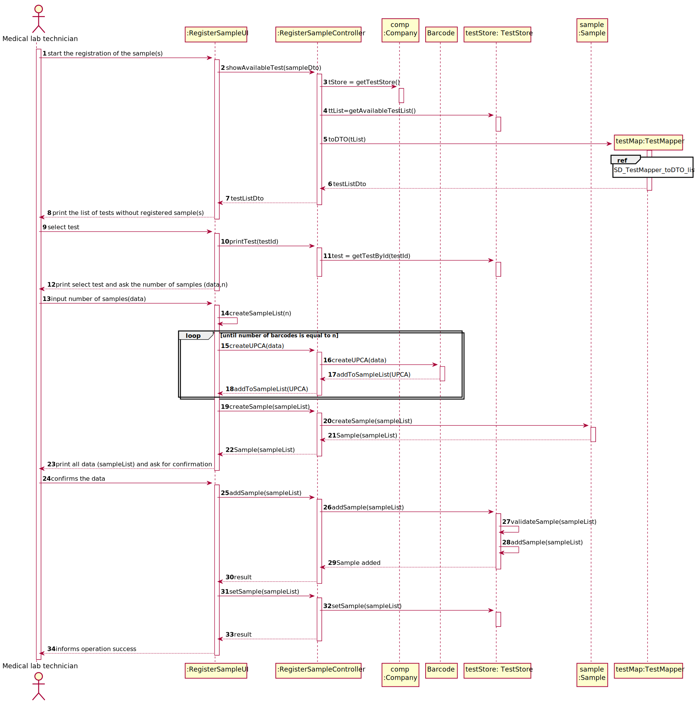
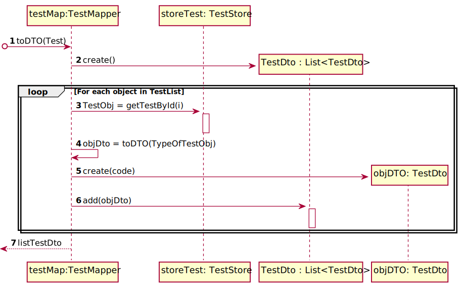

# US 005 - Register a sample of a given test

## 1. Requirements Engineering

### 1.1. User Story Description

As a medical lab technician, I want to record the samples collected in the scope of a
given test.

### 1.2. Customer Specifications and Clarifications

**From the specifications document:**

>	

**From the client clarifications:**

> **Question:** "What kind of attributes should a sample have?"
> 
> **Answer:** "Each sample is associated with a test. A sample has only one attribute, a barcode number (UPC) that is a 
> sequential number and is automatically generated by the system. Each sample has a unique barcode number.
> 
> In US5, the medical lab technician checks the system and see all tests for which there are no samples collected. 
> The medical lab technician selects a test and the system asks for the number of samples to collect."

> **Question:** "Can a test have more than one sample?"
> 
> **Answer:** "Yes."

> **Question:** "What information does the medical lab technician needs to input to record a new sample?"
> 
> **Answer:** " The medical lab technician checks a list of tests and selects one. 
> Then, the application generates barcodes (one or more). 
> After printing the barcodes (one or more) the use case ends."

> **Question:** After the barcodes are generated. The concept-reality link would be, for example to stick each barcode into each sample?
> 
> **Answer:** Yes. Each generated barcode should be saved in a folder as a jpeg file.

> **Question:** 
>
> **Answer:** 

### 1.3. Acceptance Criteria

* **AC1:** The system should support several barcode APIs
* **AC2:** The API to use is defined by configuration.
* **AC3:** A sample has only one attribute, a barcode number (UPC)
* **AC4:** Each sample has a unique barcode number
* **AC5:** The medical lab technician selects a test whit no samples
* **AC6:** The system asks for the number of samples to be registerd
* **AC7:** A test can have multiple samples
* **AC8:** After printing the barcodes (one or more) the use case ends

### 1.4. Found out Dependencies

* There is a dependency to "US 04 - Register a test to be performed" since at least a test must exist register a sample to it.

### 1.5 Input and Output Data

**Input Data:**

* Typed data:
  * Number of samples in the test
  * Sample barcode(UPC) 

* Selected data:
  * Test which the sample(s) shall be register in

**Output Data:**

* List of existing test without registered samples
* Test selected and question of the number of samples
* Sample/s barcode/s generated
* (In)Success of the operation

### 1.6. System Sequence Diagram (SSD)

**Alternative 1**

**Other alternatives might exist.**

### 1.7 Other Relevant Remarks

* The created task stays in a "not published" state in order to distinguish from "published" tasks.

## 2. OO Analysis

### 2.1. Relevant Domain Model Excerpt

### 2.2. Other Remarks

n/a

## 3. Design - User Story Realization

### 3.1. Rationale

| Interaction ID | Question: Which class is responsible for... | Answer  | Justification (with patterns)  |
|:-------------  |:--------------------- |:------------|:---------------------------- |
| Step 1  		 |	... interacting with the actor? | RegisterSampleUI   |  **Pure Fabrication:** there is no reason to assign this responsibility to any other of the existing class in the Domain Model.           |
| 		 |	... coordinating the US? |  RegisterSampleController   |  **Controller**         |
|       | ... knows TestStore?	| Company  |  **IE** Company knows the TestStore to which is delegation some tasks        |
| Step 2		 |	|   |          |
| Step 3		 |... gets the test selected? 	|  RegisterSampleController |      **Controller**     |
| Step 4		 | |   |         |
| Step 5		 | ... recives the number of Samples ?	| Sample  |   **IE**  object created in step 1 has its own data.   |
| Step 6		 | ...knowing the task categories to show? |  RegisterSampleController | **IE** Sample Categories are defined by the RegisterSampleController. |
| Step 7		|	... validating all data (local validation)? | Sample | **IE** owns its data.| 
| 			  		 |	... validating all data (global validation)? | SampleStore| **IE** knows all its samples.| 
| 			  		 |	... saving the created sample? | SampleStore | **IE** owns all its sample.|
|                     |... setting the samples? | TestStore | 
| Step 8		 | ... informing operation success?| RegisterSampleUI  | **IE** is responsible for user interactions.  | 

### Systematization ##

According to the taken rationale, the conceptual classes promoted to software classes are:

* RegisterSampleUI
* RegisterSampleController
* Company

Other software classes (i.e. Pure Fabrication) identified:

* Sample
* TestDto
* TestMapper
* TestStore

## 3.2. Sequence Diagram (SD)

**SD_TestMapper_toDTO_list**

## 3.3. Class Diagram (CD)

# 4. Tests

**Test 1:** Check that it is not possible to create an instance of the Task class with null values.

**Test 2:** Check that it is not possible to create an instance of the Task class with a reference containing less

# 5. Construction (Implementation)

## Class CreateTaskController

## Class Organization

# 6. Integration and Demo

* A new option on the Reception menu options was added.

# 7. Observations

