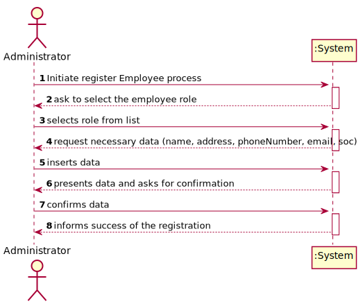

# US 007 - To register a new employee

## 1. Requirements Engineering

### 1.1. User Story Description

As an administrator, I want to register a new employee and give access to the application.

### 1.2. Customer Specifications and Clarifications 

**From the specifications document:**

>	No information in the specifications document 

**From the client clarifications:**

> **Question:** What kind of information does the company store about their employees and owned laboratories?
>  
> **Answer:** Employee ID; Organization Role; Name; Address; Phone Number; E-Mail; Standard Occupational Classification (SOC) code.
>
> The Specialist Doctor has an additional attribute:
Doctor Index Number.

> **Question:** Is there any size limit to the employee's name?
>
> **Answer:** Employee Name is a string with no more than 35 characters".

> **Question:** Is there any validation that needs to be done on the employee's email format and size?
>
> **Answer:** The format of an e-mail address is well-known. Attribute validation is always a good practice.

> **Question:** Regarding the registration of a new employee, which is the organization role's format?
>
> **Answer:** Organization Role is a string with no more than 15 characters.

> **Question:** When registering a new employee should the administrator write or select his role
>
> **Answer:** The administrator should write the role when he is registering a new employee.

> **Question:** What is the length of the Doctor index number and does it need to be validated?
>
> **Answer:** The length is 6 digits and for now, it is not necessary to confirm that the code really exists.
 
> **Question:** What is the length of the SOC number and is it generated or manually introduced by the admin?
>
> **Answer:** The SOC number is 4 digits, and it is introduced by the administrator.

### 1.3. Acceptance Criteria

* **AC1:** All required fields, namely Organization role, name, address, phone, e-mail and SOC code, must be filled in.
* **AC2:** The SOC number is 4 digits and introduced by the admin
* **AC3:** When creating an employee with an already existing reference, the system must reject such operation, and the user must have the change to modify the typed reference.
* **AC4:** When creating an employee, the id of the employee should be generated automatically with the format of employee's name initials and five digits.
* **AC5:** The doctor index number is 6 digits and does not need to be confirmed
* **AC6:** Employee is a String with no more than 35 characters
* **AC7:** The e-mail format should be validated

### 1.4. Found out Dependencies

* None

### 1.5 Input and Output Data

**Input Data:**

* Typed data:
	* Name;
	* Address;
	* Phone Number;
	* E-Mail;
	* Standard Occupational Classification (SOC) code.
	* Organization Role;
	* Doctor Index Number (Only when adding a new specialist doctor)
	
* Generated data:
	* Employee ID;

**Output Data:**

* (In)Success of the operation

### 1.6. System Sequence Diagram (SSD)

### 1.7 Other Relevant Remarks

## 2. OO Analysis

### 2.1. Relevant Domain Model Except 

### 2.2. Other Remarks

n/a

## 3. Design - User Story Realization 

### 3.1. Rationale

**SSD - Alternative 1 is adopted.**

| Interaction ID | Question: Which class is responsible for... | Answer  | Justification (with patterns)  |
|:-------------  |:--------------------- |:------------|:---------------------------- |
| Step 1/2/3     |	... interacting with the actor? | RegisterEmployeeUI   |  Pure Fabrication: there is no reason to assign this responsibility to any existing class in the Domain Model.           |
| 			     |	... instantiating a new Employee? | Employee with Administrator role | Creator (Rule 1): in the DM Employee can have a administrator role.   |
|       		 |	... knowing the employee roles to show? | Company | IE: Employee roles are defined by the Company. |
| Step 4 	  	 |	... connecting the UI layer to the Domain? | RegisterEmployeeController | Controller is responsible for making the bridge between UI and Domain |
| Step 5  		 |	... send the Employee List of the company employee store? | Company  | IE: Company knows all its Employee  |
| Step 6  		 |	... sending the inputted data to the object constructor? | EmployeeStore  | The employee store is responsible for sending data to the Employee constructor and store the object later.  |
| Step 7  		 |	... saving the inputted data? | Employee  | IE: object created in this step has its own data.  |
|                |	... validating all data (local validation)? | Employee | IE: owns its data.| 
| Step 9	     |	... asking user to confirm data? | RegisterEmployeeUI | UI Layer is responsible for user interactions.|  
| Step 11	     |	... asking to save the Employee after admin validated data? | RegisterEmployeeController | Sends UI commands to the Domain layer.| 
| Step 12	     |	... saving the Employee after admin validated data? | EmployeeStore | IE: stores all employees.| 
| Step 8/13	     |	... validating all data (global validation)? | EmployeeStore | IE: knows all its employees.| 
| Step 14	  	 |	... adding the created employee to the employee list? | EmployeeStore | IE: owns all its employee.| 
| Step 15  		 |	... informing operation success?| RegisterEmployeeUI  | UI Layer is responsible for user interactions.  | 

### Systematization ##

According to the taken rationale, the conceptual classes promoted to software classes are: 

 * Employee
 * Company
 * SpecialistDoctor
 * EmployeeStore

Other software classes (i.e. Pure Fabrication) identified: 

 * RegisterEmployeeUI  
 * RegisterEmployeeController

## 3.2. Sequence Diagram (SD)

*Alternative 1*

*Alternative 2*

## 3.3. Class Diagram (CD)

# 4. Tests 

# 5. Construction (Implementation)

## Class CreateEmployeeController 

    public boolean createEmployee(String role, String name, String address, String phoneNumber, String email, int soc){
        this.emp = this.empStore.createEmployee(role, name, address, phoneNumber, email, soc);
        return saveEmployee();
    }

    public boolean createSpecialistDoctor(String role, String name, String address, String phoneNumber, String email, int soc, int indexNumber){
        this.emp = this.empStore.createSpecialistDoctor(role,name,address,phoneNumber,email,soc, indexNumber);
        return saveEmployee();
    }

	private boolean saveEmployee() {
        return this.empStore.saveEmployee(emp);
    }

## Class Employee

	public Employee(String role, String name, String address, String phoneNumber, String email, int soc) {
        employeeCount++;
        setRole(role);
        setName(name);
        setAddress(address);
        setPhoneNumber(phoneNumber);
        setEmail(email);
        setSoc(soc);
        this.employeeID = employeeIdCreator();
    }

# 6. Integration and Demo 

* A new option on the Employee menu options was added.

* Some demo purposes some tasks are bootstrapped while system starts.

# 7. Observations

