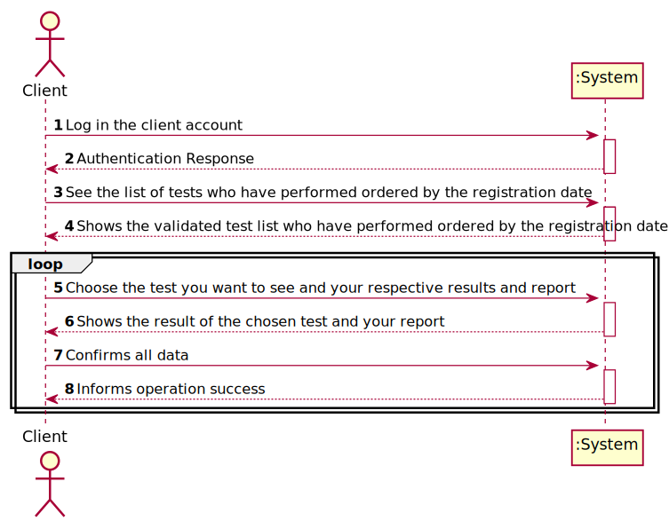
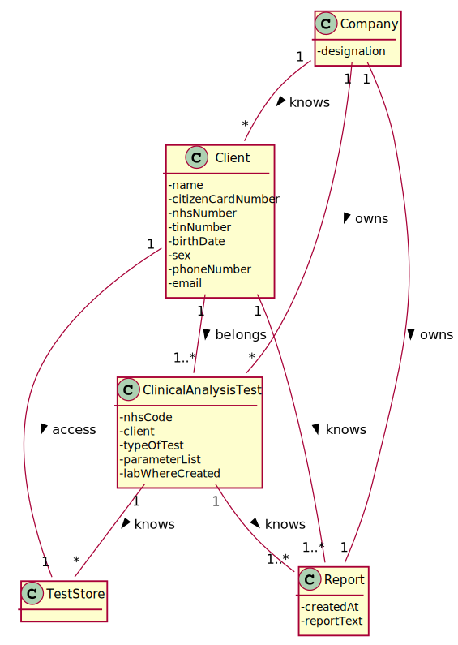
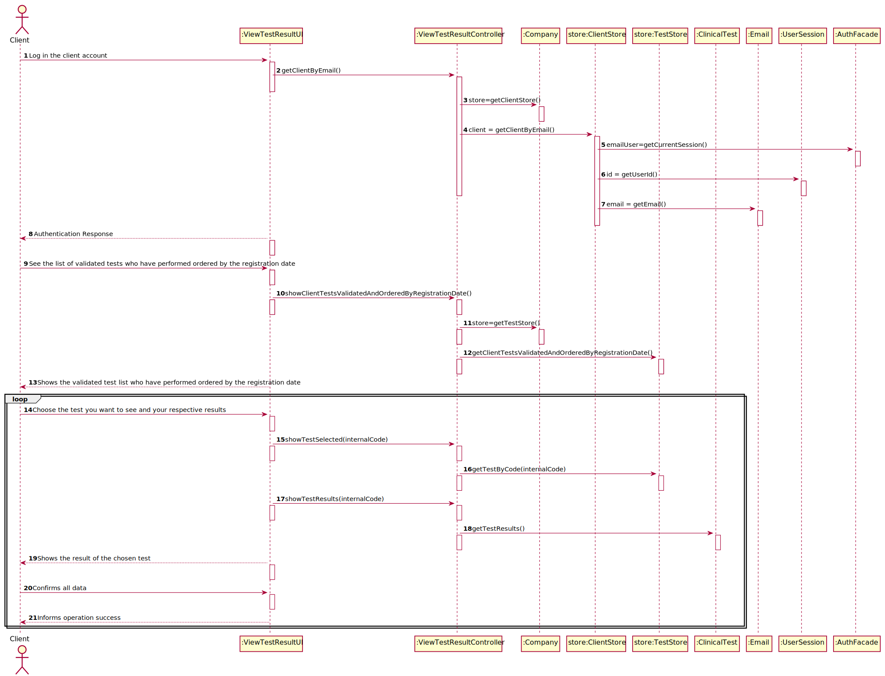
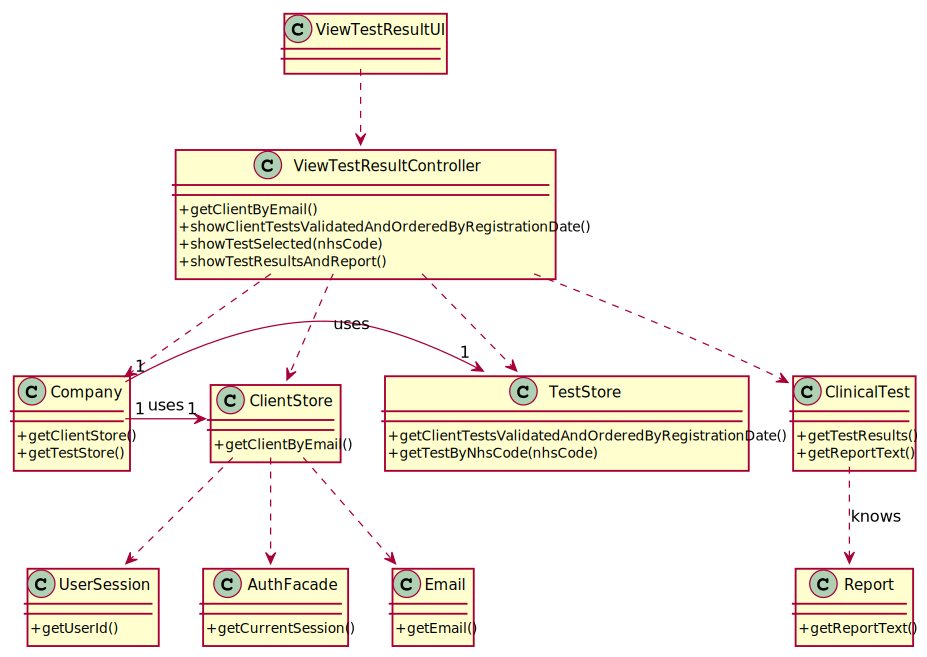

# US 001 - As a client, I want to access the application to view the results of the tests I have performed.

## 1. Requirements Engineering

### 1.1. User Story Description

As a client, I want to access the application to view the results of the tests I have
performed.

### 1.2. Customer Specifications and Clarifications

**From the specifications document:**

> "the client receives a notification alerting that the
results are already available in the central application and informing that he/she must access the
application to view those results."

**From the client clarifications:**

> **Question:** In US01 which date should be used to arrange the tests in order?The date the test is done, or the validation date?

> **Answer:** The test registration date.

> **Question:** What are the data to show the customer? and in what way do we have to show? do you have any examples you can give us?

> **Answer:** I want to access the application to view the results of the tests I have performed. This includes the report made by the specialist doctor.
The client tests must be shown ordered from the most recent to the oldest one. The test results are shown only after the client has selected a test.

> **Question**  My group is assuming that the client only wants to see the validated tests. Do you want to see tests in other states and if that's the case say the state of the test and show only the information available for that state?

> **Answer** The client should only see tests that have already been validated.

### 1.3. Acceptance Criteria

* **AC1:** The client tests must be shown ordered from the most recent to the oldest one.
* **AC2:** The test results are shown only after the client has selected a test.
* **AC3:** The client should only see tests that have already been validated.

### 1.4. Found out Dependencies

* There is a dependency to "US04 Register a new test", because the client wants to see your tests when he/she access the application.
* There is a dependency to "US13: As a clinical chemistry technologist, I intend to consult the historical tests
  performed by a particular client and to be able to check tests details/results" because the client wants see your test when he/she access the application.

### 1.5 Input and Output Data

**Input Data:**
* view the results of the test

**Selected data**
* nhsCode

**Output Data:**
* (In)Success of the operation

### 1.6. System Sequence Diagram (SSD)

### 1.7 Other Relevant Remarks
* n/a.

## 2. OO Analysis
### 2.1. Relevant Domain Model Excerpt

### 2.2. Other Remarks

n/a

## 3. Design - User Story Realization

### 3.1. Rationale
| Interaction ID | Question: Which class is responsible for... | Answer  | Justification (with patterns)  |
|:-------------  |:--------------------- |:------------|:---------------------------- |
| Step 1 | ...interacting with the user? | ViewTestResultUI | Pure Fabrication: There are no reasons to assign this task to any class of the domain |
| 		 | ...managing the US? | ViewTestResultController | Controller: The controller is responsible to make the bridge between UI layer and Domain Layer |
| Step 2 | 									| 														| 												|
| Step 3 | ...send data from UI to Domain? | ViewTestResultController | Controller |
| 		 | ...knows the ClientStore? | Company | IE: Company knows all its stores |
| 		 | ...knows the TestStore? | Company | IE: Company knows all its stores|
| Step 4 | ... get the client? | ClientStore | **IE:** Knows all clients|		| 				|						 |
| Step 5 | ... get the selected test? | TestStore | **IE** TestStore knows all client tests
| Step 6 | ... get the results of the tests? | ClinicalTest | Creator: ClinicalTest will knows all the tests who have performed by the clients |
|        | ... get the report of the tests?  | Report       | Creator: Report will knows all the tests who have performed by the clients |
| Step 7 | ...confirm all the parameters | Client | IE: knows its own data and also knows each acceptance criteria |
| Step 8 | ...informing success of the operation? | ViewTestResultUI | It's always responsible for user interaction |

### Systematization ##

According to the taken rationale, the conceptual classes promoted to software classes are:

* Company
* ClinicalTest
* Report

Other software classes (i.e. Pure Fabrication) identified:

* ViewTestResultUI
* ViewTestResultController
* ClientStore
* TestStore

## 3.2. Sequence Diagram (SD)

## 3.3. Class Diagram (CD)

## 4. Tests

#STORE
   

    @Test
    public void testGetTestByCode() {
        List<Parameter> lp = new ArrayList<>();
        lp.add(p1);
        List<ClinicalTest> ca = new ArrayList<>();
        ClinicalTest test = new ClinicalTest("123456789123", client1,tpt,lp,"lol", 2);
        testStore.saveTest(test);
        assertEquals(test.toString(), testStore.getTestByCode(test.getInternalCode()).toString());
    }

# 6. Integration and Demo
A new option on the Client menu options was added.

# 7. Observations
No observations.

