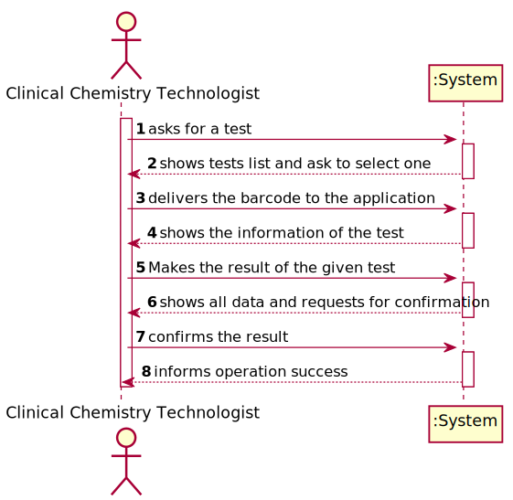
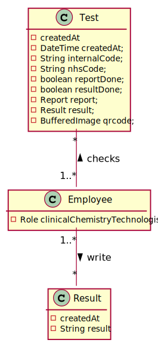
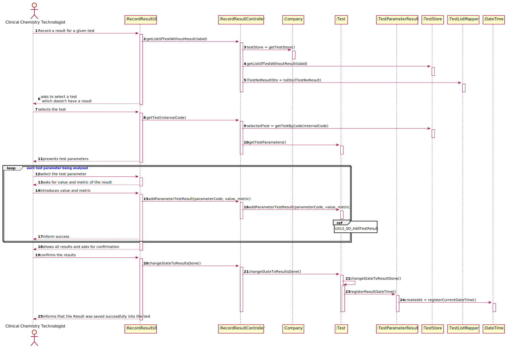
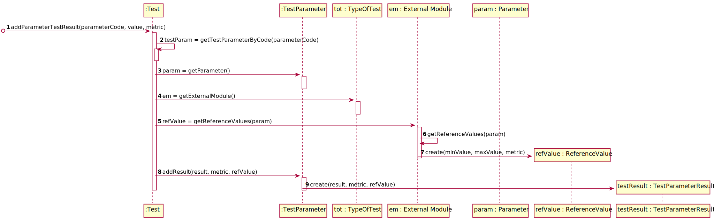
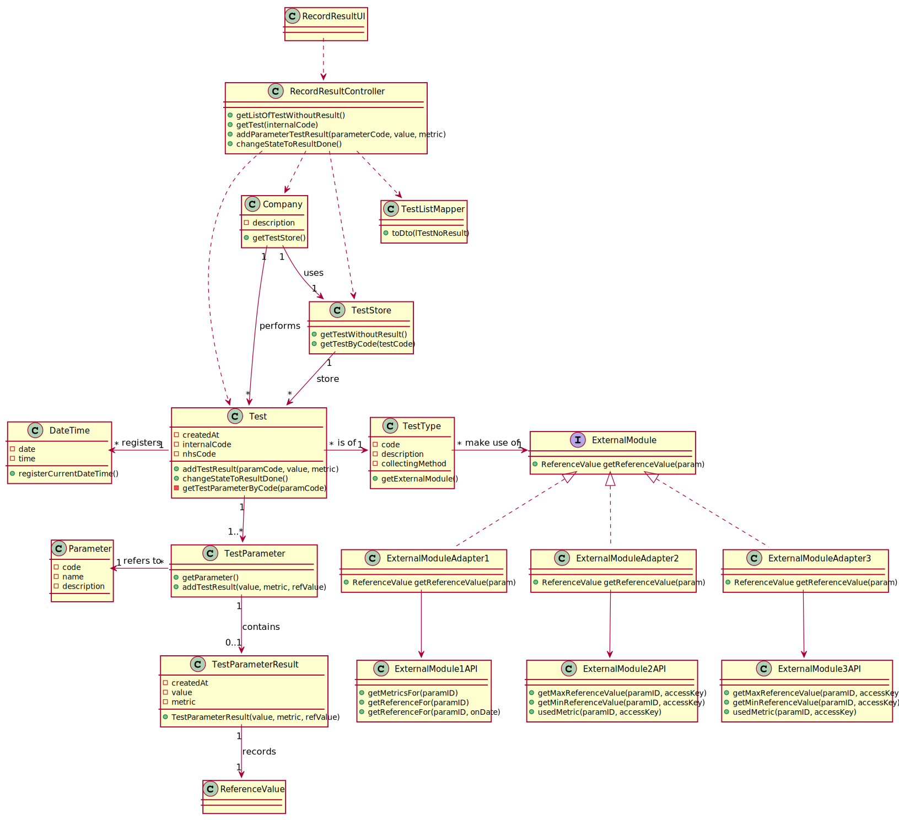

# US 012 - To record the results of a given test

## 1. Requirements Engineering

### 1.1. User Story Description

As a clinical chemistry technologist, I intend to record the parameter results of a given test

### 1.2. Customer Specifications and Clarifications

**From the specifications document:**

>   "At the company's headquarters, the clinical chemistry technologist receives the samples (delivered
by a courier) and performs the chemical analysis, recording the results in the software application."

>   "Blood tests are frequently characterized by measuring several parameters which for
presentation/reporting purposes are organized by categories. For example, parameters such
as the number of Red Blood Cells (RBC), White Blood Cells (WBC) and Platelets (PLT) are
usually presented under the blood count (Hemogram) category."

>   "Covid tests are characterized by measuring a single parameter stating whether it is a positive
or a negative result."

>   "The application should use an external module that is responsible for providing the test reference values.
The application can use an external module for each type of test.
For instance, when the results are for blood tests parameters, the
external module BloodReferenceValues1API can be used. When the results are for
Covid-19 tests parameters, the external module CovidReferenceValues1API can be used.
In any case, the API request should include, at most: (i) a key to access the module
(e.g.: “KEY1234”); (ii) a parameter identifier; (iii) the reference date; and (iv) reference
measurement unit (e.g. "mg")."

**From the client clarifications:**

> **Question:** Are the reference values, for each parameter, going to be delivered to the groups? If so, when and how?
>
> **Answer:** You should use the APIs available in moodle to obtain the reference values.

> **Question:** Does this "at most" express that there are some parameters of the API request that are optional? If so, could you clarify the parameters that are optional?
>
> **Answer:** "At most" means the maximum number of parameters that will be used. Depending on the API being used, all parameters above may be required or some may be optional.
>
> **Important: The number of parameters depends on the API that is being used.**

> **Question:** When you intend to record the results of the Blood Test, do you want to introduce all results for all parameters or just only one?
>
> **Answer:** The clinical chemistry technologist should record all results related to a test at a given time/moment.

> **Question:** When the Clinical Chemistry Technologist wants to record the results of a test, how does he have access to that test? By internal code, NHS code?
>
> **Answer:** Each sample has a unique barcode. The clinical chemistry technologist should use the sample barcode number to find the test for which the sample was collected.

> **Question:** Should the system present a result for each test parameter, or a single result for the test to be recorded?
>
> **Answer:** The Clinical Chemistry Technologist should register a value/result for each parameter of the test.

> **Question**: What information is the system going to have to ask the clinical chemistry technologist to be able to create the test results?
>
>**Answer1:**: The clinical Chemistry Technologist should use the sample barcode number to find (in the system) the test for which the sample was collected.
>**Answer2:**: The Clinical Chemistry Technologist should register a value/result for each parameter of the (selected) test.
>All parameter values of the test should be filled/defined (by the Clinical Chemistry Technologist) when the use case finishes.

### 1.3. Acceptance Criteria

* **AC1:** The application should use an external module that is responsible
  for providing the test reference values. The application can use an external module for
  each type of test. For instance, when the results are for blood tests parameters, the
  externalmodule BloodReferenceValues1API can be used. When the results are for
  Covid-19 tests parameters, the external module CovidReferenceValues1API can be used.
  In any case, the API request should include, at most:
  >(i) a key to access the module (e.g.:  “KEY1234”);
  >
  >(ii) a parameter identifier;
  >
  >(iii) the reference date; and (iv) reference
  measurement unit (e.g. "mg").

### 1.4. Found out Dependencies

* There is a dependency to "US5: As a medical lab technician, I want to record the samples collected in the scope of a
  given test." since at least a test must exist for a record to be created.

### 1.5 Input and Output Data

**Input Data:**

* Typed data:
    - Result

* Selected data:
    - Test

**Output Data:**
- Result's preview of the test

### 1.6. System Sequence Diagram (SSD)

**Alternative 1**

**Alternative 2**

### 1.7 Other Relevant Remarks

## 2. OO Analysis

### 2.1. Relevant Domain Model Excerpt

### 2.2. Other Remarks

n/a

## 3. Design - User Story Realization

### 3.1. Rationale

| Interaction ID | Question: Which class is responsible for... | Answer  | Justification (with patterns)  |
|:-------------  |:--------------------- |:------------|:---------------------------- |
| Step 1  		 |	... interacting with the actor? | RecordResultUI   |  Pure Fabrication: there is no reason to assign this responsibility to any existing class in the Domain Model.           |
| 			  		 |	... coordinating the US? | RecordResultController | Controller                             |
| 			  		 |	... instantiating a new Result? | Employee (Clinical Chemistry Technologist)   |  in the DM Employee with Clinical Chemistry Technologist role records the result.   |
| 			  		 |	... knowing to which test the result belongs to? | Test  | IE: knows its own data (qrcode, result) |
|                    |	... knowing all the results of the parameters?	|  ParameterTest  | IE: the results created will be stored in ParameterTest with all needed parameters                           |
| Step 2  		 |	...saving the inputted data? | Result  | IE: object created in step 1 has its own data.  |
| Step 3  		 |	...knowing the Result categories to show? | Test  | IE: Result Categories are defined by the test specifications. |
| Step 4  		 |	... saving the selected category? | ParameterTestResult  | IE: object created in step 1 is classified in one Category.  |
| Step 5  		 |	... validating all data (local validation)? | ParameterTestResult | IE: owns its data.| 
| 			  		 |	... validating all data (global validation)? | Test | IE: knows all its results.| 
| 			  		 |	... saving the created Result? | Test | IE: owns the respective result.| 
| Step 6  		 |	... informing operation success?| RecordResultUI  | IE: is responsible for user interactions.  | 
### Systematization ##

According to the taken rationale, the conceptual classes promoted to software classes are:

* Employee
* Test
* ParameterTestResult
* ParameterTest

Other software classes (i.e. Pure Fabrication) identified:

* RecordResultUI
* RecordResultController

## 3.2. Sequence Diagram (SD)

**Alternative 1**

**Alternative 2**

## 3.3. Class Diagram (CD)

**From alternative 1**

# 4. Tests

**Test 1:** Check that if is possible to get the result of the test parameters.

    @Test
	public void testGetTestParameterResultMethod(){
        Parameter p = new Parameter("42424", "asdsd", "afdfas", new ParameterCategory("34314", "qweqeq"));
        TestParameter tp = new TestParameter(p);
        TestParameterResult tpr = new TestParameterResult(2.22, "ml", new ReferenceValue(2.22, 2.11, "ml"));
        tp.addTestResult(2.22, "ml", new ReferenceValue(2.22, 2.11, "ml"));
        assertEquals(tpr.toString(), tp.getTestParameterResult().toString());
    }

# 5. Construction (Implementation)

## Class RecordResultController

	public class RecordResultController {

    private final TestStore testStore;
    private CATest test;

    /**
     * Constructor that gets the instance of the company being used
     */
    public RecordResultController(){
        this(App.getInstance().getCompany());
    }

    /**
     * Constructor that gets the test store used by the company
     * @param company
     */
    public RecordResultController(Company company){
        this.testStore = company.getTestStore();
    }

    /**
     * This method returns all the tests without results that were created in the same lab from where the user is working from
     * @param labId ID of the clinical analysis lab
     * @return a list with the tests that matches the requirements
     */
    public List<String> getListOfTestWithoutResult(String labId){
        List<CATest> testList = testStore.getTestsWithoutResults(labId);
        if(testList!=null && !testList.isEmpty()) {
            TestListMapper tlm = new TestListMapper();
            return tlm.toDto(testList);
        }
        return null;
    }

    /**
     * This method returns the list of parameters assigned to a test with the same code as the one received by parameter
     * @param internalCode of the test
     * @return a list with all the parameters
     */
    public List<String> getTest(String internalCode){
        this.test = testStore.getTestByCode(internalCode);
        return ParameterMapper.toDto(this.test.getParameterList());
    }

    /**
     * This method adds a value and metric to a parameter in order to save the result
     * @param internalCode of the parameter
     * @param value measured when testing the parameter
     * @param metric used to measure a value
     * @return
     */
    public boolean addParameterTestResult(String internalCode, double value, String metric){
        return test.addTestParameterResult(internalCode, value, metric);
    }

    /**
     * This method returns the results of all the parameter tested
     * @return a string with the results
     */
    public String getTestResults(){
        return this.test.getTestResults();
    }

    /**
     * After all the results were saved, this method is called to change the state of the test to tell that the results are done
     * @return if the state was changed or not
     */
    public boolean changeStateToResultDone(){
        return test.changeStateToResultDone();
    }
}

## Class TestParameterResult

    public class TestParameterResult {

    private double value;
    private String metric;
    private ReferenceValue refValue;

    /**
     * Constructor of this class
     * @param value of the test
     * @param metric used
     * @param refValue for the parameter tested
     */
    public TestParameterResult(double value, String metric, ReferenceValue refValue) {
        this.value=value;
        this.metric = metric;
        this.refValue = refValue;
    }

    /**
     * To string method
     * @return return important data about the result of the parameter tested
     */
    @Override
    public String toString() {
        return String.format("Results -> value: %f %s | %s", value, metric, refValue.toString());
    }
}

# 6. Integration and Demo

# 7. Observations

