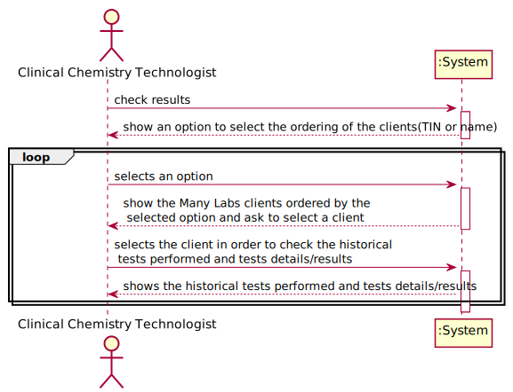

# US 13 - To consult the historical tests performed by a particular client and to be able to check tests details/results.

## 1. Requirements Engineering

### 1.1. User Story Description

As a clinical chemistry technologist, I intend to consult the historical tests performed by a particular client and to be able to check tests details/results.

### 1.2. Customer Specifications and Clarifications 

**From the specifications document:**

> " (...) At the same time the results are also available in the central application where the medical lab technicians
who collect the samples, the clinical chemistry technologist, the specialist doctor, and the laboratory
coordinator can check them.
To facilitate the access to the results, the application must allow ordering the clients by TIF and by
name. The ordering algorithm to be used by the application must be defined through a configuration
file. It is intended that the choice of the ordering algorithm is based on the algorithm complexity
(mainly the execution time). Therefore, at least two sorting algorithms should be evaluated and
documented in the application user manual (in the annexes) that must be delivered with the
application."

**From the client clarifications:**

> **Question:** Should we show every client already registered when we show the clients' list to the clinical chemistry technologist or should we only show the clients' with a test or more already assigned?
> 
> **Answer:** The system should show only clients that have tests already validated by the lab coordinator.

> **Question:** The client's tests, that we have to show on this US, need to have been validated by the lab coordinator or is it enough if they just have results and we can show them before being validated by the lab coordinator?
>
> **Answer:** The tests to be presented in US13 are tests that have already been validated by the lab coordinator.

> **Question:** From the user story description "As a clinical chemistry technologist, I intend to consult the historical tests performed by a particular client and to be able to check tests details/results". What do you mean by "check tests details/results" ?
>
> **Answer:** The clinical chemistry technologist should be able to check the historical tests performed by a particular client and see the results obtained in each test. For a given client (that was selected by the clinical chemistry technologist) the application should show all tests performed by the client and, for each parameter, the application should show the parameter value and the parameter reference values. The clinical chemistry technologist should not have access to the report made by the specialist doctor.

> **Question:** Should the user be the one selecting if the Clients are ordered by Name or TIN, or should it be defined through the configuration file? If it is the user, how should he be able to select it?
> 
> **Answer:** When using the application, the clinical chemistry technologist should be able to sort the clients by name or TIN. The algorithm that will be used to sort the data should be defined through a configuration file.

> **Question:** In US13, the Clinical Chemistry Technologist, can select more than one client at once to view its historical test results?
> 
> **Answer:** No.

> **Question:** Moreover, will all the tests associated with the client be displayed or the clinical chemistry technologist will have also to select the tests he wants to see?
> 
> **Answer:** After selecting one client, the application should show all the historical test results, of that client, to the Clinical Chemistry Technologist.

### 1.3. Acceptance Criteria

* **AC1:** The application must allow ordering the clients by TIN and
  by name to help the clinical chemistry technologist choose the target client. The
  ordering algorithm to be used by the application must be defined through a
  configuration file. 
* **AC2:** At least two sorting algorithms should be available.

### 1.4. Found out Dependencies

* This US has a dependency with the US03, because in order to get the tests details, the client needs to be registered in the system.
* This US has a dependency with the US07, because in order to get the tests details, the client needs to be registered in the system by a receptionist and after validated by a Lab Coordinator.
* This US has a dependency with the US15, because in order to get the tests , the client needs to be validated by the Lab Coordinator.

### 1.5 Input and Output Data

**Input Data:**

* Typed data:
	
	
* Selected data:

**Output Data:**

* (In)Success of the operation

### 1.6. System Sequence Diagram (SSD)

### 1.7 Other Relevant Remarks

## 2. OO Analysis

### 2.1. Relevant Domain Model Except 

### 2.2. Other Remarks

n/a

## 3. Design - User Story Realization 

### 3.1. Rationale

| Interaction ID | Question: Which class is responsible for... | Answer  | Justification (with patterns)  |
|:-------------  |:--------------------- |:------------|:---------------------------- |
| Step 1 | ...interacting with the user? | CheckTestsResultsUI | Pure Fabrication: There are no reasons to assign this task to any class of the domain |
| | ...managing the US? | CheckResultsController | Controller: The controller is responsible to make the bridge between UI layer and Domain Layer |
| Step 2 | | | |
| Step 3 |  ...transform list of client to a DTO? | ClientMapper | DTO: Used to transfer data from domain to UI and vice-versa, and reduce coupling between these layers |
| | ...present the clients that made a test(s), already validated by the Lab Coordinator? | heckTestsResultsUI | Pure Fabrication: There are no reasons to assign this task to any class of the domain |
| | ...giving all tests already validated by the Lab Coordinator? | TestStore | Creator and HC+LC: to remove this responsibility from the Company and apply HC+LC |
| | ...knows the TestStore? | Company | IE: Company knows all its stores |
| | ...knows the ClientStore? | Company | IE: Company knows all its stores |
| | ...knowing client data? | Client | IE: Each client knows its own data |
| Step 4 | | | |
| Step 5 | ...giving test's details? | Test | Creator: Test will store its own reports and is also responsible for instantiating a new report |
| Step 6 | | | |

### Systematization ##

According to the taken rationale, the conceptual classes promoted to software classes are: 

 - Company
 - Client
 - Test

Other software classes (i.e. Pure Fabrication) identified: 

 - CheckTestsResultsUI
 - CheckResultsController
 - TestStore
 - ClientMapper
 - ClientStore

## 3.2. Sequence Diagram (SD)

## 3.3. Class Diagram (CD)

# 4. Tests 

        @Test
        public void testGetSortedList() {
        ClientDTO dto1 = new ClientDTO("Alfredo", "1237897890123456", "1234567821", "9234567891", "23/12/2001", "male", "92345678901", "alfredo@isep.ipp.pt", "street 1");
        ClientDTO dto2 = new ClientDTO("Tomás", "1234567890123456", "1234567891", "1234567890", "23/12/2001", "male", "12345678901", "tomas@isep.ipp.pt", "street 1");
        Client ct01 = new Client(dto1);
        Client ct02 = new Client(dto2);

        List<Client> clientList = new ArrayList<>();
        clientList.add(ct02);
        clientList.add(ct01);

        List<Client> ordered = new SortingAdapterBubbleSortName().getSortedList(clientList);

        assertTrue("expected", ordered.get(0).getName().equals("Alfredo"));
    }

# 5. Construction (Implementation)

public CheckResultsController() {
this(App.getInstance().getCompany());
}

    public CheckResultsController(Company company) {
    }
    
    public List<String> showClients() {
    List<Client> listClients = ctStore.getClientList();
        if(listClients != null) {
            return ClientMapper.toDTOClient(listClients);
        }
        return null;
    }
    
    public List<String> showOrderedClients(String type){
        List<Client> listClients = new ArrayList<>(ctStore.getClientList());
        this.sorting= this.company.getSortingMethod(type);
        List<Client> clients=this.sorting.getSortedList(listClients);
        if (clients!=null){
            return ClientMapper.toDTOClient(clients);
        }
        return null;
    }

    public List<String> showTestDetails(String tin){
        this.ct=ctStore.getClientByTIN(tin);
        List<ClinicalTest> lTestNoReport = tstStore.getClientTests(ct);
        if(lTestNoReport != null) {
            return TestsFinalizedMapper.toDtoFin(lTestNoReport);
        }
        return null;
    }

# 6. Integration and Demo 

*A new option was added to Clinical Chemistry Technologist menu.*

# 7. Observations

*Overall, it is believed that the work done is consistent and meets the requirements specified by the Client.*

