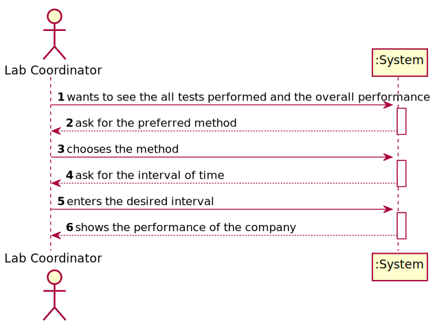
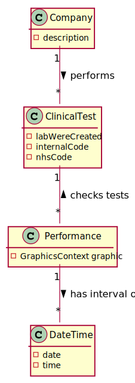
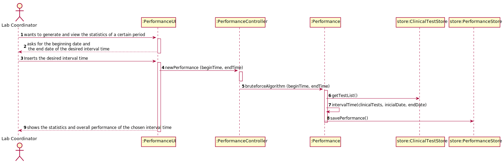
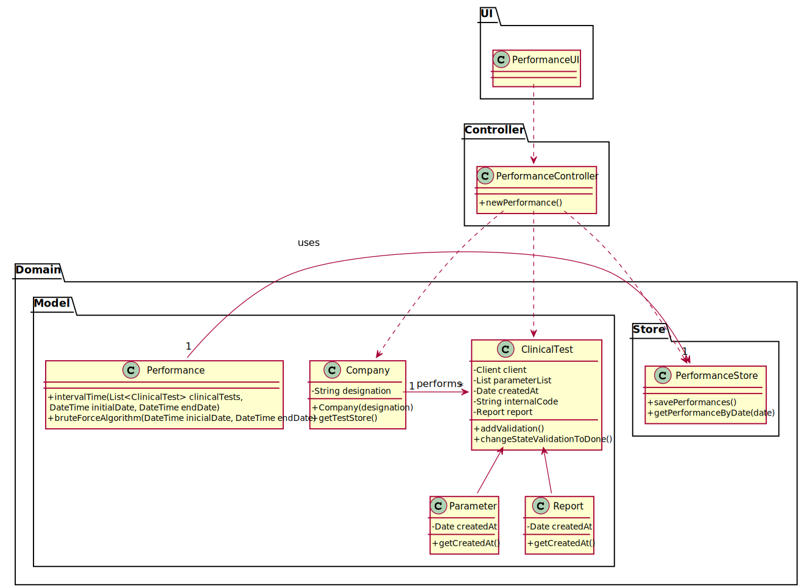

# US 16 - Overview and Analuse the overall performance of the company

## 1. Requirements Engineering

### 1.1. User Story Description

*: As a laboratory coordinator, I want to have an overview of all the tests performed
by Many Labs and analyse the overall performance of the company.*

### 1.2. Customer Specifications and Clarifications 

*From the Specification Document:*

>Moreover, Many Labs is a company that needs to be continuously evaluating and improving its
internal processes to achieve excellence and to beat the competition. Therefore, the company wants
to decrease the number of tests waiting for its result. To evaluate this, it proceeds as following: for
any interval of time, for example one week (6 working days with 12 working hours per day), the
difference between the number of new tests and the number of results available to the client during
each half an hour period is computed. In that case, a list with 144 integers is obtained, where a
positive integer means that in such half an hour more tests were processed than results were
obtained, and a negative integer means the opposite. Now, the problem consists in determining what
the contiguous subsequence of the initial sequence is, whose sum of their entries is maximum. This
will show the time interval, in such week, when the company was less effective in responding. 

>So,the application should implement a brute-force algorithm (an algorithm which examines each
subsequence) to determine the contiguous subsequence with maximum sum, for any interval of time
registered. The implemented algorithm should be analysed in terms of its worst-case time complexity, and it should be compared to a provided benchmark algorithm. The algorithm to be
used by the application must be defined through a configuration file.
>The complexity analysis must be accompanied by the observation of the execution time of the
algorithms for inputs of variable size in order to observe the asymptotic behaviour. The time
complexity analysis of the algorithms should be properly documented in the application user
manual (in the annexes) that must be delivered with the application

*From the Client Specifications:*

> **Question:** Should the interval of time considered for the evaluation be asked to the Laboratory Coordinator?
> 
> **Answer:** Yes.

> **Question:** How should we ask him the interval of time to be considered? Should we ask him to type a number of days? A number of weeks? Should we give general options like: last week, last month..., for him to select from?
>
> In case the Laboratory Coordinator chooses, for example, one week, should we consider the last 7 days, or should we consider, for example, the data from monday to sunday? 
>
> **Answer:** The laboratory coordinator should introduce two dates that define an interval, the beginning date and the end date. This interval will be used to find the contiguous subsequence with maximum sum.

> **Question:** What is the meaning of "overview" here? Should the laboratory coordinator see the number of tests waiting for samples, the number of tests waiting for results, the number of tests waiting for diagnoses... Or should he see the information available for each one of the tests in the application?
>
> **Answer:** The laboratory coordinator should be able to check the number of clients, the number of tests waiting for results, the number of tests waiting for diagnosis and the total number of tests processed in the laboratory in each day, week, month and year. Moreover, the laboratory coordinator should be able to check the contiguous subsequence with maximum sum.

> **Question:** After the Laboratory Coordinator types the requested data and views the analysis of the company performance, should he be able to re-type different data and view the results for a different interval of time and/or algorithm? To make the re-type of the data easier, should there be a "clear" button, that is responsible for clearing the text fields for data entry?
>
> **Answer:** The laboratory coordinator should be able to explore different parameter values (settings) and check the results. Each team should prepare a simple and intuitive interface that requires a minimum number of interactions with the user.

> **Question:** Can we assume that every day in the interval defined by the coordinator is a working day with 12 working hours each?
>
> **Answer:** Yes.

> **Question:** If Saturday or Sunday are in the interval should we skip them or count them also as working days?
>
> **Answer:** Sunday is not a working day. All the other days of the week are working days.

> **Question:** "For example one week (6 working days with 12 working hours)"
Q2. In this case, is there any specifc hour to start filling the 144 integers list?
>
> **Answer:** A working day is from 8h00 to 20h00.

> **Question:** When referring to "the application should also display statistics and graphs" is it up to the team to decide which API or resource should be used to generate graphs and statistics, or do you prefer something specific?
>
> **Answer:** With JavaFX you can draw high quality graphs and there is no need to use other tools.

### 1.3. Acceptance Criteria

**AC1** : *While evaluating the performance the laboratory
coordinator should have the ability to dynamically select the algorithm to be
applied from the ones available on the system (the benchmark algorithm provided
in moodle and the brute-force algorithm to be developed). Support for easily
adding other similar algorithms is required.*

### 1.4. Found out Dependencies

*No dependencies with other US and/or requirements.*

### 1.5 Input and Output Data

*Input Data*

-Typed Data: n/a

-Output Data: Graphics with the statistics
(In)Success of the operation.

### 1.6. System Sequence Diagram (SSD)

*Insert here a SSD depicting the envisioned Actor-System interactions and throughout which data is inputted and outputted to fulfill the requirement. All interactions must be numbered.*

### 1.7 Other Relevant Remarks

*Use this section to capture other relevant information that is related with this US such as (i) special requirements ; (ii) data and/or technology variations; (iii) how often this US is held.* 

## 2. OO Analysis

### 2.1. Relevant Domain Model Excerpt 
*In this section, it is suggested to present an excerpt of the domain model that is seen as relevant to fulfill this requirement.* 

### 2.2. Other Remarks

*Use this section to capture some aditional notes/remarks that must be taken into consideration into the design activity. In some case, it might be usefull to add other analysis artifacts (e.g. activity or state diagrams).* 

## 3. Design - User Story Realization 

### 3.1. Rationale

**The rationale grounds on the SSD interactions and the identified input/output data.**

| Interaction ID | Question: Which class is responsible for... | Answer  | Justification (with patterns)  |
|:-------------  |:--------------------- |:------------|:---------------------------- |
| Step 1                 |	... interacting with the actor? | PerformanceUI   |  **Pure Fabrication:** there is no reason to assign this responsibility to any existing class in the Domain Model           |
| 			  		     |	... coordinating the US? | PerformanceController | **Controller**                             |
|                        |  ... knows the statistics ?  | Company  | **IE** Company knows the PerformanceStore who will alocate all the statistics
| 	Step 2  	                 |	... instantiating a new performance? | Employee with Lab Coordinator role   | **Creator (R1)** and **HC+LC**: By the application of the Creator (R1) it would be the "Company". But, by applying HC + LC to the "Company", this delegates that responsibility to the "ClientStore"   |
|  		 			     |  ... knows PerformanceStore?	 |  Company   |  **IE:** Company knows the PerformanceStore |
| Step 3                 |	                |                   |                   |	
| Step 4	     	     |	... saving the performance? | PerformanceStore | **IE:** Knows all statistics| 
| 			  		     |	... validating all data ? | PerformanceStore | **IE:** knows all the statistics requirements|
| Step 5                 |	... shows the graph of the data?|   | **IE:** is responsible for user interactions  | 
|                           |	... informing operation success?| PerformanceUI  | **IE:** is responsible for user interactions  | 

### Systematization ##

According to the taken rationale, the conceptual classes promoted to software classes are: 

 * Performance
 * PerformanceStore

Other software classes (i.e. Pure Fabrication) identified: 
 * PerformanceUI
 * PerformanceController

## 3.2. Sequence Diagram (SD)

*In this section, it is suggested to present an UML dynamic view stating the sequence of domain related software objects' interactions that allows to fulfill the requirement.* 

## 3.3. Class Diagram (CD)

*In this section, it is suggested to present an UML static view representing the main domain related software classes that are involved in fulfilling the requirement as well as and their relations, attributes and methods.*

# 4. Tests 
*In this section, it is suggested to systematize how the tests were designed to allow a correct measurement of requirements fulfilling.* 

**_DO NOT COPY ALL DEVELOPED TESTS HERE_**

**Test 1:** Check that it is not possible to create an instance of the Example class with null values. 

	@Test(expected = IllegalArgumentException.class)
		public void ensureNullIsNotAllowed() {
		Exemplo instance = new Exemplo(null, null);
	}

*It is also recommended to organize this content by subsections.* 

# 5. Construction (Implementation)

*In this section, it is suggested to provide, if necessary, some evidence that the construction/implementation is in accordance with the previously carried out design. Furthermore, it is recommeded to mention/describe the existence of other relevant (e.g. configuration) files and highlight relevant commits.*

*It is also recommended to organize this content by subsections.* 

# 6. Integration and Demo 

*In this section, it is suggested to describe the efforts made to integrate this functionality with the other features of the system.*

# 7. Observations

*In this section, it is suggested to present a critical perspective on the developed work, pointing, for example, to other alternatives and or future related work.*

