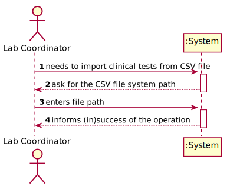
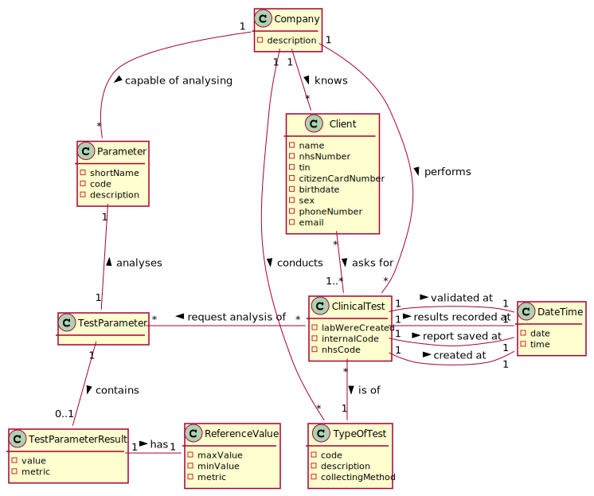
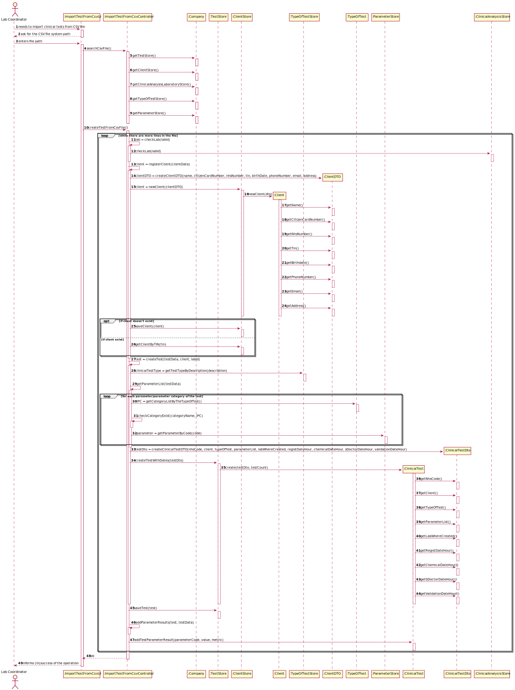

# US 17 - Import clinical tests from a CSV file

## 1. Requirements Engineering

### 1.1. User Story Description

As a laboratory coordinator, I want to import clinical tests from a CSV file.

### 1.2. Customer Specifications and Clarifications 

**From the specifications document:**

* N/A

**From the client clarifications:**

> **Question:** In what folder should the CSV file be when we want to use the application through the console?
> 
> **Answer:** In this sprint each team should develop a graphical user interface. The file to import can be located in any folder. The user should specify the path of the file.

> **Question:** Considering we could have more clients than the number that a Many Labs specific laboratory could deal in a day, then the registration date could be different than the sample collection date. My question is thus: Should the tests have a registration date plus sample collection date?
>
> **Answer:** You should use the Test_Reg_DateHour as the sample collection date.

> **Question:** If a labID on the CSV file isn't found on the system, should we consider it as "invalid data"?
>
> **Answer:** Yes. To import tests of any laboratory (with a given Lab_ID), it is required that a laboratory having the given Lab_ID exists in the system.
> Therefore, if you want to import data from a given laboratory, you should use the application to create that laboratory in the system. Then you should import the data.
> When creating a laboratory in the system, you should use the given Lab_ID (available in the CSV file) and define the other attributes using valid data. In this project, 
> we are NOT going to import data from laboratories (or other entities) to reduce the amount of hours required to develop and deliver a working application to the client.
> What I say in this message is valid for the laboratories and for other entities that appear in the CSV files.

### 1.3. Acceptance Criteria

* **AC1:** If the file contains invalid data (e.g., a parameter not defined in the system), that data should not be load into the system. An exception
  should be thrown.

### 1.4. Found out Dependencies

* This US has dependencies with several US such as the ones that allow to register clients, tests, parameters, etc.

### 1.5 Input and Output Data

**Input Data:**

* Typed data:
	* CSV file path
	
* Selected data:
	* N/A

**Output Data:**

* (In)Success of the operation
* Tests added to the System
* Tests that failed due to invalid data

### 1.6. System Sequence Diagram (SSD)

### 1.7 Other Relevant Remarks

## 2. OO Analysis

### 2.1. Relevant Domain Model Except 

### 2.2. Other Remarks

n/a

## 3. Design - User Story Realization 

### 3.1. Rationale

| Interaction ID | Question: Which class is responsible for... | Answer  | Justification (with patterns)  |
|:-------------  |:--------------------- |:------------|:---------------------------- |
| Step 1 | ...interacting with the user? | ImportTestFromCsvUI | Pure Fabrication: The UI is always responsible for user interactions and there is no reason to assign this responsibility to any other class |
| | ...managing the US? | ImportTestFromCsvController | Controller: The controller is responsible for connecting the UI to the Domain classes |
| Step 3 | ...storing the new tests imported? | TestStore | HC+LC: To switch this responsibility from the Company to a dedicated class |
| | ...storing the clients associated with the test imported? | ClientStore | HC+LC |
| | ...verifying if the labID is valid? | ClinicalAnalysisLaboratoryStore | IE: the store knows all the labs registered |
| | ...storing data of the tests | ClinicalTest | IE: Each test knows and saves his own data |
| | ...checking if the test types from the CSV file exists in the system? | TypeOfTestStore | IE: the store knows all the test types registered in the system |
| | ...knowing all the parameters available and check if the ones in the file are also present in the system? | ParameterStore | IE: knows all the parameters available in the system |
| Step 4 | ...informing (in)success of the operation? | ImportTestFromCsvUI | Pure Fabrication: The UI is always responsible for user interactions and there is no reason to assign this responsibility to any other class |

### Systematization ##

According to the taken rationale, the conceptual classes promoted to software classes are: 

 - Company
 - Report
 - ClinicalTest
 - TestParameterResult

Other software classes (i.e. Pure Fabrication) identified: 

 - ImportTestFromCsvUI
 - ImportTestFromCsvController
 - TestStore
 - ClientStore
 - ClinicalAnalysisLaboratoryStore
 - TypeOfTestStore
 - ParameterStore

## 3.2. Sequence Diagram (SD)

## 3.3. Class Diagram (CD)

# 4. Tests 

	@Test(expected = NullPointerException.class)
    public void ensureItsNotPossibleToAddNullReportText(){
        new Report(null);
    }

    @Test(expected = IllegalArgumentException.class)
    public void ensureItsNotPossibleToAddBlankReportText(){
        new Report("");
    }

    @Test(expected = IllegalArgumentException.class)
    public void ensureItsNotPossibleToAddReportTextWithMoreThan400words(){
        new Report("a b b d a a f d a d f a f d a d f d a d f a d f a d f a d f a d f a b b d a a f d a d f a f d a d f d a d f a d f a d f a d f a d f" +
                "a b b d a a f d a d f a f d a d f d a d f a d f a d f a d f a d f a b b d a a f d a d f a f d a d f d a d f a d f a d f a d f a d f" +
                "a b b d a a f d a d f a f d a d f d a d f a d f a d f a d f a d f a b b d a a f d a d f a f d a d f d a d f a d f a d f a d f a d f" +
                "a b b d a a f d a d f a f d a d f d a d f a d f a d f a d f a d f a b b d a a f d a d f a f d a d f d a d f a d f a d f a d f a d f" +
                "a b b d a a f d a d f a f d a d f d a d f a d f a d f a d f a d f a b b d a a f d a d f a f d a d f d a d f a d f a d f a d f a d f" +
                "a b b d a a f d a d f a f d a d f d a d f a d f a d f a d f a d f a b b d a a f d a d f a f d a d f d a d f a d f a d f a d f a d f" +
                "a b b d a a g g g g f");
    }

# 5. Construction (Implementation)

* Controller

  
  		public List<String> getTestWithoutReport(){
  			List<CATest> lTestNoReport = testStore.getTestWithoutReport();
  			if(lTestNoReport != null) {
  			TestListMapper tlm = new TestListMapper();
  			return tlm.toDto(lTestNoReport);
  			}
  			return null;
  		}

	  	public String getTestResults(String testCode){
	  		this.test = testStore.getTestByCode(testCode);
	  		return test.getTestResults();
	  	}

	  	public void newReport(String text){
	  		this.report = new Report(text);
	  	}

		public boolean saveReport(){
			return this.test.addReport(this.report);
		}

* Report

  
		public Report (String reportText){
			setReportText(reportText);
		}

    
    	public String getReportText() {
        	return reportText;
   		}

    
    	public DateTime getCreatedAt() {
        	return createdAt;
    	}

  		public void setReportText(String reportText) {
        	if(reportText == null)
            	throw new NullPointerException();
        	if(StringUtils.isBlank(reportText))
            	throw new IllegalArgumentException("Report cannot be empty");
        	if(CommonMethods.wordCounter(reportText) > MAX_WORDS_IN_REPORT)
            	throw new IllegalArgumentException("Report cannot have more than " + MAX_WORDS_IN_REPORT + "words.");
        	this.reportText = reportText;
        	registerReportDateTime();
    	}

    
  		public void registerReportDateTime(){
        	this.createdAt = new DateTime();
    	}
	
# 6. Integration and Demo 

# 7. Observations

