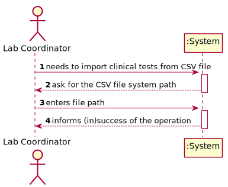

# US 17 - Import clinical tests from a CSV file

## 1. Requirements Engineering

### 1.1. User Story Description

As a laboratory coordinator, I want to import clinical tests from a CSV file.

### 1.2. Customer Specifications and Clarifications 

**From the specifications document:**

* N/A

**From the client clarifications:**

> **Question:** In what folder should the CSV file be when we want to use the application through the console?
> 
> **Answer:** In this sprint each team should develop a graphical user interface. The file to import can be located in any folder. The user should specify the path of the file

### 1.3. Acceptance Criteria

* **AC1:** If the file contains invalid data (e.g., a parameter not defined in the system), that data should not be load into the system. An exception
  should be thrown.

### 1.4. Found out Dependencies

* This US has dependencies with several US such as the ones that allow to register clients, tests, parameters, etc.

### 1.5 Input and Output Data

**Input Data:**

* Typed data:
	* CSV file path
	
* Selected data:
	* N/A

**Output Data:**

* (In)Success of the operation

### 1.6. System Sequence Diagram (SSD)

### 1.7 Other Relevant Remarks

## 2. OO Analysis

### 2.1. Relevant Domain Model Except 

### 2.2. Other Remarks

n/a

## 3. Design - User Story Realization 

### 3.1. Rationale

| Interaction ID | Question: Which class is responsible for... | Answer  | Justification (with patterns)  |
|:-------------  |:--------------------- |:------------|:---------------------------- |
| Step 1 | ...interacting with the user? | WriteReportUI | Pure Fabrication: There are no reasons to assign this task to any class of the domain |
| | ...managing the US? | WriteReportController | Controller: The controller is responsible to make the bridge between UI layer and Domain Layer |
| Step 2 | | | |
| Step 3 | ...send data from UI to Domain? | WriteReportController | Controller |
| | ...transform list of tests to a DTO? | TestListMapper | DTO: Used to transfer data from domain to UI and vice-versa, and reduce coupling between these layers |
| | ...present tests that need a report? | WriteReportUI | Pure Fabrication: There are no reasons to assign this task to any class of the domain |
| | ...giving all tests without report done? | TestStore | Creator and HC+LC: to remove this responsibility from the Company and apply HC+LC |
| | ...knows the TestStore? | Company | IE: Company knows all its stores |
| | ...knowing test data? | Test | IE: Each test knows its own data |
| | ...knowing the results for each parameter testes? | TestParameterResult | IE: each parameter result knows its own data |
| Step 4 | | | |
| Step 5 | ...storing the reports? | Test | Creator: Test will store its own reports and is also responsible for instantiating a new report |
| Step 6 | | | |
| Step 7 | ...validating the written report? | Report | IE: knows its own data and also knows each acceptance criteria |
| | ...knowing the current date and time? | DateTime | Pure Fabrication: there is no need to assign this responsibility to any domain class |
| | ...registering validation date and time? | Report | IE: saves its own data |
| Step 8 | ...informing success of the operation? | WriteReportUI | It's always responsible for user interaction |

### Systematization ##

According to the taken rationale, the conceptual classes promoted to software classes are: 

 - Company
 - Report
 - Test
 - TestParameterResult

Other software classes (i.e. Pure Fabrication) identified: 

 - WriteReportUI
 - WriteReportController
 - TestStore
 - TestListMapper
 - DateTime

## 3.2. Sequence Diagram (SD)

## 3.3. Class Diagram (CD)

# 4. Tests 

	@Test(expected = NullPointerException.class)
    public void ensureItsNotPossibleToAddNullReportText(){
        new Report(null);
    }

    @Test(expected = IllegalArgumentException.class)
    public void ensureItsNotPossibleToAddBlankReportText(){
        new Report("");
    }

    @Test(expected = IllegalArgumentException.class)
    public void ensureItsNotPossibleToAddReportTextWithMoreThan400words(){
        new Report("a b b d a a f d a d f a f d a d f d a d f a d f a d f a d f a d f a b b d a a f d a d f a f d a d f d a d f a d f a d f a d f a d f" +
                "a b b d a a f d a d f a f d a d f d a d f a d f a d f a d f a d f a b b d a a f d a d f a f d a d f d a d f a d f a d f a d f a d f" +
                "a b b d a a f d a d f a f d a d f d a d f a d f a d f a d f a d f a b b d a a f d a d f a f d a d f d a d f a d f a d f a d f a d f" +
                "a b b d a a f d a d f a f d a d f d a d f a d f a d f a d f a d f a b b d a a f d a d f a f d a d f d a d f a d f a d f a d f a d f" +
                "a b b d a a f d a d f a f d a d f d a d f a d f a d f a d f a d f a b b d a a f d a d f a f d a d f d a d f a d f a d f a d f a d f" +
                "a b b d a a f d a d f a f d a d f d a d f a d f a d f a d f a d f a b b d a a f d a d f a f d a d f d a d f a d f a d f a d f a d f" +
                "a b b d a a g g g g f");
    }

# 5. Construction (Implementation)

* Controller

  
  		public List<String> getTestWithoutReport(){
  			List<CATest> lTestNoReport = testStore.getTestWithoutReport();
  			if(lTestNoReport != null) {
  			TestListMapper tlm = new TestListMapper();
  			return tlm.toDto(lTestNoReport);
  			}
  			return null;
  		}

	  	public String getTestResults(String testCode){
	  		this.test = testStore.getTestByCode(testCode);
	  		return test.getTestResults();
	  	}

	  	public void newReport(String text){
	  		this.report = new Report(text);
	  	}

		public boolean saveReport(){
			return this.test.addReport(this.report);
		}

* Report

  
		public Report (String reportText){
			setReportText(reportText);
		}

    
    	public String getReportText() {
        	return reportText;
   		}

    
    	public DateTime getCreatedAt() {
        	return createdAt;
    	}

  		public void setReportText(String reportText) {
        	if(reportText == null)
            	throw new NullPointerException();
        	if(StringUtils.isBlank(reportText))
            	throw new IllegalArgumentException("Report cannot be empty");
        	if(CommonMethods.wordCounter(reportText) > MAX_WORDS_IN_REPORT)
            	throw new IllegalArgumentException("Report cannot have more than " + MAX_WORDS_IN_REPORT + "words.");
        	this.reportText = reportText;
        	registerReportDateTime();
    	}

    
  		public void registerReportDateTime(){
        	this.createdAt = new DateTime();
    	}
	
# 6. Integration and Demo 

# 7. Observations

