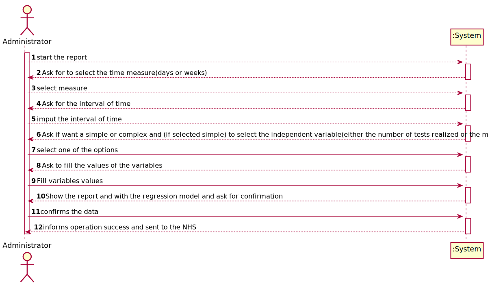
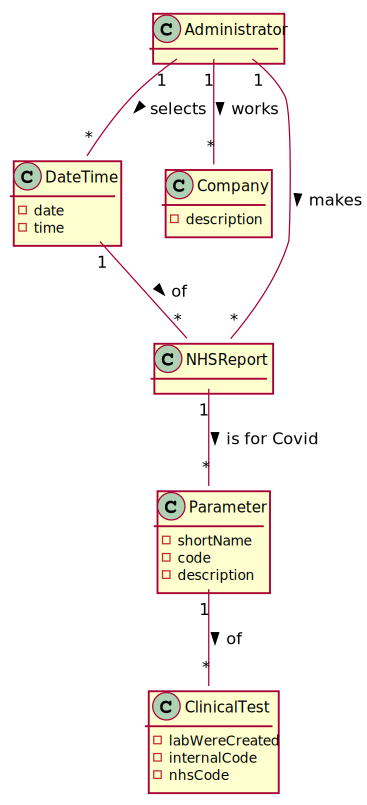
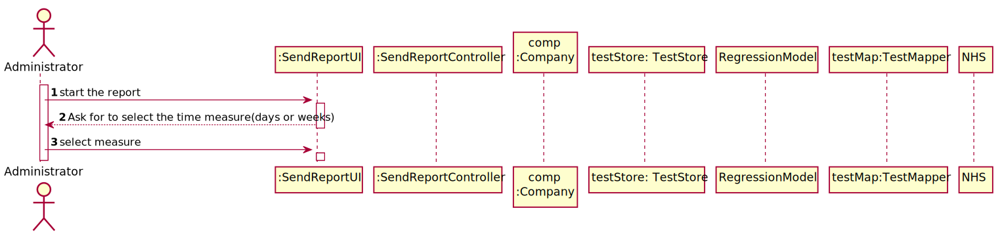
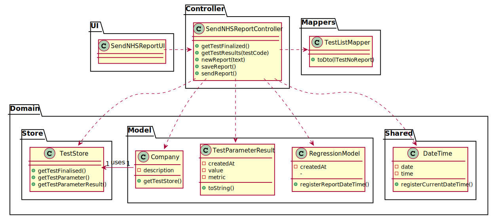

# US 018 - Send Covid19 reports to the NHS

## 1. Requirements Engineering

### 1.1. User Story Description

As an Administrator I want to send the Covid-19 report to the NHS at any time. I
want to define the interval of dates to fit the regression model, the number of historical
points (number of days or number of weeks) that must be sent to the NHS, the regression
model to use and select the independent variables to use.

### 1.2. Customer Specifications and Clarifications

**From the specifications document:**

**From the client clarifications:**

> **Question:** "From Sprint D requirements we get "I want to define... the number of historical points (number of days or number of weeks) that must be sent to the NHS".
Is the Administrator who must choose between days or weeks? If so, how should he make this choice?"
> 
> **Answer:** "Yes. The Administrator should select between days and weeks using the user interface."

> **Question:** "From the project description it is known "send the forecasts for these same time horizons (the number of Covid-19 cases for the following day, next week and next month)." In the example report we have in moodle, there is a line that says "// Prediction values". Does this mean that after this line we should put our predictions or it refers to the following table?"
> 
> **Answer:** "Yes, the prediction values are the ones available in the table that we include in the example."

> **Question:** " Regarding US18 and US19, it is only one report containing all the tests performed by Many Labs to be sent each time, correct? Or is it one report per laboratory, for example? Or other option?"
> 
> **Answer:** "The report should contain all the tests made by Many Labs."

> **Question:** "Should the report contain the data of all the tests with results (with or without report, with or without validation) or contain only the validated tests? (Or other option?)"
> 
> **Answer:** "The NHS Covid report should include statistics computed only from validated tests."

> **Question:** 
>
> **Answer:** 

### 1.3. Acceptance Criteria

* **AC1:** The system should allow the Administrator to select between a simple linear and multilinear regression model to fit the data.
* **AC2:** The Administrator should be able to choose the independent variable to use with the simple linear regression model (either the number of tests realized or the mean age)
* **AC3:** The system should send the report using the NHS API (available in moodle).
* **AC4:** The NHS Covid report should include statistics computed only from validated tests.

### 1.4. Found out Dependencies

* US15  validate the work done by the clinical chemistry technologist and specialist doctor

### 1.5 Input and Output Data

**Input Data:**

* Typed data:
  *Time interval(day or weeks)
  * Number of Covid19 tests (per day ,per week or per mean age)
  

* Selected data:
  *Type of regression model
  * Measure of time (days or weeks)

**Output Data:**
* Report for NHS
* (In)Success of the operation

### 1.6. System Sequence Diagram (SSD)

**Alternative 1**

**Other alternatives might exist.**

### 1.7 Other Relevant Remarks

* The created task stays in a "not published" state in order to distinguish from "published" tasks.

## 2. OO Analysis

### 2.1. Relevant Domain Model Excerpt

### 2.2. Other Remarks

n/a

## 3. Design - User Story Realization

### 3.1. Rationale

| Interaction ID | Question: Which class is responsible for... | Answer  | Justification (with patterns)  |
|:-------------  |:--------------------- |:------------|:---------------------------- |
| Step 1  		 |	                     |             |                              |
| Step 2  |		... interacting with the actor? | SendReportUI   |  **Pure Fabrication:** there is no reason to assign this responsibility to any other of the existing class in the Domain Model.           |
| 		 |	... coordinating the US? |  SendReportController   |  **Controller**         |
|       | ... knows TestStore?	| Company  |  **IE** Company knows the TestStore to which is delegation some tasks
| Step 3		|... gets the selected measure? 	|  SendReportController |      **Controller**     |
| Step 4		|                        |             |                              |
| Step 5		 | ... receives the interval of time ?	| RegressionModel  |   **IE**  object created in step 1 has its own data.   |
| Step 6		 |	                     |             |                              |
| Step 7		 |...receives the complexity selected and the independent variable?   |   RegressionModel        |       **IE**  object created in step 1 has its own data.                       |
| Step 8		 |	                     |             |                              |
| Step 9		 |	 ...receives the values of the independent variable?              |   RegressionModel            |                              |
| Step 10		 |	                     |             |                              |
| Step 11		 |	 ...receives the report?                  |    NHS         |                              |
 Step 12		 | ... informing operation success?| SendReportUI  | **IE** is responsible for user interactions.  | 

### Systematization ##

According to the taken rationale, the conceptual classes promoted to software classes are:

* SendReportUI
* SendReportController
* Company

Other software classes (i.e. Pure Fabrication) identified:

* 
* TestDto
* TestMapper
* TestStore

## 3.2. Sequence Diagram (SD)

## 3.3. Class Diagram (CD)

# 4. Tests

**Test 1:** Check that it is not possible to create an instance of the Task class with null values.

**Test 2:** Check that it is not possible to create an instance of the Task class with a reference containing less

# 5. Construction (Implementation)

## Class RegisterSampleController

    public class RegisterSampleController {

    private TestStore testStore;

    private CATest test;

    private Sample sample;

    /**
     * This constructor finds the instance of the company being used by the app
     */
    public RegisterSampleController() {
        this(App.getInstance().getCompany());
    }

    /**
     * This constructor finds the testStore used by the company
     */
    public RegisterSampleController(Company company) {
        this.testStore = company.getTestStore();
    }

    /**
     * This method returns a list with the main information about each test available without a sample
     *
     * @return a list of Strings holding the data for each test
     */
    public List<String> getTestWithoutSample() {
        List<CATest> lTestNoSample = testStore.getTestWithoutSample();
        if (lTestNoSample != null) {
            TestListMapper tlm = new TestListMapper();
            return tlm.toDto(lTestNoSample);
        }
        return null;
    }

    /**
     * This method receives an internal code and finds the test that has it from the test store, then, returns all of its test codes
     * @param testCode internal code to be used
     * @return all the parameter tested results
     */
    public String getData(String testCode){
        this.test = testStore.getTestByCode(testCode);
        return test.getInternalCode();
    }

    /**
     * This method  uses the internal code to generate the bar code
     * @param data internal code to be used
     * @return gerated barcod
     * @throws OutputException prevents error
     * @throws IOException prevents error
     */
    public  Barcode createUPCA (String data) throws  OutputException, IOException {
        Barcode barcode = null;
        try {
            barcode = BarcodeFactory.createUPCA(data);
        } catch (BarcodeException e) {
            e.printStackTrace();
        }
        File imgFile = new File("UPCA.jpg");
        BarcodeImageHandler.saveJPEG(barcode, imgFile);
        return barcode ;
    }

    /**
     * This method turns the Arraylist received to
     * @param sampleList list to be added
     * @return sample
     */
    public Sample createSample(ArrayList sampleList) {
        this.sample = new Sample(sampleList);
        return sample;
    }

    /**
     * When everything is confirmed by the user, this method saves the samples created as an attribute of its test
     */
    public boolean addSample(){
        return this.test.addSample(this.sample);
    }

}

## Class Sample

    public class Sample {
    private List<Sample> sampleList ;

    /**
     * creates a list of class sample list
     * @param sampleList
     */
    public Sample(ArrayList sampleList) {
        this.sampleList = new ArrayList<>(sampleList);
    }

    /**
     * method to get the sample list
     * @return sampleList
     */
    public List<Sample> getSampleList() { return sampleList; }

    /**
     * to String method to show the
     * @return a String
     */
    @Override
    public String toString() {
        return "Sample:"+sampleList;
    }
    }

# 6. Integration and Demo

* A new option on the  menu options was added.

# 7. Observations

