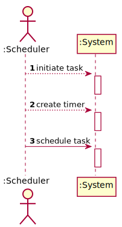

# US 19 - The Many Labs company wants to send to the NHS daily reports of Covid-19 data

## 1. Requirements Engineering

### 1.1. User Story Description

* The Many Labs company wants to send to the NHS daily reports of Covid-19 data, including the number of observed values and estimated values. Reports should be
  generated automatically with historical data and must be sent every day at 6:00 am.

### 1.2. Customer Specifications and Clarifications

**From the specifications document:**

* Considering that Many Labs has the exclusivity to perform Covid-19 tests, and that the contract
with the NHS in England requires Many Labs to summarize and report Covid-19 data, the company
needs to: identify the number of Covid-19 tests performed, identify all positive results to Covid-19
tests, report the total number of Covid-19 cases per day, per week and per month of the year, and
send the forecasts for these same time horizons (the number of Covid-19 cases for the following
day, next week and next month). The company is also required to generate daily (automatic) reports
with all the information demanded by the NHS and should send them to the NHS using their API.
To make the predictions, the NHS contract defines that a linear regression algorithm should be used.
The NHS required that both simple linear and multiple linear regression algorithms should be
evaluated to select the best model. The accuracy of the prediction models should be analysed and
documented in the application user manual (in the annexes) that must be delivered with the
application. The algorithm to be used by the application must be defined through a configuration
file.
  

* **US19:** The Many Labs company wants to send to the NHS daily reports of Covid-19
data, including the number of observed values and estimated values. Reports should be
generated automatically with historical data and must be sent every day at 6:00 am.
  * **Acceptance Criteria:** The report should include day and week (observed and
estimated) values, the regression model used to estimate each value, R(SLR), R2
and R2 adjusted for SLR and MLR, hypothesis tests for regression coefficients
significance model with Anova. Simple linear and multilinear regression models
can be used to compute the estimates and corresponding confidence intervals.
When the system is configured to use the simple linear regression model, the
performance of each model should be used to select the best model (the one that
uses the number of tests realized or the one that uses the mean age as independent
variable). The best model will be used to make the estimated/expected values that
will be sent to NHS. The interval of dates to fit the regression model and the
number of historical points (number of days and number of weeks) must be
defined through a configuration file. The system should send the report using the
NHS API (available in moodle).

**From the client clarifications:**

> **Question:** Which class is responsible for creating the scheduler(s)? Should we assume the report scope is Many Labs or is it each laboratory?
>
> **Answer:** Many Labs Many has exclusivity for doing Covid-19 tests and should send nationwide reports to NHS. The scope is Many Labs.

> **Question:** In US19, in Sprint D Requirements, it says "The report should include day and week (observed and estimated) values..." and also "Reports...must be sent every day at 6:00 am".
> As the Report is to be automatically sent very early in the morning, do you wish the report to have the data concerning the day before and the last week starting at the day before?
>
> **Answer:** The format of the report should follow the report example that is available in moodle.

> **Question:** Should the report contain the data of all the tests with results (with or without report, with or without validation) or contain only the validated tests? (Or other option?)
>
> **Answer:** The NHS Covid report should include statistics computed only from validated tests.

> **Question:** As the report is generated automatically, should the system generate a notification that the report was sent?
>
> **Answer:** The application should write the event into a log file.

> **Question:** Could you clarify how the historical points work? According to the NhsReportExample, it was chosen 15 points and the dates to fit the regression model but it seems that it was not chosen the day to start the prediction table.
>
> **Answer:** In the header of the exampleNHSReport.txt file it says "If the administrator selects: The current day to be 31/05/2021...". Please relate this information with the table available in the exampleNHSReport.txt file.
> In US19, the current day is the day when the report is sent automatically to the NHS.
> The teams should not include sundays in their analysis or estimates.
> When the time resolution is a week, please consider only complete weeks.

### 1.3. Acceptance Criteria

* **AC1:** The report should include day and week (observed and estimated) values, the regression model used to estimate each value, R(SLR), R2 and R2 adjusted for SLR and MLR, hypothesis tests for regression coefficients significance model with Anova.
* **AC2:** Simple linear and multilinear regression models can be used to compute the estimates and corresponding confidence intervals.
* **AC3:** When the system is configured to use the simple linear regression model, the performance of each model should be used to select the best model (the one that uses the number of tests realized, or the one that uses the mean age as independent variable). The best model will be used to make the estimated/expected values that will be sent to NHS.
* **AC4:** The interval of dates to fit the regression model and the number of historical points (number of days and number of weeks) must be defined through a configuration file.
* **AC5:** The system should send the report using the NHS API.

### 1.4. Found out Dependencies

* This US has a dependency with the NHS API, but also with the User Story responsible for creating tests and every other that allows to create clinical tests.

### 1.5 Input and Output Data

**Input Data:**

* Typed data:
    * N/A

* Selected data:
    * N/A

**Output Data:**

* NHS Report

### 1.6. System Sequence Diagram (SSD)

### 1.7 Other Relevant Remarks

## 2. OO Analysis

### 2.1. Relevant Domain Model Except

### 2.2. Other Remarks

n/a

## 3. Design - User Story Realization

### 3.1. Rationale

| Interaction ID | Question: Which class is responsible for... | Answer  | Justification (with patterns)  |
|:-------------  |:--------------------- |:------------|:---------------------------- |
| Step 1 | ...initiating the report sending process? | Scheduler | IE: The scheduler is the only class who knows when to send the report |
| Step 2 | ...creating a new Timer? | Scheduler | The scheduler is the class who will need to know the time to send the report |
| Step 3 | ...count the time until the next report? | Timer | The timer will know when to send the next report |
| | ...know which regression model will be used in the report? | DailyNHSReportController | Controller: The controller is responsible for coordinating the US |
| | ...know all the tests in the system? | TestStore | HC+LC: To remove this responsibility from the company and apply HC+LC patterns |
| | ...know the test store? | Company | The company knows all the stores of the system |
| | ...do the report using the multiple linear regression model? | MultipleLinearRegression | This class knows all it needs to create te report |
| | ...do the report using the simple linear regression model? | SimpleLinearRegression | This class knows and has method needed to create the report |
| | ...send the report? | Report2NHS | This API only responsibility is to send reports to the NHS |

### Systematization ##

According to the taken rationale, the conceptual classes promoted to software classes are:

  * Company

Other software classes (i.e. Pure Fabrication) identified:

  * Scheduler
  * Timer
  * DailyNHSReportController
  * TestStore
  * Company
  * MultipleLinearRegression
  * SimpleLinearRegression
  * Report2NHS

## 3.2. Sequence Diagram (SD)

## 3.3. Class Diagram (CD)

# 4. Tests

      @Test(expected = IllegalArgumentException.class)
      public void testRegressionModelWithDifferentArraySizes(){
        //send two arrays with different sizes and expect error
      }

      @Test
      public void testReport(){
        //Compare the report created by the class with one confirmed
      }

# 5. Construction (Implementation)

      public DailyNHSReportController() {
        //Class constructor
      }

      private void sendDailyNhsReportSLR(TestStore testStore) {
        //Method that send the report created with a simple linear regression
      }

      private void sendDailyNhsReportMLR(TestStore testStore){
        //Method that send the report created with a multiple linear regression
      }

      private List<LocalDate> createListOfDates(LocalDate firstDate, LocalDate lastDate) {
        //Create a list of all the dates that fit between the first date and the last date except sundays
      } 
      
      private String getValuesFromConfigFile(String propertyName) {
        //Method returns the value from a configuration file based on the property
      }

# 6. Integration and Demo

  * This User Story does not require user interface since every step is done automatically with the system and if there is a need to change some settings, it will always be done through the configuration file.

# 7. Observations

