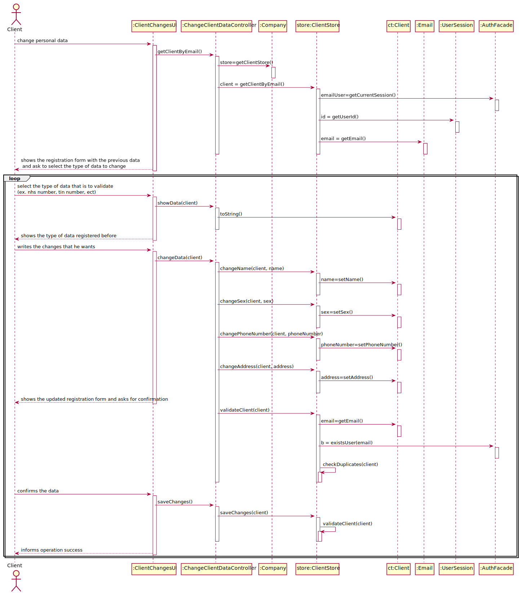

# US 02 - To update client's personal data.

## 1. Requirements Engineering

### 1.1. User Story Description

As a client, I want to update my personal data.

### 1.2. Customer Specifications and Clarifications 

**From the specifications document:**

n/a

**From the client clarifications:**
> **Question:** When we update the client's information, should we send an email informing that the client's data has been changed? If so, what should this email contain?
> 
> **Answer:** Yes. The e-mail message should only inform the client that his personal data has been updated.
> 

> **Question** Should/Can we show the current data held in the client's account? If so, we think that showing certain information(Password, for example) could violate some security purposes. How should we approach that situation?
> 
> **Answer** The client can only update his: name, address, phone number and sex attributes. The other attributes can not be updated. There are some restrictions that forced me to make this decision.

### 1.3. Acceptance Criteria

* **AC1:** The client can only update his: name, address, phone number and sex attributes.
* **AC2:** A email should be sent to the client when we make the wished changes.

### 1.4. Found out Dependencies

* There is a dependency to "US03 - Register a new Client", because in order to modify the Client data that Client must be registered in the system.
* There is a dependency to "US07 - Register a new Employee", because in order to modify the Client data that Client must be registered in the system by a receptionist.

### 1.5 Input and Output Data

**Input Data:**

* Typed data:
	* personal changes

* Selected data:
	*

**Output Data:**

* Modification of a Client Data
* (In)Success of the operation

### 1.6. System Sequence Diagram (SSD)

### 1.7 Other Relevant Remarks

## 2. OO Analysis

### 2.1. Relevant Domain Model Except 

### 2.2. Other Remarks

n/a

## 3. Design - User Story Realization 

### 3.1. Rationale

| Interaction ID | Question: Which class is responsible for... | Answer  | Justification (with patterns)  |
|:-------------  |:--------------------- |:------------|:---------------------------- |
| Step 1 | ...interacting with the user? | ClientChangesUI | Pure Fabrication: There are no reasons to assign this task to any class of the domain |
| 		 | ...managing the US? | ChangeClientDataController | Controller: The controller is responsible to make the bridge between UI layer and Domain Layer |
| Step 2 | 									| 														| 												|
| Step 3 | ...send data from UI to Domain? | ChangeClientDataController | Controller |
| 		 | ...knows the ClientStore? | Company | IE: Company knows all its stores |
| 		 | ...knowing client data? | Client | IE: Each client knows its own data |
| Step 4 | 					| 				|						 |
| Step 5 | ...storing the changes provided? | Client | Creator: Client will store its own clients |
|			    |	... saving the client? | ClientStore | IE: Knows all clients|
| Step 6 | 									| 								| 														|
| Step 7 | ...validating the changes made? | Client | IE: knows its own data and also knows each acceptance criteria |
| Step 8 | ...informing success of the operation? | ClientChangesUI | It's always responsible for user interaction |

### Systematization ##

According to the taken rationale, the conceptual classes promoted to software classes are:

 - Company
 - Client

Other software classes (i.e. Pure Fabrication) identified: 

 - ClientChangesUI
 - ChangeClientDataController
 - ClientStore

## 3.2. Sequence Diagram (SD)

## 3.3. Class Diagram (CD)

# 4. Tests 

	@Test
	public void testSaveChanges() {
	ClientDTO dto = new ClientDTO("Tomás", "1234567899123456","1239567890","1234569990","23/12/2002","male","12345679901","tomas@outlook.pt", "street 3");
	Client ct01 = cls.newClient(dto);
	assertTrue(cls.saveChanges(ct01));
	}

    @Test
    public void changeNameTest(){
       ClientDTO dto = new ClientDTO("Tomás", "1234567899123456","1239567890","1234567890","23/12/2002","male","12345679901","tomas@isep.ipp.pt", "street 3");
       Client ct01 = cls.newClient(dto);
       cls.changeName(ct01, "roberto");
       String expected= "roberto";
       assertEquals(expected,ct01.getName());
    }

    @Test
    public void changeAddressTest(){
        ClientDTO dto = new ClientDTO("Tomás", "1234567899123456","1239567890","1234567890","23/12/2002","male","12345679901","tomas@isep.ipp.pt", "street 3");
        Client ct01 = cls.newClient(dto);
        cls.changeAddress(ct01, "street 56565");
        String expected= "street 56565";
        assertEquals(expected,ct01.getAddress());
    }

    @Test
    public void changeSexTest(){
        ClientDTO dto = new ClientDTO("Tomás", "1234567899123456","1239567890","1234567890","23/12/2002","male","12345679901","tomas@isep.ipp.pt", "street 3");
        Client ct01 = cls.newClient(dto);
        cls.changeSex(ct01, "female");
        String expected= "female";
        assertEquals(expected,ct01.getSex());
    }

    @Test
    public void changePhoneNumberTest(){
        ClientDTO dto = new ClientDTO("Tomás", "1234567899123456","1239567890","1234567890","23/12/2002","male","12345679901","tomas@isep.ipp.pt", "street 3");
        Client ct01 = cls.newClient(dto);
        cls.changePhoneNumber(ct01, "12121212122");
        String expected= "12121212122";
        assertEquals(expected,ct01.getPhoneNumber());
    }

    @Test
    public void changePhoneNumberToAnExistingOneTest(){
        ClientDTO dto = new ClientDTO("Tomás", "1234567899123456","1239567890","1234567890","23/12/2002","male","12345679901","tomas@isep.ipp.pt", "street 3");
        Client ct01 = cls.newClient(dto);
        ClientDTO dto1 = new ClientDTO("Tomás", "1231567899123456","1239167890","1234167890","23/12/2002","male","11345679901","tomas1@isep.ipp.pt", "street 31");
        Client ct02 = cls.newClient(dto1);
        assertTrue(cls.changePhoneNumber(ct02, "12345679901"));
    }
	

# 5. Construction (Implementation)

	    private final ClientStore ctStore;
    private Client ct;

    public ChangeClientDataController() {
        this(App.getInstance().getCompany());
    }

    public ChangeClientDataController(Company company) {
        this.ctStore = company.getClientStore();
        this.ct = null;
    }

    public Client getClientByEmail() {
        return this.ct = this.ctStore.getClientByEmail();
    }

    public String showData(Client client) {
            return client.toString();
    }

    public void changeName(Client client, String name) {
        this.ctStore.changeName(client, name);
    }

    public void changeBirthDate(Client client, String name) {
        this.ctStore.changeBirthDate(client, name);
    }

    public void changeSex(Client client, String name) {
        this.ctStore.changeSex(client, name);
    }

    public boolean changePhoneNumber(Client client, String name) {
        return this.ctStore.changePhoneNumber(client, name);

    }

    public void changeAddress(Client client, String name) {
        this.ctStore.changeAddress(client, name);
    }

    public String getName(){
        return this.ct.getName();
    }

    public String getCitizenCardNumber(){
        return this.ct.getCitizenCardNumber();
    }

    public String getNhs(){
        return this.ct.getNhsNumber();
    }

    public String getTin(){
        return this.ct.getTinNumber();
    }

    public String getSex(){
        return this.ct.getSex();
    }

    public String getBirthDate(){
        return this.ct.getBirthDate();
    }

    public String getPhoneNumber(){
        return this.ct.getPhoneNumber();
    }

    public String getEmail(){
        return this.ct.getEmail();
    }
    public String getAddress(){
        return this.ct.getAddress();
    }

    public boolean saveChanges() {
        return this.ctStore.saveChanges(ct);
    }

	
# 6. Integration and Demo 

*A new option was added to Client menu.*

# 7. Observations

*Overall, it is believed that the work done is consistent and meets the requirements specified by the Client.*

