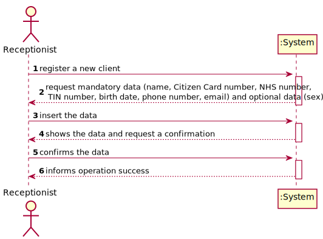
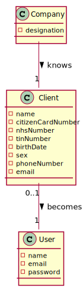
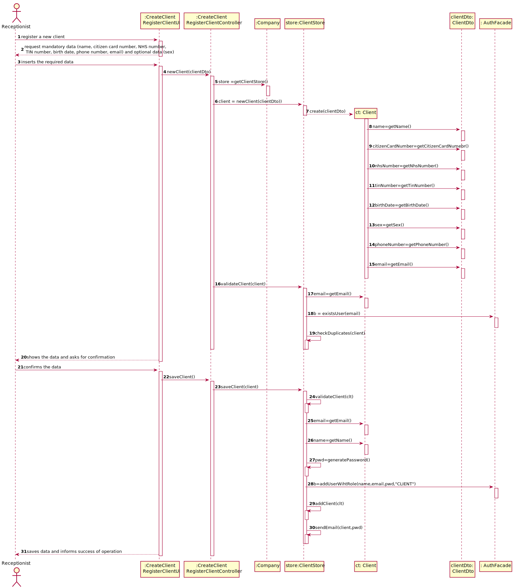
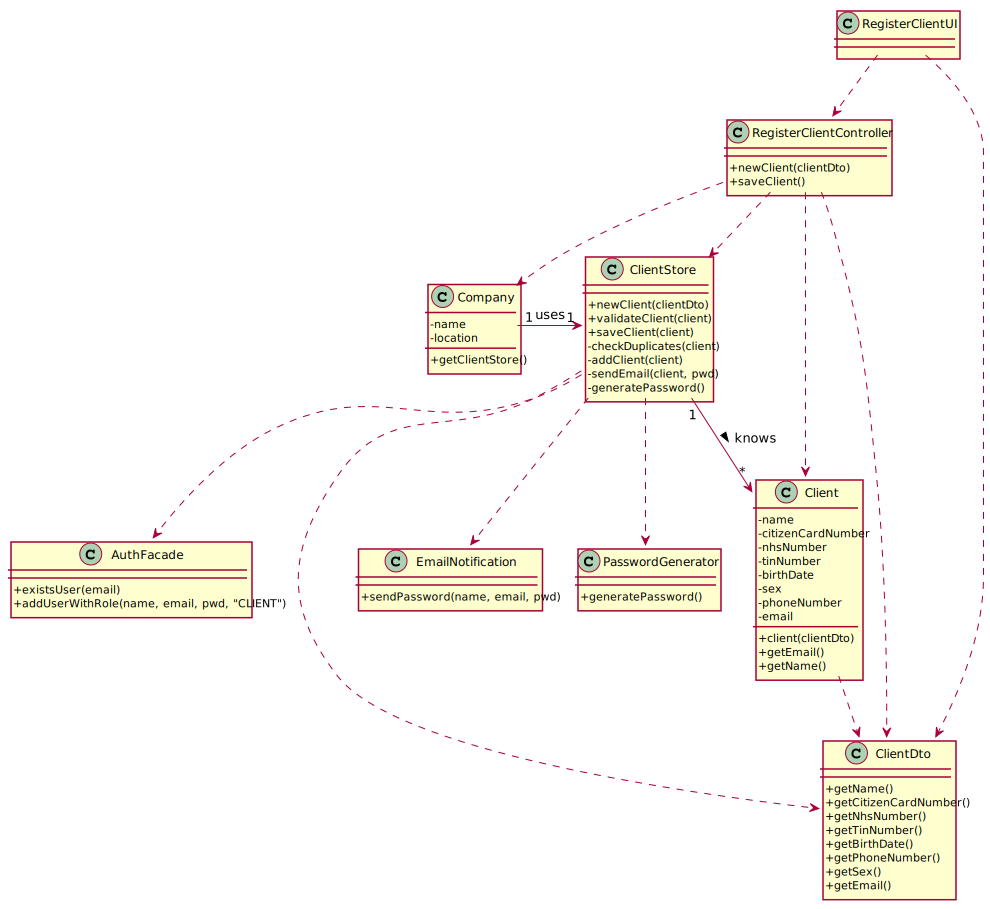

# US 03 - To register a new client

## 1. Requirements Engineering

### 1.1. User Story Description

*As a receptionist of the laboratory, I want to register a client in order to access the application.*

### 1.2. Customer Specifications and Clarifications 
*From the Specification Document:*

> "Typically, the client arrives at one of the clinical analysis laboratories with a lab order prescribed by
a doctor. Once there, a receptionist asks the client’s citizen card number, the lab order (which
contains the type of test and parameters to be measured), and registers in the application the test to
be performed to that client."
>
> "In case of a new client, the receptionist registers the client in the application. To register a client, the
receptionist needs the client’s citizen card number, National Healthcare Service (NHS) number,
birth date, sex, Tax Identification number (TIN), phone number, e-mail and name."
  
*From the Client Specifications:*

> **Question:** What attributes a Client have?
>
>**Answer:**
Name;
Citizen Card Number;
NHS number;
TIN number;
Birth Date;
Sex;
Phone number;
Email.

> **Question:** Does the receptionist need to be logged in the app to perform the regist?
> 
> **Answer:**
> Yes

> **Question:** What parameters asked by the receptionist should the system use to create the password of the new client?
> 
> **Answer:**
> The password should be randomly generated. 

> **Question:** How the system respond in the event of creating a new user with the same attributes of an already existing user?
> 
> **Answer:**
> This should be treated as an error. A subset of the attributes of any client are unique.

> **Question:** After being registered by the receptionist, should the client receive some kind of confirmation e-mail in order to finish the registration?
>
> **Answer:**
> The client only receives an e-mail informing that the registration was successful and that he can start to use the system. The email includes the client password

> **Question:** During the registration of the client, if he gives a phone number already used by another customer, should the registration continue normally, or should it be cancelled?
>
> **Answer:**
> The email address and phone number should be unique for each user . The system should present a message informing about the error and asking for a different phone number.
> 
> **Question:** Is there any restrictions to the client **age**?
> **Answer:** A client should not have more than 150 years of age. Although there are important developments in the pursuit of eternal youth, for now this value is ok.
> 
> **Question:** **login** information?
> **Answer:**  e-mail and password

### 1.3. Acceptance Criteria

* **AC1:** The client must become a system user. The "auth" component available on the repository must be reused (without modifications).
* **AC2:** The "auth" component available on the repository must be reused (without modifications).
* **AC3:** Name have a maximum of 35 characters;
* **AC4:** Citizen Card must have 16 digit number;
* **AC5:** NHS number must have 10 digit number;
* **AC6:** Birth Date must be in DD/MM/YYYY format;
* **AC7:** Phone number must have 11 digit number.
* **AC8:** The sex of the client is optional and are only two genders available (Male/Female).
* **AC9:** The password should have 10 alphanumeric characters.
* **AC9:** When registering a client with an already existing email, phone number, the system must reject such operation with an error and the user must have the change to modify the typed reference.

### 1.4. Found out Dependencies

There is dependency with the US07 - Register an employee, because in order to register a new client the system
must have a receptionist logged in, so the receptionist can register the client.

### 1.5 Input and Output Data

*Input Data*

-Typed Data: Name; Citizen Card Number; NHS number; TIN number; Birth Date; Sex; Phone Number; Email.

-Output Data: The client receives an email with the registration confirmation and his password
(In)Success of the operation.

### 1.6. System Sequence Diagram (SSD)

### 1.7 Other Relevant Remarks

*There are some similarities to US 7 regarding the need (i) to generate a password and (ii) to send an email to the resulting user.*

## 2. OO Analysis

### 2.1. Relevant Domain Model Excerpt

### 2.2. Other Remarks

n/a

## 3. Design - User Story Realization 

### 3.1. Rationale

**The rationale grounds on the SSD interactions and the identified input/output data.**

| Interaction ID | Question: Which class is responsible for... | Answer  | Justification (with patterns)  |
|:-------------  |:--------------------- |:------------|:---------------------------- |
| Step 1                 |	... interacting with the actor? | RegisterClientUI   |  **Pure Fabrication:** there is no reason to assign this responsibility to any existing class in the Domain Model           |
| 			  		     |	... coordinating the US? | RegisterClientController | **Controller**                             |
| Step 2                 |							 |             |                              |
| Step 3                 |	...transfer the data typed in the UI to the domain? | RegisterClientController | **DTO:** When there is so much data to transfer, it is better to opt by using a DTO in order to reduce coupling between UI and domain |
|                        |	...saving the typed data? | Client  | **IE:** a client knows its own data 						 |             |                              |
| 		                 |	... instantiating a new Client? | ClientStore   | **Creator (R1)** and **HC+LC**: By the application of the Creator (R1) it would be the "Company". But, by applying HC + LC to the "Company", this delegates that responsibility to the "ClientStore"   |
|  		 			     |  ... knows ClientStore?	 |  Company   |  **IE:** Company knows the ClientStore to which it is delegating some tasks |
|  		                 |	... validating all data (local validation)? | Client | **IE:** an object knows its data|
| 			  		     |	... validating all data (global validation)? | ClientStore | **IE:** knows all the clients| 
|                        | ... validate the exclusivity of the client's email? | AuthFacade | **IE:** user management is responsibility of the respective external component whose point of interaction is through the class "AuthFacade"
| Step 4                 |	                |                   |                   |        
| Step 5                   |	... generating the password? | PasswordGenerator | **IE** and **Pure Fabrication:** ClientStore has all the required information and means to generate the password (IE). However, to avoid code duplication (cf. US7) this responsibility might be assign to a common and shared artificial class, specialized in this task.|
| 			  		     |	... registering the client as a system user? | AuthFacade | **IE:** cf. A&A component documentation | 
| 			  		     |	... saving the client? | ClientStore | **IE:** Knows all clients| 
| 			  		     |	... sending email? | EmailNotificationSender | **IE** and **Pure Fabrication:** has all the required information and means to send the email (IE). However, to avoid code duplication (cf. US7) this responsibility might be assign to a common and shared artificial class, specialized in this task.| 
| Step 6                 |	... informing operation success?| RegisterClientUI  | **IE:** is responsible for user interactions  | 

### Systematization ##

According to the taken rationale, the conceptual classes promoted to software classes are:
 * Company
 * Client

Other software classes (i.e. Pure Fabrication) identified: 
* RegisterClientUI
* ClientStore
* RegisterClientController
* **EmailNotificationSender**
* **PasswordGenerator**

## 3.2. Sequence Diagram (SD)

## 3.3. Class Diagram (CD)

# 4. Tests

**Test 1:** Check that it is not possible to create an instance of the Client class with null values. 

	 @Test(expected = NullPointerException.class)
    public void garanteeNullClientIsntCreatedWithAllDataAndSex() {
        new Client(null, null, null, null, null, null, null, null);
    }

**Test 2:** Check that it is not possible to create an instance of the Client class with a name with alphanumerical values.

	 @Test(expected = IllegalArgumentException.class)
    public void ensureThatNameNotHaveAlphanumericChar() {
        new Client("To<más", "1234567890123456", "1234567891", "1234567890", "23/12/2010", "male", "12345678901", "tomas@isep.ipp.pt");
    }

**Test 3:** Check that it is not possible to create an instance of the Client class with a citizen card number with more than 16 numbers.

    @Test(expected = IllegalArgumentException.class)
    public void ensureThatCitizenCardNumberCannotHaveMore16Characters() {
        new Client("Tomás", "12345678901234568", "1234567891", "1234567890", "23/12/2001", "male", "12345678901", "tomas@isep.ipp.pt");
    }

**Test 4:** Check that it is not possible to create an instance of the Client class with a NHS and TIN number with more than 10 numbers.

    @Test(expected = IllegalArgumentException.class)
    public void ensureThatNhsAndTinCannotHaveMoreAndLessThan10Characters() {
        new Client("Tomás", "1234567890123456", "12345678901", "12345678901", "23/12/2001", "male", "12345678901", "tomas@isep.ipp.pt");
    }

**Test 5:** Check that it is not possible to create an instance of the Client class with a birth date in a wrong format.

    @Test(expected = IllegalArgumentException.class)
    public void checkBirthDateWrongFirstConstructor() {
        new Client("Tomás", "1234567890123456", "1234567891", "1234567890", "23/12/20011", "Male", "12345678901", "tomas1@isep.ipp.pt");
    }

**Test 6:** Check that it is not possible to create an instance of the Client class with a sex that don't match with the correct formats (Male/Female).

    @Test(expected = IllegalArgumentException.class)
    public void checkSexWrong() {
        new Client("Tomás", "1234567890123456", "1234567891", "1234567890", "23/12/2001", "madeira", "12345678901", "tomas1@isep.ipp.pt");
    }

**Test 7:** Check that it is not possible to create an instance of the Client class with a phone number that have more or less than 11 numbers.

    @Test(expected = IllegalArgumentException.class)
    public void checkPhoneNumberWrongFirstConstructor() {
        new Client("Tomás", "1234567890123456", "1234567891", "1234567890", "23/12/2001", "male", "1234561111178901", "tomas1@isep.ipp.pt");
    }

**Test 8:** Check that it is not possible to create an instance of the Client class with an invalid email.

    @Test(expected = IllegalArgumentException.class)
    public void checkEmailWrongFirstConstructor() {
        new Client("Tomás", "1234567890123456", "1234567891", "1234567890", "23/12/2001", "male", "12345678901", "tomas1isep.ipp.pt");
    }

# 5. Construction (Implementation)

#Class RegisterClientController

    public class RegisterClientController {
        private ClientStore ctStore;
        private Client ct;

    private AuthFacade authFacade;

    public RegisterClientController() {
        this(App.getInstance().getCompany());
    }

    public RegisterClientController(Company company) {
        this.ctStore= company.getClientStore();
        this.authFacade = company.getAuthFacade();
        this.ct = null;
    }

    private boolean addUserToSystem(String name, String email, String role) {
        return CommonMethods.addUserToSystem(name, email, role, this.authFacade);
    }

    public List<Client> getClientList(){
        return App.getInstance().getCompany().getClientStore().getClientList();
        }
    }

## Class Client

    public Client(String name, String citizenCardNumber, String nhsNumber, String tinNumber, String birthDate, String sex, String phoneNumber, String email) {
        setName(name);
        setCitizenCardNumber(citizenCardNumber);
        setNhsNumber(nhsNumber);
        setTinNumber(tinNumber);
        setBirthDate(birthDate);
        setSex(sex);
        setPhoneNumber(phoneNumber);
        setEmail(email);
    }

    public Client(String name, String citizenCardNumber, String nhsNumber, String tinNumber, String birthDate, String phoneNumber, String email) {
        setName(name);
        setCitizenCardNumber(citizenCardNumber);
        setNhsNumber(nhsNumber);
        setTinNumber(tinNumber);
        setBirthDate(birthDate);
        this.sex = SEX_BY_OMISSION;
        setPhoneNumber(phoneNumber);
        setEmail(email);

        ....
    }

## Class Company
    public class Company {

    private String designation;
    private AuthFacade authFacade;

    private TypeOfTestStore totStore = new TypeOfTestStore();
    private ClientStore clientStore = new ClientStore();
    private ParameterCategoryStore pcStore = new ParameterCategoryStore();
    private ParameterStore pStore = new ParameterStore();
    private ClinicalAnalysisLaboratoryStore calStore = new ClinicalAnalysisLaboratoryStore();
    private EmployeeStore empStore = new EmployeeStore();

    public Company(String designation)
    {
        if (StringUtils.isBlank(designation))
            throw new IllegalArgumentException("Designation cannot be blank.");

        this.designation = designation;
        this.authFacade = new AuthFacade();
        
        ...
    }

# 6. Integration and Demo 

*A new option to the receptionist menu was added.*

# 7. Observations

*Overall, it is believed that the work done is consistent and meets the requirements specified by the Client.*

